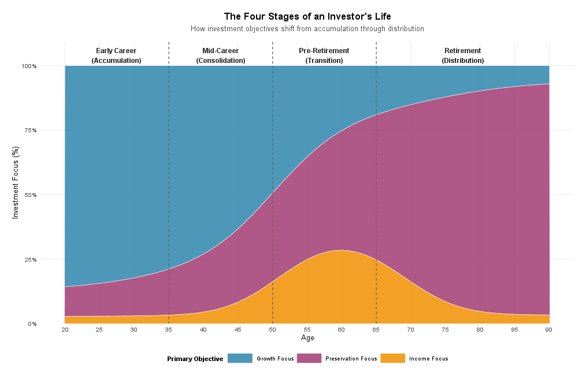
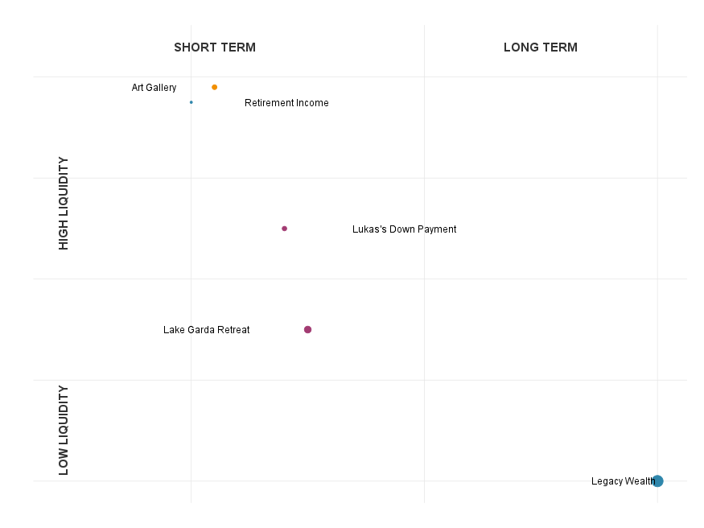
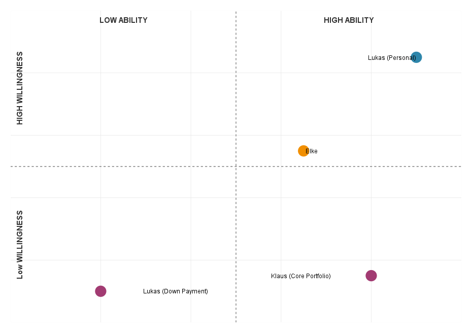
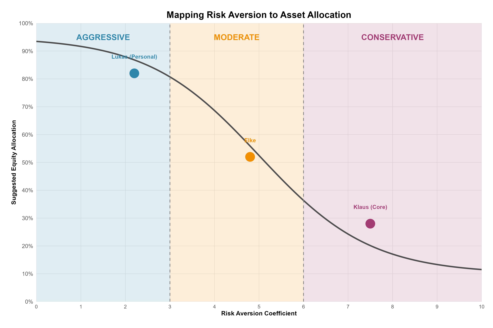
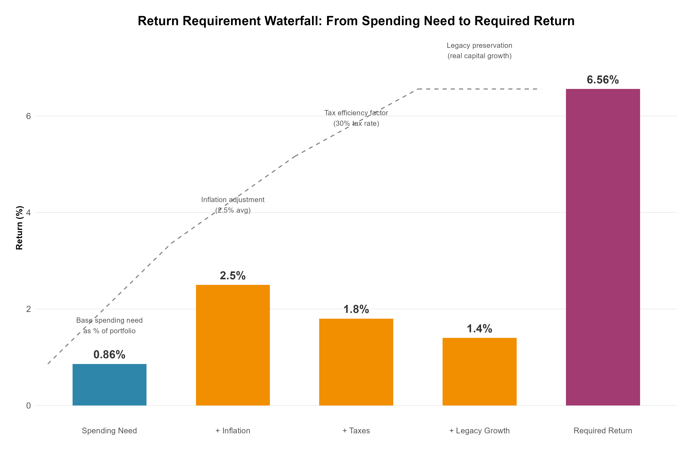
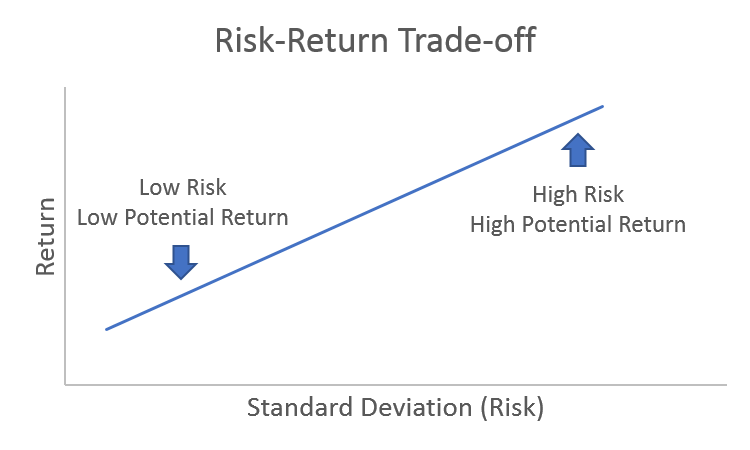

::: {.callout-tip title="Lecture Slides"}
**Associated slides:** [Lesson 3 — Client Discovery & the Investment Policy Statement](../slides/lesson-03-client-ips.html)
:::

## Introduction
In professional investment management, constructing a portfolio is only one part of the full process. A good portfolio manger must also understand the individual for whom it is built. A portfolio that fails to reflect a client's unique circumstances, goals, and behavioral biases is unlikely to succeed. Therefore, a deep understanding of each client's specific needs forms the essential backbone of the entire investment process. This crucial foundational step is known as client analysis.

Client analysis is the process of gathering, verifying, and documenting both quantitative and qualitative information about the client. Its purpose is to ensure that every investment decision refelcts the client’s financial needs. This process is the foundation for a customized, ethical, and ultimately successful investment strategy.

The framework for this analysis is formalized through the Know Your Client (KYC). The KYC process compels the advisor to move beyond surface-level facts to develop a nuanced understanding of the client's financial situation, investment experience, and capacity for risk.

However, truly exceptional client analysis recognizes that the KYC process is only the starting point. The goal is to move from "Know Your Client" to "Know Your Person." This means looking beyond the balance sheet to understand the human dynamics that drive financial decisions. It requires the advisor to explore:

- **Returns Requirements:** The specific level of performance needed to meet the client's financial goals, such as funding retirement, purchasing a home, or leaving a legacy.

- **Risk Tolerance:** A complex interplay of the client's ability to take risk (based on time horizon and financial capacity) and their willingness to do so (a function of their emotional temperament and past experiences).

- **Behavioral Biases:** An awareness of the cognitive and emotional biases—such as loss aversion, overconfidence, or attachment to inherited assets—that can influence a client's perception of risk and lead to suboptimal decisions, especially during market volatility.

- **Family Dynamics:** In multi-generational or family situations, understanding the distinct goals, risk profiles, and relationships of all members is critical to creating a cohesive and sustainable plan.

- **Personal Circumstances and Values:** A holistic view of their career stage, health, tax situation, unique constraints, and, most importantly, their deeply held values and non-financial goals—whether that is funding a passion project, supporting a child, or leaving a lasting legacy.

The culmination of a thorough client analysis is the Investment Policy Statement (IPS) . This is a written document that serves as the blueprint for the entire investment management relationship. It formally articulates the client's objectives and constraints, establishes the framework for portfolio construction, and provides a benchmark for evaluating performance. 

In the following case study, we will apply the principles of client analysis to the Schmidt-Miller family. 

::: {.callout-tip title="In IMAG"}
Throughout the IMAG simulation, participants encounter a diverse range of investors—from growth-oriented entrepreneurs seeking aggressive capital appreciation to conservative clients prioritizing capital preservation. Success requires more than identifying surface-level characteristics. Participants must develop a comprehensive understanding of each investor's complete financial profile, including risk tolerance, investment horizon, liquidity needs, income requirements, and behavioral biases.

The consequences of misalignment between investor profiles and asset allocations extend beyond theoretical discomfort. Client satisfaction directly impacts fund demand and, consequently, assets under management (AUM). When allocations align with expectations, clients maintain their investments through market cycles, supporting stable AUM growth. Conversely, misaligned portfolios lead to redemptions during downturns or impatience during flat markets, eroding AUM and limiting future opportunities.

This chapter establishes the foundation for all subsequent portfolio decisions by guiding participants through the systematic process of translating investor descriptions into actionable constraints—minimum and maximum allocations, acceptable asset classes, and currency preferences that will shape the strategic asset allocation.
:::

## Case Study

### Scenario
Lara Fischer, CFA, is a portfolio manager at a private wealth management firm in Zurich. She has been retained by the Schmidt-Miller family to help them organize their finances and develop a comprehensive investment plan. The family resides in a stable Central European country with a strong economy. The country has a progressive income tax system (with a top marginal rate of 40% on ordinary income) and a 20% tax on realized capital gains. There are tax-advantaged retirement accounts available ("Säule 3a" equivalent) where investments grow tax-free until withdrawal.

Lara is meeting with the family for the first time to gather information and understand their unique situation, goals, and attitudes toward risk.

### Meet the Schmidt-Miller Family
The family consists of three people: Klaus Schmidt-Miller (58), his wife Elke Schmidt-Miller (55), and their son, Lukas Schmidt-Miller (28). Klaus and Elke have been married for 30 years.

- **Klaus Schmidt-Miller** is a successful orthopaedic surgeon. He has worked long hours for decades and is well-respected in his field. He is the primary earner for the family.
- **Elke Schmidt-Miller** worked as a high school principal for 25 years but retired two years ago to focus on personal interests and spend more time with family.
- **Lukas Schmidt-Miller** is a software engineer at a promising tech startup in Berlin. He is unmarried and lives there.

### Current Financial Situation & Upcoming Events
Lara learns that the family's financial life is about to change dramatically.

**The Sale of the Medical Practice:**

Klaus has decided to retire from surgery. He has already agreed to sell his stake in the large surgical practice he helped found. The sale is expected to close in approximately 60 days. After all taxes are paid, the family will realize a one-time cash windfall of €18 million.

**Inheritance:**

Elke recently inherited a diversified portfolio of stocks and bonds from her parents, valued at €2.5 million. The portfolio has a very low cost basis, meaning a large portion of its value would be subject to capital gains tax if sold.

- **Existing Family Assets (Before the Sale of the Practice):**
  - **Family Home (Zug):** €2.2 million (owned free and clear, held jointly)
  - **Elke's Inherited Portfolio:** €2.5 million (diversified, low cost basis)
  - **Klaus's Retirement Account (tax-advantaged):** €800,000 (invested in a conservative fund)
  - **Lukas's Startup Equity:** 5% stake in his company. The company is private and not yet profitable. The stake is considered highly speculative and currently has a nominal value of €50,000 for tax purposes, though it could be worth significantly more or nothing in the future.
  - **Cash & Savings:** €150,000 in a high-yield savings account.

**Annual Income & Expenses:**

- **Current Income:**
  - Klaus's Salary (until retirement): CHF 350,000 (converted to € for simplicity)
  - Elke's Pension: €45,000 (indexed for inflation)
  - Lukas's Salary: €70,000
- **Living Expenses:**
  - The Schmidts' current annual living expenses are approximately €150,000. They expect this to increase slightly in retirement to cover travel and hobbies. They have no debt.

### Family Goals and Objectives
Lara meets individually with each family member to discuss their personal goals.

**Klaus & Elke's Goals (Joint):**

- **Retirement Lifestyle:** To generate a reliable, inflation-adjusted after-tax income stream of €160,000 per year to fund their retirement, starting immediately.
- **The Lake Garda Retreat:** In five years, they want to purchase a vacation home on Lake Garda in Italy for a total cost (including renovations) of approximately €2 million. They intend to use it for family gatherings and eventually leave it to Lukas.
- **Financial Support for Lukas:** They want to set aside funds to help Lukas with major life milestones, such as a down payment on a home (estimated at €400,000 in 3-5 years).
- **Legacy:** They have a strong desire to preserve their wealth for Lukas and any future grandchildren.

**Elke's Personal Goal:**

- **The Art Gallery:** Elke is passionate about art and wants to use €500,000 from the inheritance to open a small art gallery in Lucerne. This is a business venture; she understands it may not generate significant income, especially in the first few years, and could even incur losses. She is emotionally committed to this project.

**Lukas's Personal Goal:**

- **Financial Independence:** Lukas wants to be financially independent from his parents. He plans to continue working at the startup for at least another 3-5 years to see if his equity stake becomes valuable. He is not counting on this money and views it as a high-risk, high-reward opportunity.
- **First Home:** He is eager to buy his first home (a condo in Berlin) within the next 3-5 years and will likely use the gift from his parents for the down payment. He is currently saving his own salary for this purpose as well.

### Lara's Observations & Risk Profiles

**Klaus Schmidt-Miller:**

- **Personality:** Klaus is meticulous, analytical, and risk-averse. His career required precision and caution. He is relieved to be retiring and his primary focus is on capital preservation to ensure the retirement income he and Elke have planned for. He is deeply uncomfortable with market volatility and the thought of losing a significant portion of their principal. He views the €18 million as the fruit of a lifetime of work that must be protected. He is supportive of Elke's gallery but worries about the financial risk.
- **Time Horizon:** Begin phase of retirement (20+ years).
- **Risk Tolerance:** Low.

**Elke Schmidt-Miller:**

- **Personality:** Elke is thoughtful, values-driven, and more open to complexity than Klaus. She feels a strong emotional connection to the portfolio inherited from her parents and is reluctant to sell those specific stocks, even if it's for sound financial planning. She is excited about her gallery project and sees it as a meaningful way to use her time and talents. She understands risk conceptually but may underestimate the practical challenges of her new business.
- **Time Horizon:** Long-term (20+ years) for her personal wealth; medium-term for the gallery.
- **Risk Tolerance:** Moderate, but with a specific emotional attachment to the inherited assets.

**Lukas Schmidt-Miller:**

- **Personality:** Lukas is optimistic, tech-savvy, and comfortable with risk, a trait likely reinforced by his work at a startup. He sees his parents' financial caution as old-fashioned. He believes in long-term growth and is willing to accept significant short-term losses for the potential of higher returns. He is excited about the potential of his startup equity.
- **Time Horizon:** Long-term (30+ years).
- **Risk Tolerance:** High for his personal assets (the startup equity), but will likely be more conservative for the down-payment money he plans to use in 3-5 years.

**Constraints and Other Considerations:**

- **Liquidity:** Immediate need for €160,000 annual income. A €500,000 lump sum is needed in 1 year for the gallery. A €400,000 lump sum is needed in 3-5 years for Lukas's down payment. A €2 million lump sum is needed in 5 years for the Lake Garda property.
- **Tax Concerns:** The €18 million is coming in after tax. However, Elke's inherited portfolio of €2.5 million has a massive embedded capital gain. Selling it would trigger a large tax bill. Any income generated by the portfolio will be taxed.
- **Unique Circumstances:** The startup equity is a high-risk, illiquid asset. Elke's emotional attachment to her inherited assets is a strong behavioral bias that must be addressed in the plan.

## Analyzing Client’s Investment Goals
In the process of crafting a tailored investment strategy, understanding the client’s specific financial goals is crucial. This understanding shapes how investment portfolios are designed and managed, ensuring alignment with the client’s needs, preferences, and life situation. Each investors goals are shaped by the client's stage of life and the source of their wealth. 

### Stages of Life

{#fig-elementwise}

A client's stage of life is a powerful determinant of their investment objectives, risk capacity, and time horizon. Understanding where a client stands in life allows the advisor to anticipate their goals and design a strategy that not only meets current needs but also adapts to the changes that lie ahead.

Financial life stages are typically divided into four distinct phases. While every individual's life journey is unique, these general patterns provide a valuable framework for client analysis.

#### The Early Career Phase: Wealth Accumulation
The first phase encompasses the early career years, roughly from ages twenty to thirty-five. During this period, individuals are establishing themselves professionally, with incomes typically starting modestly but growing rapidly over time. This stage often coincides with significant life events such as marriage, starting a family, and purchasing a first home. Expenses can be high relative to income, as young professionals contend with student loans, mortgage payments, and the costs of raising children. Yet despite these cash flow pressures, the investor in this phase possesses one invaluable asset: time. With an investment horizon stretching thirty to forty years or more until retirement, the early-career investor can afford to take significant risk. Market downturns, while unpleasant, are temporary setbacks rather than permanent impairments, as there is ample opportunity to recover losses through continued saving and long-term compounding. The primary objective during this phase is therefore wealth accumulation, with a focus on growth-oriented assets that may experience considerable volatility but offer the highest expected returns over decades. Goals typically include building an emergency fund, saving for a down payment on a home, starting retirement contributions, and beginning to save for children's future education expenses.

#### The Mid-Career Phase: Wealth Consolidation
As investors move into their mid-career years, roughly from ages thirty-five to fifty, they enter a consolidation phase. Income rises during this period. Expenses, however, remain elevated, frequently reaching their apex with children's education costs and substantial mortgage payments. Retirement, while still distant, becomes a more concrete consideration, and investors have now lived through enough market cycles to develop a clearer understanding of their true risk tolerance. The investment approach during this phase shifts from pure growth toward a more balanced posture. Portfolios typically include a mix of equities for long-term appreciation and fixed income for stability and preservation. The time horizon remains long, with fifteen to twenty-five years until retirement, but there is now more wealth accumulated that deserves protection. Goals become more diversified as well, encompassing retirement savings, children's education funding, and perhaps aspirations for a second home or other major purchases. Some investors in this phase may need to accelerate their savings if they have fallen behind on retirement goals, making the balance between current consumption and future needs a central tension. The primary objective is wealth consolidation and growth, seeking to build upon the foundation established in the early years while beginning to guard against downside risk.

#### The Pre-Retirement Phase: The Critical Transition
The pre-retirement phase, spanning roughly ages fifty to sixty-five, is perhaps the most critical period in the entire financial lifecycle. This phase marks the fundamental transition from accumulator to spender. The end of earned income becomes visible, and investors face the challenge of converting a lifetime of savings into a reliable stream of retirement income. Major expenses such as mortgages and children's education may be concluding, freeing up cash flow that can be directed toward final retirement savings. This phase often coincides with significant life events that reshape the financial landscape, including receiving inheritances, selling a business, or making crucial decisions about when to claim pension or social security benefits. The investment implications of this transition are profound. Capital preservation becomes paramount because a major market loss just before or during early retirement can devastate a portfolio's long-term sustainability. This phenomenon, known as sequence-of-returns risk, arises when withdrawals during a market downturn lock in losses and permanently impair the portfolio's ability to recover. The time horizon is shorter, with zero to fifteen years until significant withdrawals begin, leaving less opportunity to recover from losses. The psychological weight of protecting a lifetime's savings also makes most investors more conservative during this phase, reducing their willingness to take risk even if their long-term need for growth remains. Liquidity planning becomes essential as advisors structure portfolios to provide reliable income streams through bond ladders, dividend-paying stocks, or systematic withdrawal plans. Goals during this phase include generating retirement income, potentially downsizing a home, funding travel or hobbies, and beginning serious estate planning. The primary objective shifts decisively toward capital preservation and income preparation.

#### The Retirement Phase: Wealth Distribution
The final phase begins at retirement, typically around age sixty-five, and extends through the remainder of the investor's life. During this distribution phase, earned income has ceased or significantly reduced, and the portfolio must now fund living expenses. A common misconception is that the investment horizon ends at retirement, but in reality, time horizons can still stretch twenty to thirty years or longer, a fact often underestimated by retirees. Healthcare and long-term care needs become growing considerations, and the focus naturally shifts to legacy planning and intergenerational wealth transfer. The investment challenge during this phase is balancing competing demands. The portfolio must generate sustainable, inflation-adjusted income that will last a lifetime, requiring both current income and long-term growth to outpace inflation. The capacity for risk is quite limited because the portfolio is being drawn down for living expenses, leaving little ability to recover from significant losses. Willingness for risk varies considerably among retirees, with some remaining comfortable holding equities, particularly if they have sufficient guaranteed income from pensions or annuities to cover basic needs, while others become extremely conservative. Liquidity is critical, as a portion of the portfolio must be held in highly liquid assets to fund near-term expenses without forcing sales of volatile assets during market downturns. Goals in this phase include funding a desired lifestyle, leaving a legacy for heirs or charity, managing healthcare costs, and potentially making gifts to family members during one's lifetime. The primary objective is income generation combined with wealth preservation.

|Phase | Name | Primary Objective | Secondary Objective | Income Focus Level |
|--------|--------|--------|--------|--------|
|1 | Early Career | Growth | - | Very Low |
|2 | Mid-Career | Growth | Preservation | Low |
|3 | Pre-Retirement | Preservation | Income | Peak |
|4 | Retirement | Preservation | Income | Moderate |

#### Application to the Schmidt-Miller Family
Klaus, at age fifty-eight, stands squarely in the pre-retirement transition phase. As the primary earner who built his medical practice over decades, he is about to sell that practice and cease earning income. He views the eighteen million euros in sale proceeds as wealth to be protected rather than risked. His imminent retirement means his focus is necessarily on capital preservation, ensuring that this portfolio can fund his and Elke's retirement for the next thirty years or more. The sequence-of-returns risk is large in his situation, and his psychological need for security makes low risk tolerance the binding constraint for the entire core family portfolio.

Elke, at fifty-five, presents a more complex profile. She is already retired from her career as a high school principal and receives a small inflation-indexed pension that provides baseline income, placing her technically in the distribution phase. Yet she also has a long time horizon of twenty years or more and seeks new purpose through her art gallery project. Her inherited portfolio of two and a half million euros connects her emotionally to her parents, creating an endowment bias that a purely rational asset allocation would ignore. Her goals are thus twofold: she needs income supplement from the joint portfolio to maintain their desired lifestyle, and she seeks personal fulfillment through a business venture that is not expected to generate financial returns. The advisor must respect her emotional attachment to certain assets while still building a coherent overall plan.

Lukas, at twenty-eight, occupies the early career accumulation phase. He is building his career in a high-risk, high-reward field and holds speculative equity in a startup company. His desire for financial independence and his willingness to accept significant volatility are entirely appropriate for his long-term wealth objectives. His goal of purchasing a home in Berlin within three to five years, however, creates a separate need for capital preservation with a shorter horizon. The financial support his parents intend to provide for this down payment must therefore be structured differently from his personal investment assets.

The key insight from this life stage analysis is that Lara Fischer cannot treat the Schmidt-Miller family as a single, homogeneous client. She is effectively managing three distinct individuals with overlapping but not identical objectives. Klaus's pre-retirement phase and his psychological need for security make his low risk tolerance the dominant constraint for the core family portfolio that will fund their joint retirement. Elke's early retirement status and her emotional connection to inherited wealth introduce behavioral considerations that must be accommodated within the plan. Lukas's early career phase means his personal financial situation should be managed very differently from his parents', with high risk tolerance appropriate for his long-term wealth while his shorter-term down payment goal requires a separate, more conservative approach. The unifying theme across all three is the need to balance return requirements with the psychological and practical realities of each life stage, a challenge that will shape every aspect of the Investment Policy Statement to come.

### Sources of Wealth
While the client's stage of life reveals where they stand on their financial journey, the source of their wealth reveals how they arrived there, and this history profoundly shapes their attitudes toward risk, their emotional connection to money, and their future investment goals. Two clients with identical net worth and identical life stages may require completely different investment strategies if their wealth originated differently. Understanding the source of wealth is therefore essential because it provides insight into the client's psychological relationship with money, their financial sophistication, and the potential behavioral biases they may bring to the investment process.

Wealth typically originates from one of three primary sources, each carrying distinct implications for investment behavior. The first is earned wealth, accumulated through active effort over time. This category includes entrepreneurs who build and sell companies, executives who accumulate compensation over decades, and professionals such as doctors, lawyers, and consultants who convert their human capital into financial assets. Individuals with earned wealth often have a high sense of ownership and responsibility for their money. They earned it through hard work, sacrifice, and skill, and they feel a deep sense of entitlement to protect it. This can manifest as significant loss aversion, where a market loss feels not like a number on a statement but like years of hard work erased. Entrepreneurs and business owners in particular often exhibit a fascinating paradox: they may have a high tolerance for risk within their business but become extremely conservative with their liquid wealth, viewing their investment portfolio as the hard-won fruits of labor to be preserved rather than risked. There may also be concentration risk if a significant portion of wealth remains tied to the original business or industry. From an investment perspective, these clients typically express a strong preference for capital preservation, especially after a liquidity event such as a business sale. They may resist diversification if it means selling assets they associate with their success, and they often have a low willingness to take risk even when their long time horizon suggests a higher ability to do so.

The second source of wealth is inherited wealth, received through transfer from previous generations. The recipient did not actively earn the money and may have no prior experience managing significant assets. These individuals often feel a profound sense of stewardship, viewing themselves as temporary custodians of family wealth that must be preserved for future generations. They may experience guilt or anxiety about managing money they did not earn, leading either to excessive conservatism or, in some cases, reckless behavior. A strong endowment bias is common, manifesting as an emotional attachment to specific assets that were held by the deceased. Selling what they think of as Grandfather's stocks can feel like a betrayal, even when doing so is financially prudent. There may also be limited financial sophistication if the individual has never needed to earn or manage significant sums before. Investment implications for inherited wealth include a strong focus on wealth preservation and legacy, often with the goal not of growing the wealth substantially but of ensuring it lasts for future generations. These clients may be unwillingt to sell concentrated or tax-inefficient positions due to emotional attachment. 

The third source encompasses fortunes made through speculation or windfall events. This includes wealth accumulated through circumstances such as winning a lottery, receiving a large legal settlement, striking it rich with a speculative investment like cryptocurrency, or benefiting from a startup that succeeded beyond all expectations. These individuals may have a distorted perception of risk. If they succeeded through a high-risk bet, they may underestimate the role of luck and overestimate their own skill, leading to overconfidence. They may chase the next big opportunity, believing they can replicate their success. Alternatively, some windfall recipients experience intense anxiety, fearing they will lose what they did not truly earn, leading to conservatism. From an investment standpoint, these clients present a high risk of behavioral mistakes, whether excessive risk-taking or excessive caution. They require particularly careful education and a gradual onboarding to investment concepts, along with structure and discipline to prevent impulsive decisions. Some benefit from annuitization or other forced discipline mechanisms that protect them from their own decisions.

The Schmidt-Miller family illustrates how different sources of wealth create distinct investment personalities that must be reconciled. Klaus, with his earned wealth, views the eighteen million euros as the culmination of decades of hard work. He feels deeply protective of this money, associating risk with losing what he sacrificed to build. His extreme loss aversion becomes the binding constraint for the entire portfolio, as any strategy that risks significant principal will cause anxiety and may lead to panic selling during market downturns. Elke, with her inherited wealth, feels an emotional connection to her parents' assets and experiences a strong sense of stewardship responsibility. She is reluctant to sell inherited positions even when doing so would be prudent, and her endowment bias means the plan must accommodate her attachment to certain assets while still achieving overall portfolio objectives. Lukas, with his speculative startup equity, views that holding as a lottery ticket. He is comfortable with high risk and believes in his ability to succeed where others might fail, exhibiting overconfidence that is appropriate for his personal speculative assets but must be carefully separated from the down-payment gift his parents intend to provide.

When analyzing a client's source of wealth, advisors should explore several key questions. How was this wealth created, through years of effort, through inheritance, or through a single fortunate event? What emotions are attached to the money, whether pride, guilt, anxiety, or a sense of burden? Has the client managed significant wealth before, or is this their first experience with substantial assets? Are there concentrated positions with emotional significance, such as inherited stock, company shares, or family business interests? How does the client view risk in relation to their wealth, as a threat to hard-won gains or as an opportunity to grow what was freely given? And what legacy does the client wish to leave, with wealth preservation for heirs as a primary motivator or something else entirely?

Combining the life stage analysis from the previous section with this source of wealth analysis, we can now construct a complete investment personality for each Schmidt-Miller family member. Klaus, at age fifty-eight in the pre-retirement phase with earned wealth, emerges as a protective conservative. His primary objective is capital preservation above all else, and his binding constraint is extreme loss aversion that cannot tolerate significant volatility. Elke, at age fifty-five in early retirement with a blend of inherited and earned wealth, emerges as an emotional steward. Her primary objective is to honor her family's legacy while generating income for her own needs, and her binding constraint is endowment bias that makes her reluctant to sell inherited assets. Lukas, at age twenty-eight in early career with earned salary and speculative startup equity, emerges as a confident risk-taker. His primary objective is wealth accumulation and financial independence, and his binding constraint is overconfidence that must be managed by separating his short-term goals from his long-term speculation.

### Behavioral Biases and Personality Types
Life stage reveals when a client is in their financial journey, and source of wealth reveals how they acquired their money. But to truly understand a client, we must also explore how they think about money and risk. This is the domain of behavioral finance, which examines the psychological factors that influence investment decisions. Every client has a unique set of cognitive biases and personality traits that can either support or undermine their long-term financial success. The advisor who understands these biases can design a portfolio that not only meets the client's financial needs but also protects them from their own psychological tendencies.

Behavioral biases are typically divided into two categories: cognitive biases, which stem from faulty reasoning or information processing, and emotional biases, which stem from impulses or feelings. Both types can lead to suboptimal investment decisions, but they require different approaches from the advisor. Cognitive biases can often be corrected through education and logical explanation. Emotional biases are more deeply rooted and must typically be accommodated within the portfolio structure rather than confronted directly.

#### Cognitive Biases
Cognitive biases arise from the mind's attempt to simplify information processing. They are essentially mental shortcuts that lead to systematic errors in thinking.

**Overconfidence Bias** occurs when individuals overestimate their knowledge, skill, or ability to predict future events. They may believe they can time the market, pick winning stocks, or outperform professional managers, despite overwhelming evidence that most active traders underperform simple index funds. Overconfidence leads to excessive trading, inadequate diversification, and a failure to learn from past mistakes. This bias is particularly common among individuals who have experienced recent success, such as young professionals in rapidly rising fields or entrepreneurs who have built successful businesses. They come to believe that their success in one domain translates to investment skill, a dangerous assumption. In the Schmidt-Miller family, Lukas exhibits clear overconfidence bias. His success as a software engineer and his willingness to hold concentrated startup equity reflect a belief in his ability to beat the odds, a belief that must be carefully managed in the family financial plan.

**Confirmation Bias** is the tendency to seek out information that confirms existing beliefs while ignoring or discounting information that contradicts them. An investor who believes a particular stock will rise will read analyst reports that support that view and dismiss negative news as irrelevant or biased. This bias can cause clients to hold losing positions too long, waiting for the market to validate their original thesis, or to build portfolios that reflect their prejudices rather than sound diversification principles.

**Anchoring Bias** occurs when individuals fixate on a specific reference point, such as the price they paid for a stock, and make decisions based on that anchor rather than on current fundamentals. A client who bought a stock at one hundred euros may refuse to sell it at sixty euros, waiting for it to return to the anchor price, even if the company's prospects have permanently deteriorated. This bias explains why investors hold losing positions long after they should have sold and why they may be reluctant to sell inherited assets at prices that seem low compared to some remembered peak.

**Hindsight Bias** is the tendency to believe, after an event has occurred, that one predicted it all along. After a market rally, investors convince themselves they knew it was coming, which reinforces overconfidence. After a crash, they berate themselves for not seeing what now seems obvious, which can lead to excessive caution. This bias makes it difficult for clients to learn the right lessons from experience, as they rewrite history to fit their current understanding.

**Mental Accounting** is the tendency to treat money differently depending on its source or intended use. A client might have a conservative portfolio for retirement savings while simultaneously gambling on speculative stocks with money inherited from a grandparent, failing to see that all wealth ultimately supports the same set of goals. Mental accounting can lead to inefficient asset allocation, as different accounts are managed in isolation rather than as components of an integrated portfolio. Elke's attachment to her inherited portfolio reflects a form of mental accounting, where those assets are mentally categorized as different from the couple's other wealth.

#### Emotional Biases
Emotional biases arise from impulses, feelings, and intuition rather than from faulty reasoning. They are harder to correct because they are rooted in deep psychological needs.

**Loss Aversion** is perhaps the most powerful emotional bias. Research demonstrated that the pain of a loss is psychologically about twice as powerful as the pleasure of an equivalent gain. This means investors feel the sting of a ten thousand euro loss far more intensely than the joy of a ten thousand euro gain. Loss aversion leads clients to sell winning investments too early to lock in gains while holding losing investments too long in hopes of breaking even, a pattern known as the disposition effect. It also causes clients to abandon well-designed investment plans during market downturns, selling at exactly the wrong time. Klaus Schmidt-Miller embodies loss aversion in its purest form. His entire investment personality is shaped by the overwhelming desire to avoid losses, a desire that must be respected as the dominant constraint on the family portfolio.

**Endowment Bias** is the tendency to value an asset more simply because one owns it. This bias explains why people demand a higher price to sell something they own than they would be willing to pay to buy it. In investing, endowment bias manifests as an irrational attachment to inherited assets, company stock, or investments that have been held for a long time. Clients refuse to sell not because of any objective analysis but because the assets feel like part of their identity. Elke's reluctance to sell her inherited portfolio, even when diversification would clearly benefit the family, is a textbook example of endowment bias at work.

**Regret Aversion** is the tendency to avoid making decisions that could later be source of regret. An investor who fears regret may avoid selling a losing position because doing so would crystallize the loss and make it real, or may avoid investing in equities altogether because a market decline would cause painful regret. This bias leads to inertia, as clients stick with the status quo rather than risk making a decision they might later regret.

**Status Quo Bias** is closely related, describing the general preference for things to stay the same. Even when change would clearly be beneficial, clients resist because change requires effort and introduces uncertainty. This bias explains why investors hold the same asset allocation for years without rebalancing, why they stay with underperforming advisors, and why they delay important financial decisions.

**Self-Control Bias** arises when clients prioritize short-term gratification over long-term goals. They may spend today what should be saved for tomorrow, or take excessive risk trying to earn quick returns rather than patiently building wealth. This bias is particularly relevant for younger clients who struggle to save, but it can also affect retirees who overspend early in retirement, jeopardizing their long-term security.

#### Personality Types in Investing
Beyond specific biases, advisors benefit from understanding broader personality types that shape investment behavior. While every individual is unique, certain patterns recur frequently in practice.

**The Prudent Planner**  is meticulous, analytical, and detail-oriented. This personality type dislikes surprises and uncertainty, preferring a clear, well-documented plan that can be followed methodically. Prudent planners are natural savers who take their financial responsibilities seriously, but they may be excessively conservative and reluctant to take necessary risks. They need reassurance that their plan is sound and that short-term volatility does not signal failure. Klaus Schmidt-Miller exemplifies the prudent planner. His career as a surgeon required precision and caution, and he brings those same qualities to his approach to investing. He will be most comfortable with a clear, transparent plan that prioritizes safety and predictability.

**The Emotional Steward** is values-driven, connected to the past, and guided by feelings and relationships. This personality type makes decisions based on sentiment rather than pure logic and may have strong attachments to specific assets, advisors, or investment approaches. Emotional stewards need their values acknowledged and respected within the investment plan. They benefit from understanding how their portfolio reflects what matters most to them. Elke Schmidt-Miller is the emotional steward, deeply connected to her inherited assets and motivated by a desire to honor her parents' legacy while building something meaningful through her art gallery.

**The Confident Risk-Taker** is optimistic, future-focused, and comfortable with ambiguity and volatility. This personality type believes in their ability to identify opportunities and is willing to accept short-term losses in pursuit of long-term gains. Confident risk-takers may be natural entrepreneurs who thrive on challenge, but they can also be prone to overconfidence and excessive trading. They need structure and discipline to channel their risk tolerance productively. Lukas Schmidt-Miller is the confident risk-taker, comfortable with his startup equity and dismissive of his father's caution, but needing guidance to separate his speculative instincts from his genuine financial needs.

**The Passive Avoider** is disengaged from financial matters, finding them stressful, confusing, or simply uninteresting. This personality type may procrastinate on important decisions, ignore account statements, and fail to plan for the future. Passive avoiders need simplified solutions, automatic processes, and an advisor who will take a proactive role in guiding decisions. While none of the Schmidts fall purely into this category, many clients do, and advisors must adapt their approach accordingly.

**The Anxious Worrier** is preoccupied with potential losses and catastrophic scenarios. This personality type checks account values constantly, panics at normal market fluctuations, and may be tempted to make impulsive decisions during volatility. Anxious worriers need constant reassurance, clear communication about what to expect, and portfolios designed to minimize the frequency and severity of disturbing news.

#### Integrating Behavioral Insights with Life Stage and Source of Wealth
The most sophisticated client analysis comes from integrating all three dimensions: life stage, source of wealth, and behavioral profile. Together, they create a complete picture of the client's investment personality and guide the advisor in crafting a truly personalized strategy.

For Klaus Schmidt-Miller, the integration is clear. His pre-retirement life stage explains his focus on capital preservation and his sensitivity to sequence-of-returns risk. His earned wealth explains his deep sense of ownership and his view of the portfolio as the fruit of decades of labor. His loss aversion, combined with his prudent planner personality, explains his extreme discomfort with volatility. Together, these factors create a binding constraint: the portfolio must be structured to minimize the risk of loss, even if that means accepting lower returns. Any strategy that exposes significant principal to market downturns will cause Klaus anxiety and may lead him to abandon the plan at exactly the wrong moment.

For Elke Schmidt-Miller, the integration reveals a different set of priorities. Her early retirement life stage means she needs income but also has decades of life ahead. Her inherited wealth creates emotional attachments that cannot be dismissed as irrational but must be respected within the plan. Her endowment bias, combined with her emotional steward personality, means she will resist selling certain assets regardless of what pure financial analysis suggests. The advisor must find a way to honor her connection to her parents' legacy while still building a diversified portfolio that meets the family's needs.

For Lukas Schmidt-Miller, the integration highlights the need for compartmentalization. His early career life stage justifies a long-term, growth-oriented approach for his personal wealth. His speculative startup equity reflects his confident risk-taker personality and his overconfidence bias. But his goal of purchasing a home within three to five years creates a separate need for capital preservation that cannot be ignored. The advisor's role is not to change Lukas's personality but to help him structure his affairs so that his speculation does not jeopardize his genuine needs.

### Identifying Short-term and Long-term Financial Goals
With a deep understanding of the Schmidt-Miller family's life stages, sources of wealth, and behavioral profiles, Lara Fischer can now turn to the concrete task of identifying their specific financial goals. Goals are the destination toward which the entire investment plan is oriented, and they must be defined with precision. 

Financial goals typically fall into three categories based on their time horizon. Short-term goals are those to be achieved within zero to three years. These might include saving for a major purchase such as a car, funding a wedding, or building an emergency reserve. Because the time frame is so compressed, investments intended to fund short-term goals must prioritize capital preservation and liquidity over growth. There is simply insufficient time to recover from a market decline, making volatility the enemy of short-term planning.

Medium-term goals span roughly three to ten years. This category includes saving for a down payment on a home, funding a child's university education, or starting a business. Medium-term goals require a delicate balance. Some growth is needed to outpace inflation and build the required capital, but the horizon is still short enough that a significant market loss close to the goal date could be devastating. These goals are often funded with a blend of growth assets and conservative holdings, with the allocation gradually shifting toward preservation as the target date approaches.

Long-term goals extend beyond ten years and often stretch across decades. Retirement savings are the classic example, but long-term goals may also include building a legacy for children or grandchildren, funding a second home to be enjoyed in later years, or simply accumulating wealth to provide lifelong financial independence. Long time horizons allow investors to accept significant volatility in pursuit of higher returns, as there is ample opportunity to recover from downturns through continued saving and compounding.

For the Schmidt-Miller family, the goals are multiple and span all three horizons. Their most immediate need is the €160,000 annual income required to fund their retirement lifestyle, starting immediately. This is not a lump-sum goal but an ongoing liquidity requirement that will persist for the rest of their lives. Elke's art gallery requires €500,000 within approximately one year, a classic short-term goal that demands near-complete capital preservation. The financial support for Lukas's down payment, estimated at €400,000, will be needed in three to five years, placing it in the medium-term category. The Lake Garda retreat, budgeted at €2 million and planned for five years from now, is also a medium-term goal, though at the longer end of that spectrum. Finally, the family's desire to preserve wealth for Lukas and future grandchildren represents an open-ended long-term goal that will shape the investment strategy for the remainder of their portfolio.

### Understanding Client’s Liquidity Needs and Time Horizon
Every investment goal implies a corresponding liquidity need and time horizon, and these factors collectively determine how the portfolio must be structured. Liquidity refers to the ability to convert assets into cash quickly without significant loss of value. Some goals require immediate liquidity, meaning that a portion of the portfolio must be held in cash or cash-equivalent instruments even though these assets offer minimal returns. Other goals can be funded from less liquid investments that may offer higher expected returns but cannot be accessed quickly or without cost.

The time horizon is the expected number of years until funds will be needed. This is not simply a function of the client's age but depends on the specific goal. Portfolios must therefore be constructed not as a single block but as a series of layers or buckets, each aligned with the time horizon and liquidity requirements of specific goals.

For the Schmidt-Miller family, the liquidity needs are substantial and immediate. The €160,000 annual income requirement means that the first year's withdrawals must be readily accessible. A portion of the portfolio must be held in cash or very short-term bonds to fund this spending without forcing the sale of volatile assets during a market downturn. Similarly, the €500,000 for Elke's gallery will be needed in approximately twelve months, requiring that these funds be kept in ultra-safe, liquid instruments. There is no time to recover from a loss with such a short horizon, and the gallery funding cannot be exposed to equity market risk.

The medium-term goals require a different approach. The €400,000 for Lukas's down payment, needed in three to five years, can tolerate some modest volatility but must be protected from significant decline. A portfolio of high-quality short-to-intermediate term bonds or a conservative balanced fund might be appropriate, with the allocation becoming more conservative as the target date approaches. The €2 million Lake Garda property, targeted for five years from now, sits at the boundary between medium and long-term. While five years is still a relatively short horizon for equities, the family could consider a modest allocation to growth assets if they have flexibility in timing the purchase. If the market performs poorly in year four, could they delay the purchase by a year or two? If so, they can accept more risk. If the purchase date is fixed and non-negotiable, a more conservative approach is warranted.

The remaining long-term wealth, approximately €18.55 million after setting aside funds for the specific goals, has a horizon stretching thirty years or more. This portion of the portfolio can be invested for growth, accepting significant volatility in exchange for the higher returns needed to fund decades of retirement spending and to preserve the family's wealth across generations.

{#fig-elementwise}

## Assessing Risk Tolerance
With the family's goals clearly defined and understood in the context of their life stages, sources of wealth, and behavioral profiles, Lara Fischer must now assess their risk tolerance with precision. Risk tolerance is not a single number but a complex construct comprising two distinct components: the ability to take risk and the willingness to do so.

The ability to take risk is objective and quantifiable. It depends on factors such as time horizon, income stability, existing wealth, and the flexibility of goals. A client with a long time horizon, stable employment, substantial assets, and discretionary goals has a high ability to take risk. A client who is about to retire, has no earned income, limited assets, and non-negotiable spending needs has a low ability to take risk. Ability is about capacity, not preference.

The willingness to take risk is subjective and psychological. It reflects the client's emotional comfort with uncertainty and loss. 

The advisor's challenge is that these two components do not always align. A client may have a high ability to take risk but a low willingness, as is the case with Klaus Schmidt-Miller. His long time horizon and substantial wealth give him a high capacity for risk, but his psychological makeup and his view of the money as hard-won make him unwilling to accept significant volatility. In such cases, the advisor must respect the lower of the two. A portfolio that exceeds the client's willingness to take risk will be abandoned at the worst possible moment, defeating its purpose entirely.

{#fig-elementwise}

### Methods for Evaluating Client's Risk Appetite

There are multiple methods to assess the Schmidt-Miller family's risk tolerance. Questionnaires provide a structured, quantifiable baseline. These typically present hypothetical scenarios asking clients how they would respond to market declines of varying magnitudes, what trade-offs they would make between safety and return, and what investment experience they have accumulated. The scores from such questionnaires can be normalized and compared across clients, providing a useful starting point.

However, questionnaires have well-documented limitations. Clients may answer differently depending on their mood, the wording of questions, or their recent experiences with markets. A client who has just lived through a bull market may overestimate their tolerance for risk, while one who has recently suffered losses may underestimate it. Questionnaires also cannot capture the nuanced reasons behind a client's responses.

This is why personal interviews are essential. Through conversation, Lara can explore the stories behind the numbers. She can ask Klaus what he remembers about previous market downturns and how he reacted. She can explore with Elke what her parents would have wanted for the money they left her. She can discuss with Lukas how he would feel if his startup equity became worthless and what that would mean for his other goals. These conversations reveal not just what clients think but how they feel, and feelings matter enormously in investment decisions.

For the Schmidt-Miller family, Lara might use a questionnaire that asks each member to indicate their comfort with various levels of portfolio decline, their preference between safety and growth, and their investment time horizon. She would then discuss their answers individually, probing for the underlying reasons and noting any inconsistencies or areas where stated preferences conflict with observed behavior.

### Psychological Aspects of Risk Tolerance

The psychological aspects of risk tolerance are where the behavioral biases identified earlier come into sharp focus. Loss aversion, overconfidence, endowment bias, and other cognitive and emotional tendencies all influence how clients perceive and respond to risk.

For Klaus, loss aversion is the dominant force. His questionnaire might indicate a theoretical willingness to accept moderate risk, but his interview responses would reveal that even small losses cause him significant distress. Lara must understand that Klaus's risk tolerance is not simply low but is characterized by an asymmetry in his emotional response: losses loom far larger than gains. This means that a portfolio with symmetric return potential will feel unbalanced to Klaus because the pain of a loss will outweigh the pleasure of an equivalent gain.

For Elke, endowment bias complicates the picture. She might express a moderate tolerance for risk in the abstract, but when the conversation turns to her inherited portfolio, she becomes protective and resistant to change. Her risk tolerance is not uniform across all assets but varies depending on their origin and meaning. Lara must accommodate this by treating the inherited portfolio differently within the overall plan.

For Lukas, overconfidence is the primary concern. His questionnaire might indicate a very high tolerance for risk, but his interview might reveal that this tolerance is based on an unrealistic belief in his ability to time markets or pick winners. Lara must distinguish between genuine risk tolerance rooted in understanding and overconfidence that could lead to destructive behavior.

### Determining the Level of Risk Aversion: An Experiment

Beyond questionnaires and interviews, advisors can use more formal methods to quantify risk aversion. One approach involves presenting clients with hypothetical choices that reveal their underlying preferences. The following experiment, adapted from financial economics, provides a framework for estimating a client's coefficient of risk aversion.

The advisor presents the client with a simple choice: given a risk-free asset earning a known return and a risky portfolio with known volatility and expected excess return, what percentage of their wealth would they allocate to the risky portfolio? The answer implies a specific level of risk aversion.

For example, suppose the risk-free rate is 2 percent and the expected return on a diversified equity portfolio is 6 percent, with volatility of 20 percent. The excess return is 4 percent, and the Sharpe ratio is 0.2. If a client indicates they would allocate 25 percent of their wealth to equities, this implies a risk aversion coefficient of approximately 6. If they would allocate 60 percent, the implied coefficient is approximately 2.5.

The advisor can vary the assumptions to test consistency. If the expected excess return increases, does the client's allocation increase appropriately? A client who would allocate 25 percent at a Sharpe ratio of 0.2 but only 30 percent at a Sharpe ratio of 0.6 may not fully understand the relationship between expected return and risk.

For the Schmidt-Miller family, Lara might conduct this experiment separately with each member. Klaus would likely indicate a very low allocation to the risky portfolio, perhaps 20 percent or less, implying a high risk aversion coefficient above 7. Elke might indicate a moderate allocation of 40 to 50 percent, implying a coefficient in the range of 4 to 5, though her answers might differ if the risky portfolio included her inherited stocks. Lukas might indicate an allocation of 80 percent or more, implying a very low coefficient below 2, consistent with his overconfidence.

These numbers provide a quantitative anchor for the qualitative insights gained through interviews, helping Lara translate psychological profiles into portfolio construction parameters.

{#fig-elementwise}

### Matching Risk Tolerance with Investment Strategies 
Once risk tolerance is assessed, it must be matched with appropriate investment strategies. This matching process ensures that the portfolio's risk characteristics align with the client's ability and willingness to bear uncertainty.

Conservative strategies are appropriate for clients with low risk tolerance, typically those with risk aversion coefficients above 6 or 7. These strategies prioritize capital preservation and income stability over growth. Portfolios might include 60 to 80 percent in high-quality bonds, with the remainder in diversified equities, often with a bias toward stable, dividend-paying companies. Cash and cash equivalents may represent a meaningful allocation to provide liquidity and reduce volatility. For Klaus Schmidt-Miller, whose loss aversion makes him deeply uncomfortable with market fluctuations, a conservative strategy is essential. The core family portfolio must be structured to minimize the frequency and severity of losses, even if this means accepting lower long-term returns.

Moderate strategies suit clients with risk aversion coefficients between 3 and 6. These strategies seek a balance between growth and preservation, typically with equity allocations between 40 and 60 percent and the remainder in fixed income. Diversification across asset classes, geographies, and investment styles is emphasized to smooth returns without sacrificing growth potential. For Elke Schmidt-Miller, a moderate strategy may be appropriate for her share of the family wealth, though her endowment bias may require accommodations within that framework.

Aggressive strategies are designed for clients with high risk tolerance, those with coefficients below 3. These strategies focus on capital appreciation, with equity allocations of 70 percent or more. They may include exposure to smaller companies, emerging markets, or other higher-risk segments. Volatility is expected and must be tolerated. For Lukas Schmidt-Miller's personal wealth, an aggressive strategy is entirely appropriate, though the down-payment funds he will receive from his parents must be managed separately with a conservative approach.

{#fig-elementwise}

## Identifying Rate of Return Requirements
Accurately identifying a client’s rate of return requirements is essential for devising an investment strategy that aligns with their financial goals, risk tolerance, and time horizon. This process involves calculating the target rate of return necessary to meet specific financial objectives within a defined time frame, while also considering market conditions and the client’s risk profile.

### Calculating the Client’s Target Rate of Return
The calculation begins with a clear inventory of all financial assets and all financial goals. For the Schmidt-Miller family, the total investment assets amount to approximately €21.45 million, comprising the €18 million sale proceeds, Elke's €2.5 million inherited portfolio, Klaus's €800,000 retirement account, and the €150,000 in cash. The family home is excluded as it is not an investment asset, and Lukas's startup equity is excluded as it is separate from the core family portfolio.

The goals must then be funded from these assets. The €500,000 for Elke's gallery will be set aside immediately and invested in near-cash instruments, earning essentially zero real return. The €400,000 for Lukas's down payment will be invested conservatively for three to five years, earning a modest return. The €2 million for the Lake Garda property will be invested for five years, with a strategy that balances some growth potential against the need for capital preservation.

After setting aside funds for these specific goals, approximately €18.55 million remains for the long-term portfolio. This portfolio must generate three things: the €160,000 annual income stream, inflation-adjusted, for the rest of Klaus and Elke's lives; sufficient growth to ensure that the portfolio is not depleted over a thirty-year retirement horizon; and enough additional return to preserve the real value of the legacy they wish to leave to Lukas and future generations.

A simple calculation suggests that the required return is modest. The €160,000 annual withdrawal represents only 0.86 percent of the €18.55 million portfolio. However, this calculation is misleading because it ignores inflation and taxes. If inflation averages 2.5 percent, the withdrawal in year ten will need to be approximately €205,000 to maintain the same purchasing power. If taxes consume 30 percent of the portfolio's returns, the pre-tax return must be significantly higher than the after-tax spending need.

A more realistic analysis suggests that the portfolio needs to earn a real return of approximately 4 to 5 percent after taxes to sustain the desired spending, preserve purchasing power, and maintain the real value of the legacy. This translates to a nominal pre-tax return in the range of 6 to 8 percent, depending on inflation and tax assumptions.

{#fig-elementwise}

### Balancing Return Targets with Market Realities
The required return of 6 to 8 percent is realistic but not guaranteed. Historical returns on a diversified portfolio of stocks and bonds have averaged in this range over long periods, but with significant variability from year to year and even from decade to decade. Lara must ensure that the Schmidt-Miller family understands that this target is an expectation, not a promise, and that actual returns will fluctuate.

More importantly, she must ensure that the portfolio constructed to pursue this return is consistent with the family's risk tolerance. A portfolio expected to earn 7 percent over the long term will likely have a significant allocation to equities, perhaps 50 to 60 percent. Such a portfolio could experience losses of 20 to 30 percent in severe bear markets. Can Klaus tolerate such losses? His loss aversion suggests he cannot, or at least that he would find such losses extremely distressing.

This creates a tension between the required return and the client's risk tolerance, a tension that lies at the heart of investment planning. In Klaus's case, the required return is moderate, but his risk tolerance is low. The solution may involve accepting a slightly lower expected return in exchange for greater stability, or finding ways to structure the portfolio that reduce Klaus's perception of risk even if the underlying economics are similar. This might include using separately managed accounts with direct bond holdings rather than bond funds, or structuring the portfolio with a dedicated income bucket that provides psychological comfort even if it is not mathematically optimal.

For Elke, the required return for her portion of the portfolio must be balanced against her endowment bias. If she insists on holding concentrated inherited positions, those holdings may have different risk and return characteristics than a diversified portfolio would. Lara must model the expected return of the actual holdings, not just a theoretical optimal portfolio, and ensure that the overall plan remains on track.

For Lukas, the required return on his down-payment funds is essentially zero. These funds must be preserved, not grown. The required return on his personal wealth, including his startup equity, is whatever the market provides. His role in the family financial plan is to manage his own affairs responsibly while understanding that the family's core wealth will be managed conservatively to support his parents' retirement.

The art of investment management lies in balancing these competing demands: the mathematical requirements of the goals, the psychological realities of the clients, and the practical constraints of the markets. When all three are respected, the resulting Investment Policy Statement becomes not just a document but a true guide to a lifetime of financial decisions.

{#fig-elementwise}

## Other Client Requirements and Constraints
In addition to risk tolerance and rate of return requirements, a comprehensive investment strategy must also consider various other client-specific requirements and constraints. These include legal and tax considerations, ethical and social constraints, and regulatory requirements. Addressing these factors is crucial for creating a tailored and compliant investment plan.

### Legal and Tax Considerations
The legal framework within which a client operates can significantly constrain investment choices and influence portfolio structure. These considerations often vary by jurisdiction, by the client's personal circumstances, and by the specific assets they hold.

Legal considerations can significantly influence investment decisions, especially regarding the ownership structure, inheritance laws, and cross-border investment regulations. For instance, legal restrictions might limit investment opportunities in certain countries or industries, impacting portfolio diversification.

Tax considerations are critical in investment planning as they affect the net return on investments. Different investment vehicles and strategies can have varied tax implications, including income tax, capital gains tax, and estate tax. Advisors must be proficient in optimizing investment strategies to take advantage of tax incentives, defer taxes, or minimize tax liabilities, always in compliance with current legislation.

### Ethical and Social Constraints
Many clients have personal or cultural values that they wish to see reflected in their investment portfolios. This can include religious beliefs, ethical values, or social concerns. 

For clients whose religious beliefs proscribe certain investments, the advisor must be prepared to construct portfolios that honor these restrictions while still pursuing the client's financial goals. Islamic finance, guided by Shariah law, prohibits investments in businesses involved in alcohol, gambling, pork, conventional financial services that charge interest, and other activities deemed impermissible. Shariah-compliant investing also requires avoidance of interest-based instruments and may necessitate the use of specialized structures such as sukuk (Islamic bonds) or equity screens that purify income from impermissible sources.

A growing number of clients wish to align their investments with their social and environmental values. This may take the form of negative screening, avoiding companies or industries that conflict with the client's principles, such as tobacco manufacturers, firearms producers, or companies with poor environmental records. Alternatively, clients may prefer positive screening, actively seeking companies with strong environmental, social, and governance practices, often referred to as ESG investing.

Some clients have more specific concerns. They may wish to avoid investments in countries with poor human rights records, or they may want to support renewable energy and sustainable business practices. Others may prioritize corporate governance, seeking companies with diverse boards, fair executive compensation, and transparent accounting.

The spectrum of ethical investing ranges from simple exclusionary screens to complex impact investing, where the client seeks measurable social or environmental benefits alongside financial returns. Each approach carries implications for portfolio construction, diversification, and expected returns. While the academic debate continues about whether ESG screening harms or helps investment performance, the advisor's role is not to debate the client's values but to implement them as effectively as possible within the context of the overall investment plan.

### Regulatory Requirements
Investment advisors must navigate a complex landscape of industry and government regulations that influence what financial products can be offered to clients and how those products can be managed.

#### Standards of Care: Suitability vs. Fiduciary
A fundamental regulatory distinction exists between the suitability standard and the fiduciary standard. Under the suitability standard, which applies to many broker-dealers, the advisor must have a reasonable basis to believe that a recommended transaction or investment strategy is suitable for the client based on their financial situation, needs, and objectives. This standard allows for recommendations that are appropriate even if not necessarily the absolute best option available.

Under the fiduciary standard, which applies to registered investment advisors, the advisor must act in the client's best interest at all times, disclosing all conflicts of interest and seeking to minimize costs and maximize benefits for the client. This higher standard requires the advisor to put the client's interests ahead of their own and to provide advice that is not merely suitable but optimal.

Lara Fischer, as a CFA charterholder and portfolio manager at a private wealth management firm, is almost certainly held to a fiduciary standard. This means her recommendations for the Schmidt-Miller family must be not just defensible but demonstrably in the family's best interest, considering all relevant factors and disclosing any conflicts.

#### Disclosure and Documentation
Regulations require extensive disclosure and documentation of the client-advisor relationship. This begins with the investment management agreement, which specifies the scope of services, fees, and responsibilities of each party. It continues through the Investment Policy Statement, which documents the client's objectives and constraints and serves as a benchmark for evaluating performance.

Regular reporting is also required, providing clients with clear information about portfolio performance, fees paid, and any material changes to their investments. These reports must be understandable and accurate, enabling clients to assess whether their advisor is meeting their expectations.

## Conclusion: The Essential Role of Client Analysis in Financial Advisory

### The Foundation of Client-Advisor Relationships
Client analysis is not merely a procedural task—it’s the cornerstone of a successful client-advisor relationship. This comprehensive process involves understanding the client’s financial goals, risk tolerance, legal constraints, tax considerations, and personal values. By gaining a deep insight into these areas, financial advisors can tailor strategies that are not only effective in achieving financial objectives but also resonate with the client’s personal and ethical standards. This alignment is crucial for building trust and confidence, which are the bedrocks of a long-lasting advisory relationship.

### Dynamic Nature of Client Analysis
The financial world is not static, and neither are clients’ lives. Economic conditions change, financial markets fluctuate, and personal circumstances evolve. As such, client analysis is a dynamic process. It requires ongoing review and adaptation to remain relevant and effective. Regularly revisiting the client’s financial situation and goals allows advisors to adjust investment strategies as needed, ensuring that they continue to meet the client’s current needs while also anticipating future changes.

- **Periodic Reviews:** Scheduled reviews, whether annually or biannually, help keep the client’s financial strategy aligned with their evolving goals and changing market conditions.
- **Adaptability:** Being adaptable in strategy formulation enables advisors to respond swiftly to significant life events such as marriage, childbirth, career changes, or retirement, which might alter a client’s financial trajectory and risk profile.

### Proactive Approach to Client Needs
Advisors are encouraged to adopt a proactive approach in managing client relationships. This involves: 

- **Anticipating Changes:** Staying informed of potential changes in the client’s life and in the regulatory or economic landscape that could impact their investments. 
- **Communication:** Maintaining open lines of communication with clients to discuss their concerns and aspirations, and to ensure they are informed about how their portfolios are being managed. 
- **Education:** Keeping clients educated about investment options and market dynamics helps them make informed decisions and fosters a collaborative relationship.

### Encouragement for Advisors
As financial landscapes become increasingly complex and client expectations grow, the role of client analysis becomes more critical than ever. Advisors are encouraged to view client analysis not just as due diligence but as an ongoing opportunity to deepen client relationships. Through meticulous and empathetic client analysis, advisors can provide personalized, informed, and strategic advice that meets clients where they are and helps them get to where they want to be.

### Final Thoughts
In conclusion, effective client analysis is essential for crafting personalized investment strategies that achieve clients’ financial goals while respecting their risk tolerance and personal values. By continuously engaging in this process, advisors can ensure that their advice remains pertinent and valuable, reinforcing the client’s trust and securing their financial future. This proactive and dynamic approach in client analysis underscores the advisor’s commitment to service excellence and client satisfaction, paving the way for enduring partnerships and mutual success.

