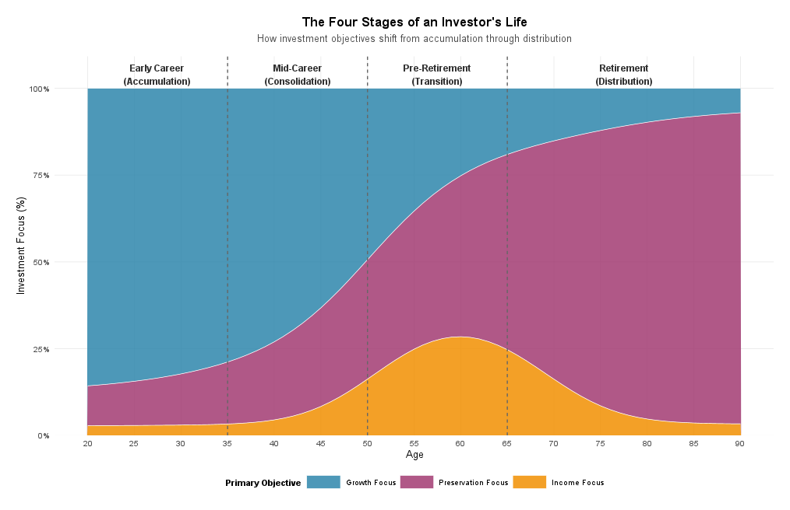
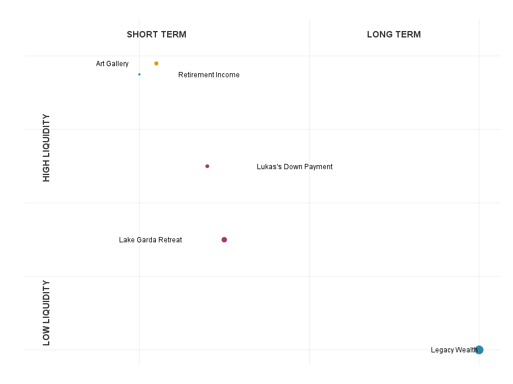
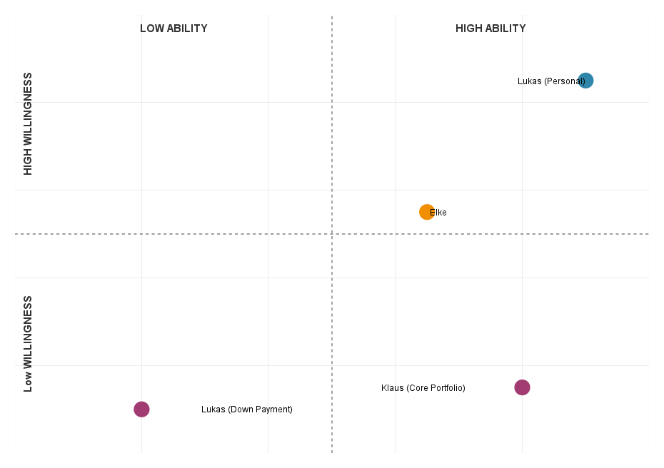
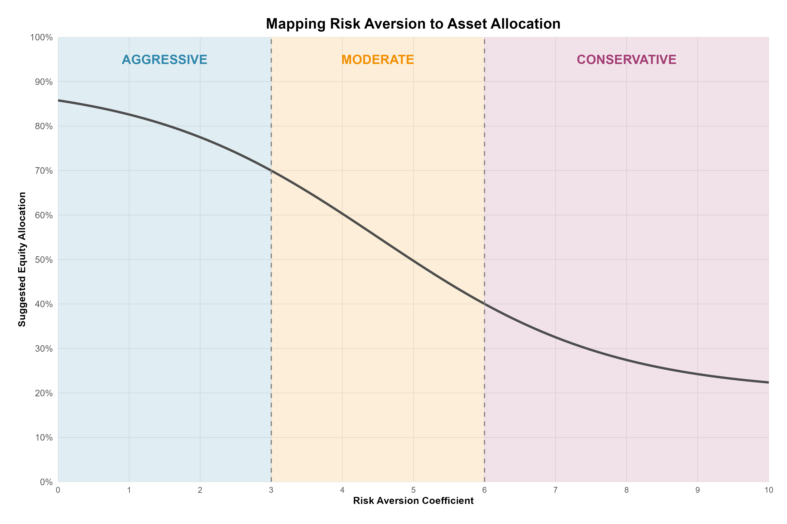
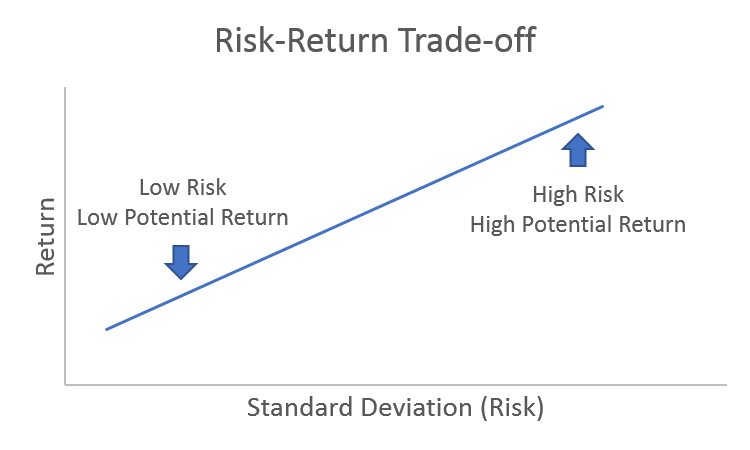
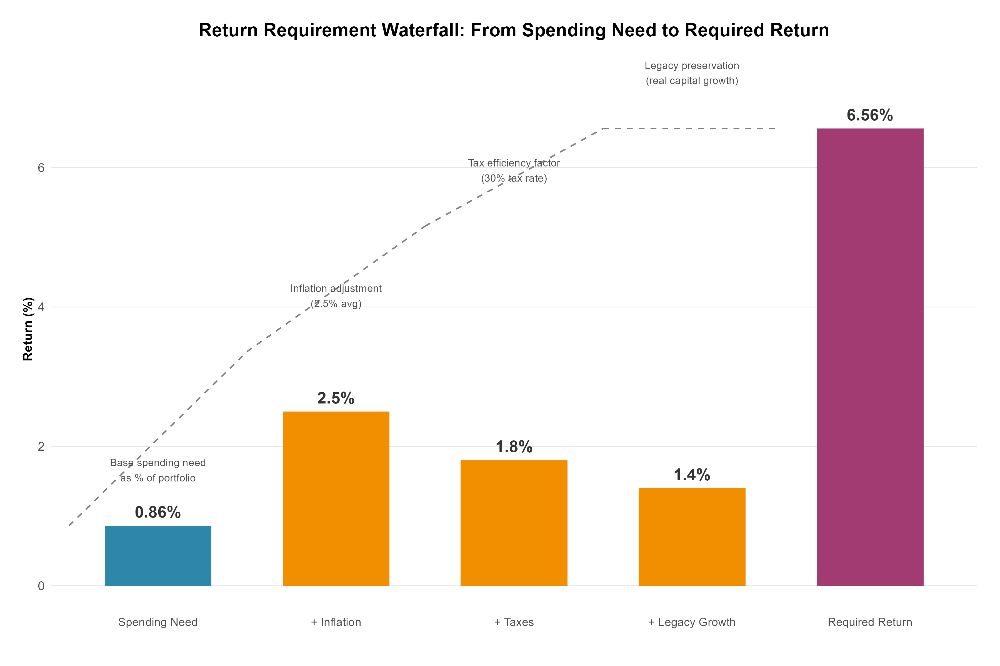
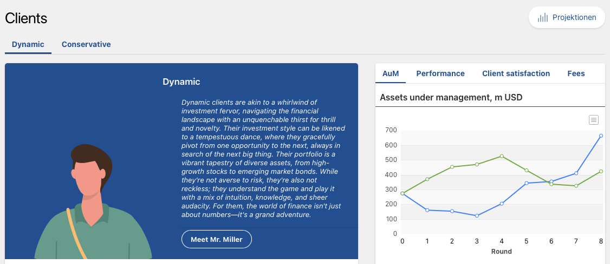

::: {.callout-tip title="Lecture Slides"}
**Associated slides:** [Lesson 3 — Client Discovery & the Investment Policy Statement](../slides/lesson-03-client-ips.html)
:::

## Introduction

In professional investment management, constructing a portfolio is only one part of the full process. Before any allocation decision is made, the manager must understand the individual for whom the portfolio is built. A strategy that fails to reflect a client's specific circumstances, goals, and behavioral biases cannot endure. The entire investment process depends on a thorough understanding of each client's needs, and this foundational step is termed client analysis.

Client analysis is the systematic work of gathering, verifying, and documenting both quantitative and qualitative information about the client. Its purpose is to ensure that every investment decision reflects what the client requires financially. The process provides the foundation for a strategy that is customized, ethically sound, and positioned to succeed. The framework for this analysis is formalized through the Know Your Client process, widely referred to as KYC. At its core, KYC compels the advisor to move beyond surface-level facts and develop a clear understanding of the client's financial situation, investment experience, and capacity to bear risk. Effective client analysis, however, treats KYC as only the starting point. The deeper goal is to move from "Know Your Client" to "Know Your Person." This shift means looking past the balance sheet and into the human dynamics that drive financial decisions. The product of a thorough client analysis is the Investment Policy Statement, or IPS. This written document serves as the blueprint for the investment relationship. It formally states the client's objectives and constraints, establishes the framework for portfolio construction, and provides a benchmark against which performance can be evaluated.

::: {.callout-tip title="In IMAG"}
Throughout the IMAG simulation, participants encounter a diverse range of investors—from growth-oriented entrepreneurs seeking aggressive capital appreciation to conservative clients prioritizing capital preservation. Success requires more than identifying surface-level characteristics. Participants must develop a comprehensive understanding of each investor's complete financial profile, including risk tolerance, investment horizon, liquidity needs, income requirements, and behavioral biases.

The consequences of misalignment between investor profiles and asset allocations extend beyond theoretical discomfort. Client satisfaction directly impacts fund demand and, consequently, assets under management (AUM). When allocations align with expectations, clients maintain their investments through market cycles, supporting stable AUM growth. Conversely, misaligned portfolios lead to redemptions during downturns or impatience during flat markets, eroding AUM and limiting future opportunities.

This chapter establishes the foundation for all subsequent portfolio decisions by guiding participants through the systematic process of translating investor descriptions into actionable constraints—minimum and maximum allocations, acceptable asset classes, and currency preferences that will shape the strategic asset allocation.
:::

## Case Study

### Scenario

We examine the financial position of the Schmidt-Miller family, who have engaged a wealth management firm to structure their affairs and construct an investment plan suited to their circumstances. The family resides in a stable Central European nation with robust economic fundamentals. The local tax framework imposes a progressive income tax with a top marginal rate of 40 percent on ordinary income and a separate 20 percent levy on realized capital gains. Tax-advantaged retirement vehicles are also available, permitting investments to compound without annual tax drag until funds are withdrawn.

### Meet the Schmidt-Miller Family

The household consists of three individuals: Klaus Schmidt-Miller (68), his wife Elke Schmidt-Miller (65), and their son Lukas Schmidt-Miller (28). Klaus and Elke have been married for three decades.

Klaus is an orthopedic surgeon nearing the end of an active career. Decades of long hours and procedural precision have earned him high professional standing, and he has served as the primary source of family income throughout the marriage. Elke spent twenty-five years as a school principal before retiring two years prior to this engagement. She stepped away from her career to pursue personal interests and spend more time with family. Their son Lukas works as a software engineer for a technology startup based in Berlin. He is unmarried and lives independently.

### Current Financial Situation and Upcoming Events

The family's financial position is approaching a period of significant change. Klaus has executed an agreement to sell his ownership stake in the surgical practice he helped to establish. The transaction is scheduled to close in approximately sixty days, and after settling all associated tax obligations, the family will receive a cash sum of €18 million. Meanwhile, Elke holds a portfolio of equities and fixed income instruments inherited from her parents. The current market value stands at €2.5 million, and the cost basis of these holdings is low. Disposing of the assets would therefore generate a substantial realized capital gain and a corresponding tax liability under the 20 percent rate.

The following table summarizes the family's balance sheet prior to the receipt of the €18 million from the practice sale.

| Asset Category | Value (€) | Notes |
|----------------|-----------|-------|
| Primary Residence (Zug) | 2,200,000 | Jointly held, unencumbered by debt. |
| Elke's Inherited Portfolio | 2,500,000 | Diversified holdings with low cost basis. |
| Klaus's Retirement Account | 800,000 | Tax-advantaged account invested in a conservative allocation. |
| Lukas's Startup Equity | 50,000 | Illiquid 5% stake in a private, pre-profit company. Value for tax purposes only; future value unknown. |
| Cash and Savings | 150,000 | High-yield deposit account. |

Klaus's current salary from the practice is €350,000 per year, a stream that will cease upon the sale closing. Elke receives an inflation-adjusted pension of €45,000 annually, and Lukas earns a salary of €70,000. Current household living expenses total approximately €150,000 per year. The Schmidt-Millers anticipate a modest increase in this figure during retirement to accommodate travel. The family carries no debt.

### Family Goals and Objectives

We begin by considering each family member's stated objectives and then integrate these individual goals into a single, coherent family strategy.

Klaus and Elke share several joint goals. Their primary objective is to generate a stable, after-tax cash flow of €160,000 per year, adjusted for inflation, starting immediately upon Klaus's retirement. This income stream must be reliable and sustainable over a multi-decade horizon. Within five years, the family also plans to acquire a vacation property on Lake Garda in Italy. The estimated total capital outlay is €2 million, including necessary renovations, and the property is viewed as a long-term family asset intended for eventual transfer to Lukas. Beyond the vacation home, Klaus and Elke wish to gift €400,000 to their son for a down payment on a primary residence in Berlin, a need they anticipate arising within three to five years. Underpinning all of these goals is a clear preference for wealth preservation to benefit Lukas and future generations.

Elke also holds a personal goal. She plans to allocate €500,000 from her inherited portfolio to establish a small art gallery in Lucerne. This is a commercial venture rather than a hobby, and while she accepts that early profitability is unlikely and operating losses may occur, she remains fully committed to the project. The capital is firmly earmarked and scheduled for deployment within one year. Lukas, for his part, seeks financial independence from his parents. He intends to remain with his current employer for at least three to five years to allow his equity stake to mature, though he views this holding as a speculative opportunity rather than a reliable source of future wealth. He will accept the €400,000 gift from his parents for a down payment on a Berlin condominium within that three-to-five-year window, while concurrently building his own savings.

### Observations and Risk Profiles

The financial data reveals specific constraints, and the psychological profiles reveal specific biases. We synthesize both to define the investment parameters for each family member.

**Klaus Schmidt-Miller**

Klaus exhibits a methodical and risk-averse disposition shaped by professional training that demanded precision and aversion to error. He regards the €18 million liquidity event as the tangible output of a career's labor, and his binding constraint follows directly from this view: the preservation of principal. He states outright that he cannot tolerate significant portfolio volatility or the prospect of permanent capital loss. While he supports Elke's gallery concept, he remains wary of the financial exposure it entails. His time horizon spans twenty-plus years in the retirement phase, and his risk tolerance is low.

**Elke Schmidt-Miller**

Elke demonstrates a values-oriented approach to capital. A strong sentimental connection to the securities she inherited makes her reluctant to sell specific positions, even when doing so would improve tax efficiency or portfolio diversification. She is enthusiastic about the gallery and views it as a meaningful use of her time, though her grasp of business risk may be incomplete relative to the capital commitment the project demands. Her time horizon is long-term for personal assets but shortens to one year for the gallery funding. Her risk tolerance is moderate, though it remains subject to the emotional attachment she holds toward the inherited holdings.

**Lukas Schmidt-Miller**

Lukas presents as an optimist comfortable with illiquidity and uncertainty. His professional environment in the startup sector reinforces a high tolerance for risk, and he perceives his parents' conservative stance as outdated. He is prepared to accept large short-term drawdowns in pursuit of long-term appreciation. His time horizon extends thirty-plus years. His risk tolerance is high for personal speculative assets but moderate for the near-term down payment requirement.

**Liquidity and Tax Constraints**

The plan must address a series of specific, dated liquidity demands. The immediate annual withdrawal of €160,000 must be funded from portfolio cash flow. Within one year, €500,000 must be available for the gallery. Within three to five years, a separate €400,000 must be available for Lukas's housing, and within five years, €2 million must be available for the Lake Garda property.

The €18 million from the practice sale arrives post-tax and can be deployed with full flexibility. Elke's €2.5 million portfolio, by contrast, carries an embedded tax liability. The 20 percent capital gains rate acts as a friction on any rebalancing or repositioning of those assets. Furthermore, the plan must account for the startup equity, an illiquid position with an undefined terminal value and no current income.

The central challenge lies in reconciling the family's aggregate return requirement with Klaus Schmidt-Miller's narrow tolerance for drawdown.

## Analyzing Client's Investment Goals

In constructing a tailored investment strategy, we must first isolate and define the specific financial objectives of the client. This analysis determines how portfolios are structured and governed, ensuring alignment with needs, preferences, and life circumstances. An investor's goals are shaped by two primary forces: the stage of life they occupy and the source of their wealth.

### Stages of Life

{#fig-elementwise}

A client's position within the financial lifecycle dictates investment objectives, risk capacity, and time horizon. Recognizing this position allows us to anticipate goals and design a strategy that adapts as circumstances evolve. The framework is grounded in the Life-Cycle Hypothesis (LCH) pioneered by @modigliani1954utility. Modigliani's theory suggests that individuals seek to smooth their consumption over their entire lifetime, borrowing when young, accumulating wealth during their most productive years, and dissaving during retirement.

While rooted in Modigliani's Life-Cycle Hypothesis, the practical application for wealth managers is typically organized into four distinct phases, a framework popularized by @maginn2007managing: Accumulation, Consolidation, Transition (Pre-Retirement), and Distribution (Retirement). However, the theoretical foundation for optimal life-cycle portfolio choice under uncertainty was established by @merton1969lifetime, @merton1975optimum and @samuelson1975lifetime. Crucially, their continuous-time stochastic models demonstrate that the optimal allocation to risky assets is not a simple deterministic function of age. Instead, it is a dynamic response to the stochastic nature of investment opportunities, the investor's evolving risk aversion, and the present value of future labor income, commonly referred to as human capital.

#### The Early Career Phase: Wealth Accumulation

This phase spans roughly ages twenty to thirty-five. Individuals establish professional footing during these years, with incomes starting modestly and increasing over time. Marriage, starting a family, and purchasing a first home often coincide with this period, and expenses can run high relative to income due to student debt, mortgage obligations, and childcare costs.

Despite these cash flow pressures, the investor in this phase possesses two valuable assets: time and human capital. Human capital (the present value of future expected labor income) represents a significant portion of total wealth. For an individual with a stable, predictable career trajectory, human capital behaves similarly to a risk-free bond. Consequently, to achieve a balanced total wealth profile, the financial portfolio should be allocated heavily toward growth-oriented assets. With a horizon stretching thirty to forty years until retirement, the early-career investor can accept significant portfolio volatility. Market downturns represent temporary events rather than permanent impairments. Recovery occurs through continued saving and the long-term compounding of returns.

The primary objective in this phase is wealth accumulation. Portfolios emphasize growth-oriented assets that may experience considerable price fluctuation but offer the highest expected returns over decades. Common goals include building emergency reserves, saving for a home down payment, initiating retirement contributions, and funding future education expenses for children.

#### The Mid-Career Phase: Wealth Consolidation

As investors move into their mid-career years, roughly ages thirty-five to fifty, they enter a consolidation phase. Income rises during this period, though expenses remain elevated and often reach their peak with children's education and mortgage payments.

Retirement now becomes a more concrete consideration. Investors have lived through market cycles and developed a clearer understanding of their true tolerance for risk. The investment approach shifts from pure growth toward a balanced posture, with portfolios typically including equities for appreciation and fixed income for stability. As human capital begins to peak and the time horizon shortens, the financial portfolio must increasingly compensate for the decreasing flexibility of future earnings. The time horizon remains long at fifteen to twenty-five years until retirement, but more accumulated wealth now requires protection. Goals diversify to include retirement savings, education funding, and perhaps a second home. The primary objective is wealth consolidation with continued growth: building upon the foundation established earlier while beginning to guard against downside risk.

#### The Pre-Retirement Phase: The Critical Transition

The pre-retirement phase, spanning roughly ages fifty to sixty-five, represents a fundamental transition. The end of earned income becomes visible, and investors face the challenge of converting savings into a reliable stream of retirement cash flow.

Major expenses such as mortgages and children's education may conclude during this period, freeing cash flow for final retirement contributions. Significant events also tend to cluster here: receiving inheritances, selling a business, or deciding when to claim pension benefits. The investment implications of this transition are substantial. Capital preservation becomes paramount, because a major market loss just before or during early retirement can permanently impair a portfolio's sustainability. This is the phenomenon known as sequence-of-returns risk. Furthermore, as the investor approaches retirement, human capital is rapidly depleting and being converted into financial capital. The financial portfolio must now absorb the shock of market downturns without the buffer of future wage income. Withdrawals made during a market downturn lock in losses and reduce the portfolio's capacity to recover.

The time horizon shortens to zero to fifteen years until significant withdrawals begin, leaving less opportunity to recover from losses. The psychological weight of protecting a lifetime's savings makes most investors more conservative during this phase. Liquidity planning becomes essential, and portfolios must be structured to provide reliable income through bond ladders, dividend-paying equities, or systematic withdrawal plans. The primary objective shifts decisively toward capital preservation and income preparation.

#### The Retirement Phase: Wealth Distribution

The final phase begins at retirement, typically around age sixty-five, and extends through the remainder of life. Earned income has ceased or reduced significantly, and human capital has been fully exhausted. The financial portfolio must now fund living expenses entirely.

A common misconception holds that the investment horizon ends at retirement. In reality, time horizons can stretch twenty to thirty years or longer. Healthcare and long-term care needs become growing considerations, while legacy planning and wealth transfer gain prominence. The investment challenge is balancing competing demands: the portfolio must generate sustainable, inflation-adjusted income while maintaining enough growth to outpace inflation. Risk capacity is limited because the portfolio is being drawn down for expenses, and the ability to recover from losses is constrained.

Willingness to accept risk varies among retirees. Those with sufficient guaranteed income from pensions may remain comfortable holding equities, while others become extremely conservative. Liquidity is critical in either case. A portion of the portfolio must be held in accessible assets to fund near-term expenses without forced sales during downturns. The primary objective is income generation combined with wealth preservation.

The following table summarizes the four phases, explicitly highlighting the role of human capital in driving the asset allocation shift:

| Phase | Name | Primary Objective | Income Focus | Human Capital State |
|-------|------|-------------------|--------------| --------------|
| 1 | Early Career | Growth | Very Low | High |
| 2 | Mid-Career | Growth with Preservation | Low | Peak |
| 3 | Pre-Retirement | Preservation | Peak | Rapidly converting to financial capital |
| 4 | Retirement | Preservation with Income | Moderate | Fully exhausted |

### Sources of Wealth

The client's stage of life reveals their position on the financial timeline. The source of their wealth reveals how they arrived there. This history shapes attitudes toward risk, emotional connection to money, and future investment goals. Two clients with identical net worth and identical life stages may require different investment strategies if their wealth originated differently. Understanding the source of wealth provides insight into the client's psychological relationship with money. Building on the typology established by @barnewall1987psychological, we distinguish between 'Active' investors, who created their own wealth and often demand control, and 'Passive' investors, who inherited wealth and may prioritize stewardship over growth.

Wealth typically originates from one of three primary sources, and each carries distinct implications for investment behavior.

**Earned Wealth**

The first category is wealth accumulated through active effort over time. This includes entrepreneurs who build and sell companies, executives who accumulate compensation over decades, and professionals such as doctors, lawyers, and consultants who convert human capital into financial assets.

Individuals with earned wealth often exhibit a high sense of ownership and responsibility for their money. They accumulated it through work, sacrifice, and skill, and they feel entitled to protect it. This manifests as significant loss aversion. A market decline feels not like an abstract number but like years of effort erased.

Entrepreneurs and business owners present a specific paradox. They may demonstrate high risk tolerance within their business operations yet become conservative with liquid wealth. The investment portfolio is viewed as the hard-won fruit of labor, something to be preserved rather than risked. Concentration risk may also be present if a significant portion of wealth remains tied to the original business or industry. From an investment perspective, these clients express a strong preference for capital preservation, particularly after a liquidity event such as a business sale. They may resist diversification if it means selling assets they associate with their success, and they often exhibit low willingness to accept risk even when a long time horizon suggests a higher capacity to do so.

**Inherited Wealth**

The second source is wealth received through transfer from previous generations. The recipient did not actively earn the money and may have no prior experience managing significant assets.

These individuals often feel a sense of stewardship. They view themselves as temporary custodians of family wealth that must be preserved for future generations, and they may experience guilt or anxiety about managing money they did not earn. This emotional burden can lead to excessive conservatism or, in some cases, careless behavior. The endowment effect, empirically demonstrated by @kahneman1990experimental, shows that individuals demand significantly more compensation to give up an asset than they would be willing to pay to acquire it. In practice, selling what they consider family stocks can feel like a betrayal, even when doing so is financially sound. Limited financial sophistication may also be present if the individual has never needed to earn or manage significant sums before.

Investment implications for inherited wealth center on preservation and legacy. The goal is often not substantial growth but ensuring the wealth endures for future generations. These clients may be unwilling to sell concentrated or tax-inefficient positions due to the emotional weight those holdings carry.

**Speculative or Windfall Wealth**

The third category encompasses fortunes made through speculation or sudden events. Lottery winnings, large legal settlements, speculative investment gains such as cryptocurrency appreciation, and startup equity that succeeded beyond expectations all fall into this group.

These individuals may hold a distorted perception of risk. Those who succeeded through a high-risk bet often underestimate the role of luck and overestimate their own skill, a pattern that leads directly to overconfidence. This self-serving attribution bias causes them to chase the next opportunity, believing they can replicate their past success. Furthermore, the behavioral phenomenon known as the "house money effect," documented by @thaler1990gambling, illustrates that individuals treat prior gains or windfalls differently from their initial endowment, often exhibiting increased risk-taking with money perceived as "house money" rather than their own capital. They may chase the next opportunity, believing they can replicate the success. At the other extreme, some windfall recipients experience intense anxiety. They fear losing what they did not truly earn, and this fear leads to excessive conservatism.

From an investment standpoint, these clients present a high risk of behavioral mistakes, whether through excessive risk-taking or excessive caution. They require careful education and gradual onboarding to investment concepts. Structure and discipline are necessary to prevent impulsive decisions, and some benefit from annuitization or other mechanisms that protect them from their own choices.

The following table summarizes the behavioral profiles associated with each wealth source.

| Source | Primary Behavioral Tendency | Key Investment Implication |
|--------|----------------------------|----------------------------|
| Earned Wealth | Loss Aversion | Strong preference for capital preservation; resistance to diversification. |
| Inherited Wealth | Endowment Bias | Emotional attachment to specific assets; focus on stewardship over growth. |
| Speculative/Windfall | Overconfidence or Anxiety | Distorted risk perception; requires structure and education. |

**Key Questions for Source of Wealth Analysis**

When analyzing a client's source of wealth, we explore several questions. How was this wealth created? Through years of effort, through inheritance, or through a single fortunate event? What emotions are attached to the money? Pride, guilt, anxiety, or a sense of burden? Has the client managed significant wealth before, or is this their first experience with substantial assets? Are there concentrated positions with emotional significance, such as inherited stock, company shares, or family business interests? How does the client view risk in relation to their wealth: as a threat to hard-won gains or as an opportunity to grow what was freely given? And finally, what legacy does the client wish to leave? Is wealth preservation for heirs a primary motivator?

### Behavioral Biases and Personality Types

Life stage reveals where a client stands in their financial journey. Source of wealth reveals how they acquired their money. To understand a client fully, we must also examine how they think about money and risk. This is the domain of behavioral finance, which examines the psychological factors that shape investment decisions. The academic foundation of this field was established by @kahneman1979prospect through Prospect Theory, which challenged the traditional economic assumption of 'rational' utility-maximization and introduced a descriptive model for how individuals actually evaluate gains and losses under uncertainty.

Every client carries a set of cognitive biases and personality traits. These can support or undermine long-term financial success. An advisor who recognizes these biases can design a portfolio that meets financial needs while protecting the client from their own psychological tendencies.

Behavioral biases are typically divided into two categories. Cognitive biases stem from faulty reasoning or information processing, while emotional biases stem from impulses or feelings. Both can lead to poor investment decisions, but they require different approaches. Cognitive biases can often be corrected through education and logical explanation. Emotional biases, by contrast, are more deeply rooted and must typically be accommodated within the portfolio structure rather than confronted directly.

#### Cognitive Biases

Cognitive biases arise from the mind's attempt to simplify information processing. This phenomenon is rooted in the concept of 'Bounded Rationality' introduced by @simon1955behavioral, which posits that human decision-making is limited by the information available, the cognitive limitations of the mind, and the finite amount of time available. To cope with these limits, the brain utilizes 'heuristics'—mental shortcuts that, while efficient, lead to systematic errors.

**Overconfidence Bias** occurs when individuals overestimate their knowledge, skill, or ability to predict future events. They may believe they can time markets, select winning stocks, or outperform professional managers. Theoretical models by @odean1998volume demonstrate that overconfident investors overestimate the precision of their private information, leading to excessive trading. Empirical evidence from @barber2000trading confirms this mechanism, showing that active trading significantly reduces net returns, with the most active traders systematically underperforming simple market benchmarks. This bias is common among individuals who have experienced recent success, such as young professionals in rapidly rising fields or entrepreneurs who have built successful businesses. They come to believe that success in one domain translates to investment skill.

**Confirmation Bias** is the tendency to seek information that confirms existing beliefs while ignoring contradictory evidence. An investor who believes a particular stock will rise reads analyst reports that support that view and dismisses negative news as irrelevant. This bias causes clients to hold losing positions too long, waiting for the market to validate their original thesis. In economic theory, @rabin1999confirmation formally model confirmatory bias, demonstrating how individuals systematically misinterpret ambiguous evidence as supporting their current hypotheses. This induces overconfidence and can lead to persistent suboptimal decision-making, as the agent fails to update their beliefs correctly and may come to believe a false hypothesis with near certainty, even when presented with an infinite amount of information.

**Anchoring Bias** occurs when individuals fixate on a specific reference point and make decisions based on that anchor rather than current fundamentals. Foundational research by @tversky1974judgment identifies anchoring as a primary heuristic in human judgment. In financial markets, this manifests clearly when a client who bought a stock at one hundred euros refuses to sell at sixty euros, waiting for a return to the anchor price, even if the company's prospects have deteriorated. 

**Mental Accounting** is the tendency to treat money differently depending on its source or intended use. The concept of mental accounting, introduced by @thaler1985mental, explains how individuals compartmentalize their wealth into separate cognitive accounts, violating the economic principle of fungibility. A client might maintain a conservative retirement portfolio while speculating on risky stocks with inherited money, failing to see that all wealth ultimately supports the same set of goals. Mental accounting leads to inefficient asset allocation as different accounts are managed in isolation rather than as components of an integrated, holistic portfolio.

#### Emotional Biases

Emotional biases arise from impulses, feelings, and intuition. They are harder to correct than cognitive biases because they are rooted in deep psychological needs.

**Loss Aversion** is perhaps the most powerful emotional bias. Foundational research in prospect theory demonstrates that the pain of a loss is psychologically about twice as powerful as the pleasure of an equivalent gain [@kahneman1979prospect]. Investors feel the sting of a ten thousand euro loss far more intensely than the joy of a ten thousand euro gain. In financial markets, this asymmetry directly drives the disposition effect. As formally modeled and empirically documented by @shefrin1985disposition, loss aversion leads investors to sell winning investments early to lock in gains (realizing pride) while holding losing investments too long in hopes of breaking even (avoiding the realization of regret). This pattern not only distorts individual portfolio returns but also causes clients to abandon well-designed plans during market downturns, selling at precisely the wrong time.

**Endowment Bias** is the tendency to value an asset more simply because one owns it. This bias explains why people demand a significantly higher price to sell something they own than they would be willing to pay to acquire it. The empirical reality of this effect was established by @kahneman1990experimental, who demonstrated that ownership creates an immediate psychological attachment that violates the standard economic assumption of fungibility. In investing, endowment bias manifests as an irrational attachment to inherited assets, concentrated company stock, or long-held investments. Clients refuse to sell not because of objective fundamental analysis, but because the assets feel like an extension of their identity.

**Regret Aversion** is the tendency to avoid decisions that could later become a source of regret. The foundational economic theory of regret, developed independently by @loomes1982regret and @bell1982regret, demonstrates that decision-makers derive disutility not just from the absolute outcome of a choice, but from the comparison of that outcome with the outcome of the forgone alternative. An investor who fears regret may avoid selling a losing position because doing so would crystallize the loss and force them to acknowledge their error. Alternatively, they may avoid equities altogether because a market decline would cause painful regret. This bias leads to inertia, status quo maintenance, and missed opportunities.

**Status Quo Bias** describes a preference for the current state of affairs, even when change would be objectively beneficial. As demonstrated by @samuelson1988status, clients resist change because it requires cognitive effort, introduces uncertainty, and triggers loss aversion. This bias explains why investors hold the same asset allocation for years without rebalancing, why they stay with underperforming advisors, and why they delay important financial decisions until forced to act.

**Self-Control Bias** arises when clients prioritize short-term gratification over long-term goals. Modeled by @thaler1981economic as an intrapersonal conflict between a farsighted "planner" and a myopic "doer," this bias leads individuals to spend today what should be saved for tomorrow. This bias is particularly relevant for younger clients who struggle to save and for retirees who overspend early in retirement, jeopardizing their long-term security.

#### Personality Types in Investing {#sec-personality-types}

Beyond specific cognitive and emotional biases, investor behavior is shaped by broader personality archetypes. In applied portfolio management, the standard framework for categorizing these behavioral patterns is the model developed by @bailard1986personal, which is widely adopted in professional wealth management curricula [@maginn2007managing]. 

The BBK model evaluates investors along two primary axes: their level of confidence in their financial decisions, and their approach to information processing (ranging from highly analytical to highly impulsive). Based on the intersection of these dimensions, investors are typically classified into five distinct personality types. Understanding these archetypes allows us to anticipate behavioral drivers, tailor our communication, and design a portfolio structure that aligns with the client's natural decision-making style.

**The Straight Arrow**

This type represents the middle ground of both the confidence and analytical spectrums. Straight arrows generally view themselves as reasonably knowledgeable about investing and take a balanced, moderate approach to portfolio management. They are neither paralyzed by fear nor driven by impulsive urges. Because they exhibit a relatively stable and predictable behavioral profile, they respond well to standard, well-diversified portfolios and require only routine advisor communication to stay aligned with their long-term plan.

**The Methodical Investor**

Methodical investors score high on confidence and analytical thinking. They rely heavily on quantitative data, rigorous research, and hard facts. These investors often spend significant time analyzing market trends or evaluating complex strategies. Because their decisions are rooted in data rather than emotion, they rarely develop irrational attachments to specific assets. However, their constant pursuit of new information can sometimes lead to over-analysis. Advisors must respect their analytical nature by providing deep, data-driven research and transparent performance attribution.

**The Cautious Investor**

Cautious investors are highly analytical but lack confidence in their financial decisions. They are deeply averse to potential losses and possess a strong need for financial security. While they diligently gather information and analyze data, their fear of making a mistake often leads to decision paralysis. They may miss attractive market opportunities because they are overly focused on downside risk. Portfolios for cautious investors should emphasize capital preservation and low volatility. Advisors must provide frequent reassurance, clear communication, and a steady hand during periods of market stress.

**The Individualist**

Individualists are highly confident but moderately analytical. They are independent thinkers who actively seek out information but are not afraid to deviate from consensus views. These investors place immense faith in their own insights and are willing to take contrarian positions. While their independence can lead to strong conviction and long-term success, it can also result in concentrated bets or a dismissal of professional advice. Advisors should act as objective sounding boards, providing rigorous stress-testing of the client's ideas while respecting their autonomy.

**The Spontaneous Investor**

Spontaneous investors exhibit low confidence in their deep analytical abilities but score high on impulsivity. They are highly reactive to market news, often fearing that they are missing out on the latest trend. Consequently, they tend to over-manage their portfolios, resulting in excessively high turnover. This constant second-guessing and frequent trading typically destroy wealth through transaction costs and poor market timing. Advisors must impose strict discipline and structure, utilizing automated rebalancing rules and clearly defined investment policy statements to prevent emotionally driven, impulsive trades.

| Personality Type | Confidence Level | Decision Style | Primary Need from Advisor |
|------------------|------------------|----------------|---------------------------|
| Straight Arrow | Moderate | Balanced | Standard diversification; routine communication |
| Methodical | High | Highly Analytical | Deep, data-driven research; transparent attribution |
| Cautious | Low | Highly Analytical | Reassurance, capital preservation, and downside protection |
| Individualist | High | Independent | Objective stress-testing; respect for contrarian views |
| Spontaneous | Low | Impulsive | Strict discipline, automated processes, and trading guardrails |

#### Integrating Behavioral Dimensions

The most complete client analysis integrates three dimensions: life stage, source of wealth, and behavioral profile. Together, they create a full picture of the client's investment personality. The following framework guides this integration.

First, we identify the client's position in the financial lifecycle. This establishes the appropriate balance between growth and preservation based on time horizon and proximity to retirement. Second, we examine the origin of the client's wealth, which reveals emotional connections to money and potential psychological friction points in the investment process. Third, we assess the client's dominant behavioral biases and map them to the BBK personality types. This final step determines which constraints are flexible and which are fixed.

The output of this integration is a clear statement of the client's primary objective and binding constraint. The objective defines what the portfolio must achieve. The constraint defines what the portfolio cannot do.

#### Application to the Schmidt-Miller Family

We now apply this framework to each member of the Schmidt-Miller household, integrating life stage, wealth source, and behavioral profile into a clear statement of objectives and constraints for every individual.

**Klaus Schmidt-Miller**

Klaus stands in the pre-retirement life stage. Although his time horizon extends twenty-plus years, the shift from earning to spending is imminent, and his primary objective reflects this transition: capital preservation to guard against sequence-of-returns risk. The wealth at stake is earned. The €18 million from the sale of his practice represents decades of labor and sacrifice, and Klaus regards this sum as the tangible output of his career. His emotional connection to the capital is one of deep ownership and protectiveness.

Loss aversion dominates his behavioral profile. For Klaus, the pain of a potential loss outweighs the pleasure of an equivalent gain by a factor of approximately two. His personality aligns with the Cautious investor type in the Bailard, Biehl, and Kaiser framework [@bailard1986personal]. Although his profession as a surgeon required meticulous, analytical thinking, his low willingness to accept market risk and deep aversion to losses define his investment personality. Cautious investors have a strong need for financial security and are deeply averse to potential losses, often leading to an excessive preference for capital preservation and a reluctance to accept necessary risk. Taken together, these dimensions produce a sharply defined profile. His primary objective is capital preservation to fund a sustainable retirement income stream of €160,000 annually, adjusted for inflation. His binding constraint is extreme loss aversion. The portfolio cannot expose principal to significant volatility, because any strategy that risks material drawdowns will cause psychological distress and may trigger panic selling during market declines.

**Elke Schmidt-Miller**

Elke is in the early retirement life stage. She has already ceased earned income and receives only a small pension, yet her time horizon remains long at twenty-plus years. Her objective from this stage blends income generation with continued modest growth. The composition of her wealth is mixed. She shares in the family's joint assets derived from Klaus's earned wealth, but she also holds a separate €2.5 million portfolio that is inherited. It is the inherited portion that creates a distinct psychological profile, one governed by a different set of emotional rules.

Endowment bias is Elke's dominant behavioral tendency. Her baseline personality aligns with the Straight Arrow type, representing a moderate, balanced approach to financial decisions. However, her inherited portfolio is heavily distorted by the endowment effect and mental accounting. While a typical Straight Arrow might objectively evaluate the entire portfolio, Elke treats the inherited assets as a separate mental account, exhibiting Cautious traits specifically regarding this legacy. She is deeply averse to the potential "loss" of her parents' securities, valuing them more simply because she owns them and because they connect her to her past. The integration of these dimensions yields a profile centered on honoring her parents' legacy while contributing to the family's income needs and funding her art gallery venture. Her binding constraint is the reluctance to sell inherited positions, even when diversification or tax efficiency would improve the overall portfolio. The plan must either accommodate this attachment or address it through gradual education rather than forced liquidation.

**Lukas Schmidt-Miller**

Lukas occupies the early career life stage. His time horizon for retirement savings exceeds thirty years, and his objective is aggressive wealth accumulation. He can accept significant volatility in pursuit of long-term growth. His personal wealth combines earned salary with speculative startup equity. The equity stake, a 5 percent holding in a private, pre-profit company, is illiquid and carries an undefined terminal value. Its source is speculative.

Overconfidence is Lukas's dominant bias. He believes in his ability to identify opportunities and succeed where others might fail. His personality matches the Individualist type. Individualists are highly confident, independent thinkers who are comfortable with ambiguity and willing to take calculated risks. They place immense faith in their own insights and are not afraid to deviate from consensus views, such as investing in a speculative startup. These traits serve him well in his professional environment but create risk when applied to near-term financial goals. His primary objective is wealth accumulation and financial independence through continued career growth and his equity stake. The binding constraint is that his overconfidence and Individualist tendencies, while appropriate for long-term speculative assets, must not influence the management of the €400,000 down payment for a Berlin condominium due within three to five years. These two pools of capital require separate treatment.

**Synthesis of Family Profiles**

The following table consolidates the three-dimensional analysis for each family member, mapping them to the BBK personality framework.

| Family Member | Life Stage | Wealth Source | Dominant Bias | BBK Personality Type | Primary Objective | Binding Constraint |
|---------------|------------|---------------|---------------|----------------------|-------------------|--------------------|
| Klaus | Pre-Retirement | Earned | Loss Aversion | Cautious | Capital preservation for retirement income | Cannot tolerate principal volatility |
| Elke | Early Retirement | Inherited | Endowment Bias | Straight Arrow (with Cautious traits for inherited assets) | Honor legacy; fund gallery; support income | Reluctant to sell inherited assets |
| Lukas | Early Career | Speculative | Overconfidence | Individualist | Long-term wealth accumulation | Must separate speculation from near-term needs |

This synthesis confirms the central challenge we identified at the outset. The family's aggregate investable assets total approximately €21.45 million, and the stated goals demand a nominal pre-tax return of 6 to 8 percent. Achieving such a return typically requires a portfolio allocation with material exposure to equities and other growth assets. Klaus's Cautious personality and extreme loss aversion, however, set a hard boundary on acceptable volatility. A standard portfolio built to deliver 6 to 8 percent will almost certainly exceed his tolerance for drawdown. Elke's endowment bias compounds the difficulty, because her €2.5 million inherited portfolio carries both a low cost basis and an emotional weight that resists repositioning.

The plan we construct must bridge this gap. It must pursue the required return without violating Klaus's psychological limits or dismissing Elke's connection to her inheritance. Meeting this challenge demands a departure from a simple, single-portfolio approach. We must consider structuring distinct sub-portfolios, each aligned to a specific goal and time horizon. This technique is the subject of the sections that follow.

### Identifying Short-term and Long-term Financial Goals

Goals are the destination toward which the investment plan is oriented, and they must be defined with precision. A goal without a specific time horizon and capital requirement cannot be reliably funded. Financial goals typically fall into three categories based on their time horizon.

**Short-Term Goals**

Short-term goals are those to be achieved within zero to three years. Examples include saving for a major purchase such as a vehicle, funding a wedding, or building an emergency reserve. Because the time frame is compressed, investments intended to fund short-term goals must prioritize capital preservation and liquidity over growth. There is simply insufficient time to recover from a market decline, and volatility represents the primary risk to any short-term plan.

**Medium-Term Goals**

Medium-term goals span roughly three to ten years. This category includes saving for a home down payment, funding a child's university education, or starting a business. These goals demand a careful balance. Some growth is needed to outpace inflation and build the required capital, yet the horizon remains short enough that a significant market loss close to the goal date could prove damaging. Medium-term goals are therefore often funded with a blend of growth assets and conservative holdings, with the allocation shifting toward preservation as the target date approaches.

**Long-Term Goals**

Long-term goals extend beyond ten years and often stretch across decades. Retirement savings are the classic example, but this category also includes building a legacy for children or grandchildren, funding a second home for later years, or accumulating wealth to provide lifelong financial independence. Long time horizons allow investors to accept significant volatility in pursuit of higher returns, because ample opportunity exists to recover from downturns through continued saving and compounding.

The following table summarizes the characteristics of each goal category.

| Goal Category | Time Horizon | Primary Risk Concern | Appropriate Asset Focus |
|---------------|--------------|----------------------|--------------------------|
| Short-Term | 0 to 3 years | Volatility | Capital preservation; high liquidity. |
| Medium-Term | 3 to 10 years | Significant loss near target date | Blend of growth and preservation. |
| Long-Term | 10+ years | Inflation eroding purchasing power | Growth-oriented assets. |

### Understanding Client's Liquidity Needs and Time Horizon

Every investment goal carries two defining characteristics that shape how the capital intended to fund it must be managed. The first is the liquidity requirement, which specifies how quickly and with what certainty the funds must be available when needed. The second is the time horizon, which specifies how many years remain until the funds will be called upon. Together, these factors determine the appropriate asset allocation for each goal and, by extension, for the portfolio as a whole.

Liquidity refers to the ability to convert assets into cash quickly without incurring a significant loss of value. Cash held in a deposit account is perfectly liquid, while a publicly traded stock is highly liquid, though its value at the time of sale may fluctuate. A private business interest or a direct real estate holding, by contrast, is illiquid. Such assets cannot be converted to cash rapidly without accepting a substantial discount to their intrinsic value. Some goals require immediate or near-immediate liquidity. An emergency fund intended to cover unexpected expenses must be accessible within days, if not hours. A planned major purchase with a fixed date, such as a property closing, demands that the full amount be available on a specific day. For these goals, the assets set aside must be held in instruments that offer high liquidity and stable value, even though such instruments typically provide minimal returns. The cost of illiquidity in these situations, whether being forced to sell a volatile asset at a depressed price or being unable to complete a planned transaction, far outweighs the benefit of any additional return that might have been earned.

The time horizon is the expected number of years until funds will be needed. This is not simply a function of the client's age. A client aged sixty may have a thirty-year horizon for retirement spending, because withdrawals will occur gradually over decades. That same client may have a one-year horizon for a planned home renovation. Each goal carries its own clock. The length of the time horizon dictates the portfolio's capacity to absorb volatility. A goal with a horizon of one year has no capacity to recover from a market decline, and the funds must be preserved with near certainty. A goal with a horizon of five years has some capacity to accept modest volatility, because time remains for a recovery before the funds are required. A goal with a horizon of twenty years or more has substantial capacity to accept volatility, since short-term fluctuations become irrelevant to the long-term outcome.

These two dimensions interact in predictable ways. A goal with a short time horizon and a high liquidity requirement demands the most conservative positioning. A goal with a long time horizon and a low liquidity requirement can be positioned for growth. The portfolio as a whole must therefore be constructed not as a single block with a single allocation but as a series of segments, each aligned with the time horizon and liquidity requirements of a specific goal. This approach prevents the forced sale of volatile assets during market downturns to meet near-term cash needs. The assets funding short-term goals are held in stable, liquid instruments, while the assets funding long-term goals can be invested for growth because they will not be touched during periods of market stress. The client can observe that their essential near-term needs are fully secured, which provides the psychological comfort necessary to tolerate volatility in the long-term segment.

#### Application to the Schmidt-Miller Family

We now apply these frameworks to the specific goals of the Schmidt-Miller household. The family's goals span all three time horizons and carry distinct liquidity requirements, making them a useful illustration of how time and liquidity interact in practice.

**Immediate Income Requirement**

The most pressing need is the €160,000 annual income required to fund their retirement lifestyle, starting immediately upon the sale of Klaus's practice. This is not a lump-sum goal but an ongoing liquidity requirement that will persist for the remainder of their lives.

The time horizon is immediate and ongoing, and the liquidity need is high. The first year's withdrawals must be readily accessible in cash or near-cash instruments. This means a portion of the portfolio must be held in highly liquid, low-volatility assets to fund this spending without forcing the sale of growth assets during a market decline.

**Elke's Art Gallery**

Elke requires €500,000 within approximately one year to open her gallery in Lucerne. This qualifies as a short-term goal with a one-year horizon and a high liquidity need, since the full amount must be available on a specific date. These funds must therefore be kept in instruments offering near-complete capital preservation. There is no time to recover from a loss, and equity market exposure is inappropriate for this specific goal.

**Lukas's Down Payment**

The parents intend to provide a gift of €400,000 to assist Lukas with a down payment on a Berlin condominium. The expected timing is three to five years, placing this goal in the medium-term category. The liquidity need is moderate to high at the target date. This capital can tolerate modest volatility but must be protected from significant decline. A portfolio of high-quality short-to-intermediate term bonds or a conservative balanced fund may be suitable, and the allocation should become more conservative as the target date approaches. The family should also determine whether the purchase date is fixed or flexible, because flexibility would allow for slightly more growth exposure.

**Lake Garda Residence**

The family intends to purchase a vacation property on Lake Garda in five years at an estimated cost of €2 million. This goal sits at the boundary between medium-term and long-term, with a five-year horizon and high liquidity required at the target date. Five years is a relatively short horizon for full equity exposure. The family could consider a modest allocation to growth assets if they have flexibility in the purchase timing. If the market declines in year four, could they delay the purchase by one or two years? A fixed and non-negotiable date would warrant a more conservative approach, and this must be clarified during plan construction.

**Legacy and Long-Term Wealth Preservation**

The family expresses a firm desire to preserve wealth for Lukas and future grandchildren. This is an open-ended long-term goal with a horizon of thirty-plus years and a low liquidity need. This portion of the portfolio can therefore be invested for growth. It can accept significant volatility in exchange for the higher returns needed to fund decades of retirement spending and to preserve wealth across generations.

**Aggregate Capital Segmentation**

After accounting for the specific dated goals and the initial income reserve, we can estimate the segmentation of the family's total investable assets. The total core investable assets are approximately €21.45 million, comprising the €18 million from the practice sale, Elke's €2.5 million inherited portfolio, Klaus's €800,000 retirement account, and €150,000 in cash savings.

The following table summarizes the goal-based segmentation.

| Goal | Amount (€) | Time Horizon | Category | Recommended Asset Focus |
|------|------------|--------------|----------|--------------------------|
| Year 1 Retirement Income | 160,000 | Immediate | Short-Term | Cash or cash equivalents. |
| Elke's Art Gallery | 500,000 | 1 year | Short-Term | Capital preservation; high liquidity. |
| Lukas's Down Payment | 400,000 | 3 to 5 years | Medium-Term | Conservative blend; shift to preservation. |
| Lake Garda Residence | 2,000,000 | 5 years | Medium/Long-Term | Modest growth with flexibility; or conservative if fixed. |
| Long-Term Portfolio | ~18,390,000 | 30+ years | Long-Term | Growth-oriented to meet return target and legacy goals. |

This segmentation clarifies the path forward. The near-term and medium-term goals require approximately €3.06 million in capital allocated to conservative, liquid instruments. The remaining long-term portfolio of approximately €18.39 million must generate the bulk of the return required to meet the family's 6 to 8 percent target.

The central challenge, however, remains unchanged. The long-term portfolio must pursue growth to achieve the required return, yet Klaus's loss aversion limits the volatility this portfolio can exhibit. The plan must reconcile this tension, likely through a combination of a clearly defined liquidity reserve for near-term needs and a carefully calibrated growth allocation for the long-term portfolio that respects Klaus's psychological boundary.

{#fig-elementwise}

## Assessing Risk Tolerance

With the family's goals defined and understood in the context of their life stages, sources of wealth, and behavioral profiles, we must now assess their risk tolerance with precision. Risk tolerance is not a single number. It is a construct comprising two distinct components that must be evaluated separately and then reconciled.

The first component is the ability to take risk. This is objective and quantifiable. It depends on factors that can be measured and verified: the length of the investment time horizon, the stability of income sources, the size of existing wealth relative to spending needs, and the flexibility embedded within stated goals. A client with a long time horizon, stable employment, substantial assets, and discretionary goals possesses a high ability to take risk. They can absorb market declines without altering their lifestyle or abandoning their plans. A client who is about to retire, has no earned income, limited assets, and non-negotiable spending needs possesses a low ability to take risk. For such a client, a significant loss would force material changes to their intended retirement. Ability is about capacity, not preference, and it defines the upper boundary of prudent risk-taking.

The second component is the willingness to take risk. This is subjective and psychological. It reflects the client's emotional comfort with uncertainty and the prospect of loss. Willingness is shaped by personality, by past experiences with markets, and by the source of the wealth being invested. A client who built a business through years of effort may feel protective of the resulting capital. A client who received an inheritance may feel a sense of stewardship that discourages risk-taking. A client who succeeded through speculation may feel emboldened to take more risk than is prudent. Willingness defines the emotional boundary of acceptable portfolio behavior.

These two components do not always align. A client may have a high ability to take risk but a low willingness. In such cases, the advisor must respect the lower of the two. A portfolio that exceeds the client's willingness to take risk will be abandoned at the worst possible moment. The client will sell during a market decline, locking in losses and defeating the plan's purpose entirely. The mathematically optimal portfolio that the client cannot hold is inferior to a suboptimal portfolio the client can sustain. Conversely, a client with high willingness but low ability must be educated and restrained. Their enthusiasm for risk must not be allowed to jeopardize their financial security. The advisor's role is to protect the client from both external market forces and internal psychological tendencies.

{#fig-elementwise}

### Methods for Evaluating Client's Risk Appetite

Several methods exist to assess a client's risk tolerance. Each contributes a different type of information, and the most complete assessment draws from all available sources.

Questionnaires provide a structured, quantifiable baseline. These instruments present hypothetical scenarios and ask clients to indicate their preferences. A typical question might ask how the client would respond to a 20 percent decline in portfolio value over a six-month period. Would they sell everything, sell a portion, do nothing, or invest more? The scores from such questionnaires can be normalized and compared across clients, offering a useful starting point for discussion. Questionnaires do have limitations, however. Clients may answer differently depending on their mood, the phrasing of questions, or recent market experience. A client emerging from a prolonged bull market may overestimate their tolerance for risk, while one who has recently suffered losses may underestimate it. Questionnaires also cannot capture the nuanced reasons behind a client's responses. They measure the "what" but not the "why."

Personal interviews are therefore essential. Through conversation, we can explore the stories behind the numbers. We can ask what the client remembers about previous market downturns and how they reacted in real time, not how they imagine they would react in a hypothetical. We can explore what a deceased parent would have wanted for the money they left behind. We can discuss how the client would feel if a speculative investment became worthless and what that outcome would mean for their other goals. These conversations reveal not just what clients think but how they feel. A client who states on a questionnaire that they can tolerate a 20 percent decline may behave differently when that decline actually occurs and the loss represents real money with real history and real meaning attached.

Behavioral observation provides a third source of insight. Past behavior is often the best predictor of future behavior during periods of market stress. Does the client check account values daily? Do they call in a panic during normal market fluctuations? Have they held losing positions far too long in the past, unable to accept the crystallized loss? Have they sold winning positions too early to lock in gains? These patterns, if present, reveal the client's true psychological relationship with risk more accurately than any stated preference.

Beyond questionnaires and interviews, we can use more formal methods to quantify risk aversion. One approach involves presenting clients with a series of choices that reveal underlying preferences. The advisor describes a risk-free asset earning a known return and a risky portfolio with known volatility and expected excess return. The client is then asked what percentage of their wealth they would allocate to the risky portfolio, and the answer implies a specific coefficient of risk aversion. This quantitative method of assessing utility under uncertainty is grounded in the Arrow-Pratt measure of risk aversion [@arrow1965aspects; @pratt1978risk], which allows advisors to translate psychological temperament into a mathematical input for portfolio construction.

Consider a practical example. Assume the risk-free rate is 2 percent and the expected return on a diversified equity portfolio is 6 percent, with volatility of 20 percent. The excess return is therefore 4 percent. If a client indicates they would allocate 25 percent of their wealth to equities, this implies a risk aversion coefficient of approximately 6. If they would allocate 60 percent, the implied coefficient is approximately 2.5. The advisor can vary the assumptions to test consistency. If the expected excess return increases, does the client's allocation increase appropriately? A client whose allocation does not respond to changes in expected return may not fully understand the relationship between risk and reward, indicating a need for further education. A risk aversion coefficient above 6 suggests a conservative profile. A coefficient between 3 and 6 suggests a moderate profile, and a coefficient below 3 suggests an aggressive profile. This quantitative anchor complements the qualitative insights gained through interviews, helping translate psychological profiles into specific portfolio construction parameters.

### Psychological Aspects of Risk Tolerance

The psychological aspects of risk tolerance bring the behavioral biases identified earlier into sharp focus. These biases shape not only how clients answer risk tolerance questions but how they experience risk when it materializes.

Loss aversion creates an asymmetry in how risk is felt. The pain of a loss outweighs the pleasure of an equivalent gain by a factor of approximately two, meaning that a portfolio with symmetric return potential will feel unbalanced to a loss-averse client. The declines dominate the emotional experience, even if the long-term return is positive and meets all stated objectives. For a client with strong loss aversion, the portfolio must therefore limit downside volatility even if that constraint reduces expected return. The psychological cost of the occasional decline exceeds the financial benefit of the additional expected gain.

Endowment bias creates a situation in which risk tolerance is not uniform across all assets. A client may express moderate tolerance for risk in the abstract yet become protective and resistant when the conversation turns to inherited securities or long-held positions. The origin and meaning of the assets change the client's willingness to accept volatility. An asset received from a parent carries emotional weight that a recently purchased index fund does not. The client may be willing to see the index fund fluctuate but unwilling to sell or reallocate the inherited stock, even when doing so would improve diversification or tax efficiency.

Overconfidence leads clients to believe they can manage risk better than they actually can. They may state a high tolerance for risk based on an unrealistic belief in their ability to time markets or select winning investments. This stated tolerance may not reflect their actual emotional response when losses occur, nor does it reflect their actual skill. Overconfident clients often discover their true risk tolerance only during a market decline, when the losses they believed they could avoid or outsmart materialize anyway.

These psychological factors mean that risk tolerance assessment cannot rely solely on a client's stated preferences. The advisor must probe beneath the surface, looking for inconsistencies between what the client says and what their history and behavior suggest. The goal is to identify the client's true risk tolerance: the level of volatility they can actually sustain through a full market cycle without abandoning the plan.

### Matching Risk Tolerance with Investment Strategies

Once risk tolerance is assessed, it must be matched with appropriate investment strategies. This matching process ensures that the portfolio's risk characteristics align with the client's ability and willingness to bear uncertainty.

Conservative strategies are appropriate for clients with low risk tolerance, typically those with risk aversion coefficients above 6. These strategies prioritize capital preservation and income stability over growth. Portfolios might include 60 to 80 percent in high-quality bonds, with the remainder in diversified equities, often biased toward stable, dividend-paying companies. Cash and cash equivalents may represent a meaningful allocation to provide liquidity and reduce portfolio volatility. The primary objective is to limit the frequency and severity of losses, even if this means accepting lower long-term returns. For a client with strong loss aversion, a conservative strategy provides the psychological safety required to remain invested through market cycles.

Moderate strategies suit clients with risk aversion coefficients between 3 and 6. These strategies seek a balance between growth and preservation, typically with equity allocations between 40 and 60 percent and the remainder in fixed income. Diversification across asset classes, geographies, and investment styles is emphasized to smooth returns without sacrificing growth potential. The client accepts some volatility in exchange for higher expected returns but still requires a meaningful cushion against severe downturns.

Aggressive strategies are designed for clients with high risk tolerance, those with coefficients below 3. These strategies focus on capital appreciation, with equity allocations of 70 percent or more. They may include exposure to smaller companies, emerging markets, or other higher-risk segments. Volatility is expected and must be tolerated. The long time horizon and high risk capacity of these clients allow them to ride out significant declines in pursuit of higher long-term returns.

Risk tolerance is not necessarily uniform across all of a client's assets. The goal-based segmentation discussed earlier allows for different risk profiles to be applied to different pools of capital. A client may hold a conservative allocation for near-term spending needs and an aggressive allocation for long-term legacy assets. This approach can help reconcile conflicting risk tolerances within a single household and provide a framework for addressing situations where ability and willingness diverge.

{#fig-elementwise}

### Application to the Schmidt-Miller Family

We now apply this risk assessment framework to each member of the Schmidt-Miller household. The analysis reveals distinct profiles that must be reconciled within a single family plan.

Klaus Schmidt-Miller presents a clear case of misalignment between ability and willingness. His ability to take risk is substantial. He has a long time horizon of twenty-plus years for retirement spending, significant wealth with €18 million arriving post-tax from the sale of his practice, and additional assets providing a buffer against adversity. His goals include discretionary items such as the Lake Garda property that could be delayed if necessary. A purely objective assessment of his financial circumstances would conclude that Klaus can afford to accept meaningful portfolio volatility in pursuit of higher returns.

His willingness to take risk, however, is low. The earned wealth creates a deep sense of ownership and protectiveness. The €18 million represents decades of work, sacrifice, and skill, and Klaus views this capital not as an abstract pool of assets but as the tangible output of his career. His loss aversion bias means that market declines cause disproportionate psychological pain, while his prudent planner personality demands predictability and safety. In an interview, Klaus would likely state that he cannot tolerate seeing his account balance decline by more than 10 percent in any given year. A questionnaire would confirm a conservative profile, and the risk aversion experiment would likely yield a coefficient above 7, implying an equity allocation below 20 percent for his comfort level.

The implication is clear. Klaus's willingness to take risk, not his ability, is the binding constraint for the core family portfolio. The portfolio must be structured to minimize the frequency and severity of losses, even if this means accepting lower long-term returns. Any portfolio that exceeds Klaus's comfort level, even if mathematically justified by his time horizon and wealth, will be abandoned during the first significant market decline. The plan must respect this psychological boundary.

Elke Schmidt-Miller presents a more layered profile. Her ability to take risk is also substantial. She is retired but has a long horizon, shares in the family's significant wealth, and receives a stable pension of €45,000 annually that covers a portion of baseline expenses. Her willingness to take risk is moderate in the abstract. She might indicate on a questionnaire that she can tolerate moderate portfolio fluctuations, and the risk aversion experiment might yield a coefficient between 4 and 5, suggesting a balanced allocation.

This stated tolerance, however, applies unevenly across her assets. When the conversation turns to her inherited portfolio of €2.5 million, her responses become more protective. Her endowment bias creates an emotional attachment to these specific securities. They belonged to her parents, and selling them feels like a betrayal of that legacy, even when doing so would improve diversification or tax efficiency. Her risk tolerance for those specific holdings is lower than her tolerance for the family's other assets. The plan must accommodate this attachment. The inherited portfolio cannot simply be liquidated and folded into a unified allocation without causing significant distress. A different approach is required, one that respects the emotional meaning of these assets while still pursuing the family's overall objectives.

Lukas Schmidt-Miller presents yet another distinct profile. His ability to take risk for his long-term wealth is high. He is twenty-eight years old with a thirty-plus year horizon, his human capital as a software engineer is substantial and growing, and he has no dependents and limited fixed expenses. His willingness to take risk is also high. His confident risk-taker personality and overconfidence bias lead him to embrace volatility. A questionnaire would indicate an aggressive profile, and the risk aversion experiment would likely yield a coefficient below 2, implying an equity allocation above 80 percent.

This high tolerance is appropriate only for his long-term speculative assets, primarily his startup equity. His near-term goal of purchasing a home in Berlin within three to five years requires a different risk posture. The €400,000 down payment gift from his parents cannot be exposed to the same volatility as his startup equity. A significant decline in the value of those funds would jeopardize his ability to purchase the home on schedule. Lukas's personal risk tolerance for his speculative holdings must therefore be separated from the risk management required for the down payment capital. The plan must compartmentalize these two pools of assets, applying an aggressive strategy to the former and a conservative strategy to the latter.

The synthesis of these individual profiles confirms the central tension in the Schmidt-Miller case. The family's long-term portfolio, representing approximately €18.39 million after setting aside funds for near-term and medium-term goals, has a high ability to take risk. A standard portfolio construction approach would allocate a significant portion to equities to achieve the required 6 to 8 percent return. Klaus's willingness to take risk, however, is low. His loss aversion and prudent planner personality set a hard boundary on acceptable volatility. Elke's endowment bias adds a further layer of complexity, requiring that her inherited assets be treated with special care.

The resolution of this tension will require a departure from a single-portfolio approach. We must consider structuring the family's assets into distinct segments, each aligned with a specific goal and risk profile. The near-term liquidity needs, including the €160,000 annual income, the €500,000 gallery funding, and the €400,000 down payment, must be fully secured in conservative instruments. This provides Klaus with the psychological safety he requires. He can see, in concrete terms, that the family's essential goals are protected regardless of market conditions. The long-term portfolio can then pursue growth with a somewhat higher equity allocation, because Klaus understands that this capital is not needed for immediate spending and that short-term volatility will not threaten the family's lifestyle.

This segmented approach, combined with clear communication about the purpose and time horizon of each portfolio segment, offers a path to reconcile Klaus's low willingness to take risk with the family's need for long-term growth. The plan does not attempt to change Klaus's psychology. It accommodates it, building a structure that allows the family to pursue their required return without violating the psychological boundaries that define Klaus's relationship with his wealth.

## Identifying Rate of Return Requirements

Accurately identifying a client's rate of return requirement is essential for constructing an investment strategy that aligns with their financial goals, risk tolerance, and time horizon. The return requirement is not a single aspirational figure. It is a calculated number derived from the interaction of three factors: the capital available for investment, the timing and magnitude of future cash outflows, and the assumptions made about inflation and taxes. A return requirement set too low will result in the portfolio failing to meet the client's objectives. A return requirement set too high will push the client into risk levels they cannot sustain, leading to abandonment of the plan during market stress.

The calculation begins with a clear inventory of all financial assets and all financial goals. Assets that are not available for investment, such as a primary residence or illiquid holdings the client refuses to sell, must be excluded from the base of capital that will be deployed to meet financial goals. Goals must be stated with specificity: the amount required, the date when funds are needed, and whether the need is a one-time lump sum or an ongoing stream of payments. Goals that are non-negotiable, such as baseline retirement spending, carry more weight in the calculation than goals that are discretionary and could be deferred or reduced if necessary.

Once the available capital and the required cash outflows are defined, the return requirement can be calculated. For a simple goal with a single future cash need, the calculation is a straightforward time-value-of-money problem. The present value of the capital set aside, the future value required, and the number of years until the funds are needed together determine the required annualized rate of return. For ongoing spending needs such as retirement income, the calculation becomes more complex. The portfolio must generate sufficient return to fund withdrawals that increase with inflation while preserving the portfolio's ability to continue funding those withdrawals for the duration of the client's life expectancy. This is the sustainable withdrawal rate problem. The required return is the rate that, when applied to the initial portfolio value and reduced by annual withdrawals and taxes, maintains the portfolio's real value over the specified horizon.

Inflation and taxes are critical inputs to this calculation. A withdrawal need stated in nominal terms will understate the true requirement if inflation is not considered. A withdrawal of €160,000 today will require approximately €205,000 in ten years if inflation averages 2.5 percent annually. The portfolio's return must therefore cover not only the initial withdrawal but the cumulative effect of inflation on all future withdrawals. Taxes further increase the required pre-tax return. If a portion of the portfolio's return is consumed by taxes each year, the pre-tax return must exceed the after-tax spending need by an amount that depends on the client's marginal tax rate and the tax efficiency of the portfolio's investments.

### Calculating the Client's Target Rate of Return

The calculation of the required return proceeds in steps. First, we inventory the capital available for investment. Second, we define each goal with its required cash outflow and time horizon. Third, we set aside capital for near-term and medium-term goals in conservative instruments that will earn minimal returns but provide certainty of principal. Fourth, we determine the return that the remaining long-term portfolio must earn to fund the residual goals, primarily the ongoing retirement income stream and the desired legacy.

The mathematics of the calculation is straightforward. The interpretation of the result requires judgment. A calculated required return of 2 percent suggests that the client's goals are easily achievable with a conservative portfolio. A calculated required return of 12 percent suggests that the client's goals are unrealistic given their available capital and that adjustments are necessary. Those adjustments may include saving more, spending less, working longer, or accepting a lower probability of achieving certain discretionary goals. A calculated required return in the range of 5 to 8 percent is typical for many retirement portfolios and is generally achievable with a balanced allocation to equities and fixed income over long time horizons, though not without periods of volatility.

### Balancing Return Targets with Market Realities

The required return is a mathematical output. Whether that return can be achieved with an acceptable level of risk is a separate question. Historical returns on a diversified portfolio of stocks and bonds have averaged in the 6 to 8 percent range over long periods, but this average masks significant variability from year to year and even from decade to decade. A portfolio expected to earn 7 percent over the long term will likely require a significant allocation to equities, perhaps 50 to 60 percent. Such a portfolio could experience peak-to-trough declines of 20 to 30 percent during severe bear markets. The client must be able to tolerate those declines without abandoning the plan.

This creates the central tension in investment planning: the required return may imply a level of portfolio risk that exceeds the client's willingness to accept. When this occurs, the advisor has several options. The first is to educate the client, helping them understand that short-term volatility is the price of long-term returns and that a well-constructed portfolio has historically recovered from declines. The second is to adjust the goals, reducing spending expectations or extending time horizons to lower the required return. The third is to structure the portfolio in a way that reduces the client's perception of risk even if the underlying economics are similar. This might involve using separately managed accounts with direct bond holdings rather than bond funds, which can provide the psychological comfort of knowing that individual bonds will mature at par. It might also involve segmenting the portfolio into distinct buckets for near-term spending and long-term growth, so the client can see that their essential needs are secured in conservative instruments even as the growth portfolio fluctuates.

The required return is not a fixed target. It is a starting point for a conversation about the trade-offs between return, risk, and goals. The final investment strategy will reflect a negotiated balance among these competing demands, respecting both the mathematical requirements of the plan and the psychological realities of the client.

{#fig-elementwise}

### Application to the Schmidt-Miller Family

We now apply this framework to the Schmidt-Miller household. The calculation of the family's required return begins with an inventory of available capital and a precise definition of each financial goal.

The total investment assets available to fund the family's goals amount to approximately €21.45 million. This figure includes the €18 million in post-tax proceeds from the sale of Klaus's medical practice, Elke's €2.5 million inherited portfolio, Klaus's €800,000 tax-advantaged retirement account, and the €150,000 currently held in cash savings. The family's primary residence in Zug, valued at €2.2 million, is excluded from this calculation because it is not available for investment. Lukas's startup equity is also excluded, as it remains separate from the core family portfolio and carries no current liquidity or defined value.

The family's goals, as identified earlier, must now be funded from this capital base. The €500,000 required for Elke's art gallery in one year will be set aside immediately. Given the short time horizon and the non-negotiable nature of this commitment, these funds will be held in near-cash instruments earning essentially zero real return. The €400,000 designated for Lukas's down payment, needed in three to five years, will be invested in a conservative allocation of high-quality short-to-intermediate term bonds. We assume this portfolio will earn a modest nominal return of approximately 2 to 3 percent annually, roughly keeping pace with inflation. The €2 million allocated for the Lake Garda property, targeted for five years from now, will be invested with a moderate allocation that includes some equity exposure, given the assumed flexibility in the purchase date. We estimate a nominal return of approximately 4 to 5 percent for this segment.

After setting aside funds for these specific dated goals, approximately €18.39 million remains for the long-term portfolio. This portfolio must fund the family's ongoing retirement income requirement of €160,000 annually, adjusted for inflation, for the remainder of Klaus and Elke's lives. It must also preserve sufficient capital to leave a meaningful legacy for Lukas and future grandchildren. A simple calculation based on the first year's withdrawal suggests a minimal required return, since the €160,000 represents only 0.86 percent of the €18.39 million portfolio. This calculation, however, is misleading because it ignores both inflation and taxes.

If inflation averages 2.5 percent annually, the withdrawal required in year ten will be approximately €205,000. By year twenty, it will exceed €260,000. The portfolio's return must cover this growing withdrawal stream. Taxes further increase the required pre-tax return. The family's jurisdiction imposes a top marginal rate of 40 percent on ordinary income and a 20 percent rate on realized capital gains. Investment income, whether from bond interest, stock dividends, or realized gains, will be subject to taxation. If taxes consume approximately 25 to 30 percent of the portfolio's total return over time, the pre-tax return must be meaningfully higher than the after-tax spending need.

A more complete analysis, incorporating reasonable assumptions for inflation, taxes, and a thirty-year retirement horizon, indicates that the long-term portfolio must earn a real return after taxes of approximately 3.5 to 4.5 percent to sustain the desired spending, preserve purchasing power, and maintain the real value of the legacy. This translates to a nominal pre-tax return requirement in the range of 6 to 8 percent.

This return target is realistic but not guaranteed. Historical returns on a diversified portfolio with a balanced allocation to equities and fixed income have averaged in this range over long periods. Achieving this return, however, requires a material allocation to equities. A portfolio expected to earn 7 percent nominally over the long term will likely require an equity allocation of 50 to 60 percent, and such a portfolio will experience volatility. In a severe bear market, it could decline by 20 to 30 percent or more from its peak value.

This is where the tension between the required return and the client's risk tolerance becomes acute. Klaus's loss aversion, identified earlier, sets a hard boundary on his willingness to accept portfolio declines. He has stated that he cannot tolerate significant volatility or the prospect of material principal loss. A portfolio with a 60 percent equity allocation, while mathematically aligned with the family's return requirement, would almost certainly exceed Klaus's psychological comfort level. During a market decline, he would experience distress and might demand that the portfolio be liquidated at the worst possible moment.

The resolution of this tension requires more than a simple asset allocation decision. It requires a portfolio structure that addresses Klaus's psychological needs while still pursuing the required return. The goal-based segmentation described earlier provides the foundation for this structure. By clearly separating the assets funding near-term and medium-term goals into conservative, stable instruments, we create a visible buffer that protects the family's essential objectives. Klaus can see that the income for the next several years, the gallery, the down payment, and the Lake Garda property are all funded with assets that will not be subject to market fluctuations. This security may allow him to accept a somewhat higher equity allocation in the long-term portfolio, because he understands that volatility in that segment will not threaten the family's lifestyle.

Additional accommodations may be necessary. The portfolio's fixed income allocation could be implemented through direct bond holdings with staggered maturities rather than through bond funds. Direct bond holdings provide the psychological comfort of knowing that each bond will mature at par and return its principal, regardless of interim market fluctuations. This visibility can reduce the perceived risk of the fixed income segment, even if the underlying economics are similar to a bond fund. The equity allocation could be implemented through low-volatility strategies or funds that emphasize stable, dividend-paying companies, reducing the frequency and severity of large drawdowns.

For Elke's inherited portfolio, the return calculation must account for her endowment bias. She is reluctant to sell the specific securities she inherited from her parents, and those holdings may have different risk and return characteristics than a fully diversified portfolio would offer. Some may be concentrated in particular sectors or companies, and some may be tax-inefficient, generating taxable income or carrying large embedded gains that would be triggered upon sale. The plan must model the expected return of the actual inherited holdings, not a theoretical optimal portfolio, and ensure that the overall family plan remains on track. If the inherited holdings are expected to underperform or add uncompensated risk, the long-term portfolio may need to adjust its allocation to compensate, or Elke may need to be gradually educated about the benefits of diversification without being forced to act against her emotional attachments.

For Lukas, the required return on the down payment funds set aside by his parents is essentially the preservation of principal. These funds are not intended to grow. They are intended to be available in full when he is ready to purchase his home, and the modest return earned on the conservative instruments holding these funds is incidental to the primary objective of capital certainty.

The required return for the Schmidt-Miller family, then, is not a single number applied uniformly to all assets. It is a set of requirements that vary by goal and by portfolio segment. The gallery funds require safety. The down payment funds require safety with a modest return. The Lake Garda funds require a balance of growth and preservation. The long-term portfolio requires a return of 6 to 8 percent to sustain retirement spending and preserve the legacy. The challenge is to achieve this long-term return without violating Klaus's psychological limits on risk and without forcing Elke to abandon the inherited assets she holds dear. The solution lies not in a single portfolio allocation but in a carefully segmented structure that respects both the mathematical requirements of the goals and the psychological realities of the clients.

{#fig-elementwise}

## Other Client Requirements and Constraints

Risk tolerance and return requirements define the central parameters of an investment strategy. A comprehensive plan, however, must also account for a broader set of client-specific requirements and constraints. These include legal and tax considerations, ethical and social preferences, and the regulatory framework within which the advisor operates. Each of these factors can limit or direct investment choices, and ignoring them produces a plan that is theoretically sound but practically unworkable.

### Legal and Tax Considerations

The legal framework within which a client operates constrains investment choices and influences portfolio structure. These constraints vary by jurisdiction, by the client's personal circumstances, and by the specific assets they hold. Legal restrictions may limit investment opportunities in certain countries or industries. Ownership structure matters, since assets held in a trust, a foundation, or a corporate entity may be subject to different rules than assets held directly by an individual. Inheritance laws determine how wealth transfers at death and may influence decisions about gifting during life or structuring accounts with designated beneficiaries. Cross-border considerations arise when a client holds assets or citizenship in multiple countries, potentially exposing them to overlapping tax regimes or reporting requirements.

Tax considerations are critical because they directly affect the net return available to fund the client's goals. Different investment vehicles and strategies carry distinct tax implications. Interest income, dividend income, and realized capital gains may be taxed at different rates. Investments held in tax-advantaged accounts grow without annual tax drag, while those held in taxable accounts generate ongoing liabilities. The timing of tax payments also matters. Deferring taxes allows capital to compound on a pre-tax basis for longer, increasing terminal wealth. The realization of capital gains can be controlled by the client, creating opportunities to harvest losses to offset gains or to time sales for years when income is lower. Estate taxes or inheritance taxes may apply to wealth transferred at death, influencing decisions about lifetime gifting or the use of trusts.

The advisor must be proficient in optimizing investment strategies within the applicable tax framework. This does not mean the advisor serves as a tax preparer or legal counsel. It means the advisor understands the tax consequences of investment decisions and coordinates with the client's other professional advisors to ensure that the portfolio is managed in a tax-efficient manner consistent with the client's overall financial picture.

### Ethical and Social Constraints

Many clients hold personal or cultural values that they wish to see reflected in their investment portfolios. These values may stem from religious beliefs, ethical principles, or social concerns. The advisor's role is to construct portfolios that honor these preferences while still pursuing the client's financial goals.

Religious constraints can be specific and binding. Clients whose beliefs follow Shariah law, for example, are prohibited from investing in businesses involved in alcohol, gambling, pork products, or conventional financial services that charge interest. They must also avoid interest-based instruments altogether, requiring the use of specialized structures such as sukuk, which represent ownership in tangible assets rather than debt obligations, or equity screens that purify income from impermissible sources. Other religious traditions may have their own guidelines regarding acceptable investments.

A growing number of clients wish to align their investments with social and environmental values even absent specific religious mandates. This alignment can take several forms. Negative screening involves excluding companies or industries that conflict with the client's principles. Common exclusions include tobacco manufacturers, firearms producers, companies with poor environmental records, or firms doing business in countries with repressive regimes. Positive screening involves actively seeking companies with strong environmental, social, and governance practices, an approach often labeled ESG investing. Impact investing goes further, seeking measurable social or environmental benefits alongside financial returns, such as investments in affordable housing, renewable energy projects, or microfinance institutions.

Each approach carries implications for portfolio construction. Exclusionary screens reduce the investable universe and may lead to sector concentrations or tracking error relative to broad market benchmarks. Positive screening may tilt the portfolio toward certain industries or away from others. Impact investments may offer lower liquidity or different risk-return profiles than traditional assets. The academic debate continues about whether ESG constraints help or harm investment performance. The advisor's role is not to debate the client's values. It is to implement those values as effectively as possible within the context of the overall investment plan, ensuring that the client understands the trade-offs involved.

### Regulatory Requirements

Investment advisors operate within a complex landscape of industry and government regulations. These regulations govern what products can be offered, how advice must be delivered, and what disclosures must be made.

The most fundamental regulatory distinction is the standard of care to which the advisor is held. The suitability standard, which applies to many broker-dealers, requires that a recommended transaction or investment strategy be suitable for the client based on their financial situation, needs, and objectives. This standard allows for recommendations that are appropriate even if not necessarily the optimal choice among available alternatives. The fiduciary standard, which applies to registered investment advisors and to professionals holding certain designations such as the CFA charter, imposes a higher duty. The advisor must act in the client's best interest at all times, disclosing all conflicts of interest and seeking to minimize costs and maximize benefits for the client. The advisor's interests must be subordinated to the client's interests, and advice must be not merely suitable but demonstrably in the client's best interest.

Regulations also require extensive disclosure and documentation. The investment management agreement specifies the scope of services, the fee structure, and the responsibilities of each party. The Investment Policy Statement documents the client's objectives and constraints and serves as the benchmark against which portfolio performance and advisor conduct will be evaluated. Regular reporting provides clients with clear information about portfolio performance, fees paid, and any material changes to their investments. These reports must be understandable and accurate, enabling clients to assess whether their advisor is meeting expectations.

### Application to the Schmidt-Miller Family

We now apply this framework to the specific circumstances of the Schmidt-Miller household. The family's legal, tax, ethical, and regulatory context shapes the investment plan in several material ways.

The family resides in a stable Central European jurisdiction with a progressive income tax system. The top marginal rate on ordinary income is 40 percent, and realized capital gains are taxed at a flat 20 percent rate. Tax-advantaged retirement accounts exist within the local framework, permitting investments to compound without annual tax drag until funds are withdrawn. Klaus's €800,000 retirement account benefits from this treatment. The family's primary residence is unencumbered and held jointly.

The most significant tax consideration in this case is the embedded capital gain in Elke's inherited portfolio. The portfolio's current market value is €2.5 million, and its cost basis is low, meaning that selling the holdings would trigger a substantial realized gain and a corresponding tax liability at the 20 percent rate. This tax friction reinforces Elke's endowment bias. The emotional reluctance to sell her parents' stocks is now joined by a financial disincentive. Liquidating the portfolio to reinvest in a more diversified or tax-efficient structure would generate an immediate tax bill, reducing the capital available to fund the family's goals. The plan must address this reality. Options include retaining the inherited holdings and managing them within the overall asset allocation, gradually selling portions over time to spread the tax impact across multiple years, or using the holdings to fund charitable gifts if the family has philanthropic intentions. The decision will be made in consultation with the family's tax advisor.

The legal ownership structure of the family's assets is straightforward. Assets are held directly by Klaus and Elke, either jointly or individually. No trusts or complex entities are involved. This simplifies administration but also means that the assets are fully exposed to the family's personal liabilities and will be subject to the jurisdiction's inheritance laws upon death. The family should be encouraged to consult with an estate planning attorney to ensure that their wishes regarding the transfer of wealth to Lukas and future grandchildren are properly documented and that the appropriate beneficiary designations are in place for retirement accounts.

The family has expressed no specific religious constraints on their investments. They have not indicated a desire to apply Shariah-compliant screens or to adhere to other faith-based investment guidelines, nor have they expressed strong views regarding environmental, social, or governance factors. Elke's gallery venture reflects a personal interest in the arts, but this is a separate business endeavor rather than an investment constraint on the family portfolio. Should the family later express interest in aligning their investments with specific values, the plan can be adjusted to incorporate appropriate screens or tilts, provided the family understands the potential impact on diversification and expected returns.

The regulatory context for this engagement is defined by the fiduciary standard. The advisor managing the Schmidt-Miller family's wealth is held to a duty of loyalty and care. Every recommendation must be made in the family's best interest, conflicts of interest must be disclosed and managed, and the fee structure must be transparent and reasonable. The Investment Policy Statement that emerges from this analysis will document the family's objectives, constraints, and the agreed-upon investment strategy. It will serve as the governing document for the relationship, ensuring that both the advisor and the family have a shared understanding of the plan and a clear benchmark against which to measure progress.

The documentation of this plan is particularly important given the differing risk profiles and objectives within the family. Klaus's conservative preferences and Elke's attachment to her inherited assets create potential points of tension. A clearly articulated Investment Policy Statement, signed by both Klaus and Elke, establishes a formal record of their agreed-upon approach. It protects the advisor by demonstrating that the strategy was developed with full knowledge of the family's circumstances and with their informed consent. It protects the family by providing a reference point for future decisions and a mechanism for resolving disagreements should they arise.

The combination of tax considerations, legal structure, and regulatory obligations does not fundamentally alter the central challenge of this case. The required return remains 6 to 8 percent. Klaus's loss aversion remains the binding constraint. Elke's inherited portfolio remains a distinct pool of assets requiring special handling. The additional constraints identified in this section refine the implementation of the plan without changing its essential character. The task remains to construct a portfolio that pursues the required return without violating Klaus's psychological limits on risk, while respecting the tax implications and emotional significance of Elke's inheritance and operating within the fiduciary standards that govern the advisory relationship.

## Client Analysis in the IMAG

The framework developed in this chapter is applied directly in the IMAG simulation. Participants manage portfolios for a diverse client base, and the accuracy of their client analysis directly determines their ability to attract and retain assets. The same principles that guided our analysis of the Schmidt-Miller family become operational necessities in the simulated market. Identifying life stage, understanding wealth source, and recognizing behavioral biases are not preparatory exercises. They are the work of portfolio management itself.

{#fig-elementwise}

The simulation provides two layers of client information. The main screen displays a broad client type profile offering a general sense of the segment's characteristics. Behind the "Meet client X" button lies a detailed representative profile that reveals an individual client's life circumstances, goals, and needs. It is here that the discipline of client analysis becomes essential. Vaguely expressed preferences must be translated into specific risk tolerance assessments. Implicit time horizons must be extracted from life circumstances. Behavioral tendencies that appear in the narrative must be recognized and accommodated within the portfolio structure.

The investor profiles encountered in the simulation mirror the typologies examined throughout this chapter. Growth-oriented entrepreneurs, often holding speculative wealth and exhibiting overconfidence, demand equity-heavy portfolios that would be inappropriate for a loss-averse retiree. Conservative clients, typically with earned wealth and a Cautious personality type, cannot tolerate significant drawdowns. Some clients display endowment bias, refusing to sell inherited holdings even when diversification suffers. Others exhibit mental accounting, treating different pools of capital as though they were unrelated to one another. Each profile requires the same disciplined approach we applied to Klaus, Elke, and Lukas: translate the narrative into a clear statement of objectives and binding constraints.

Misalignment between investor profiles and portfolio construction carries immediate and measurable consequences. Client satisfaction, assessed through surveys that examine different areas of fund management, directly drives fund demand and assets under management. When portfolios respect the client's risk tolerance, accommodating loss aversion rather than confronting it and honoring emotional attachments rather than dismissing them, clients remain invested through market cycles. When these psychological boundaries are violated, redemptions follow. The asset base erodes and future opportunities shrink. The discipline of client analysis is therefore not preparation for portfolio management. It is the foundation on which all subsequent decisions rest.

