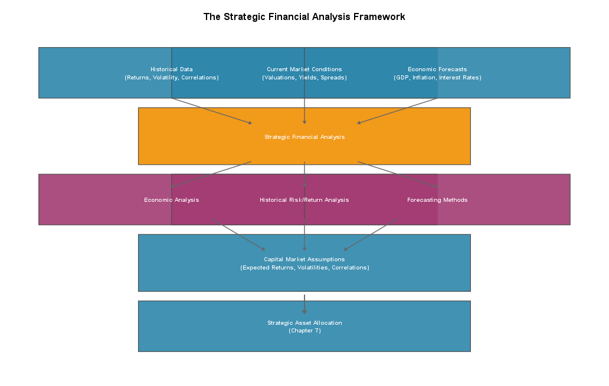
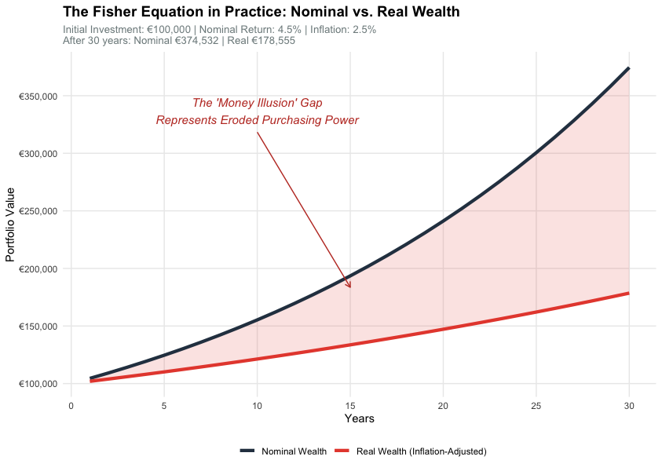
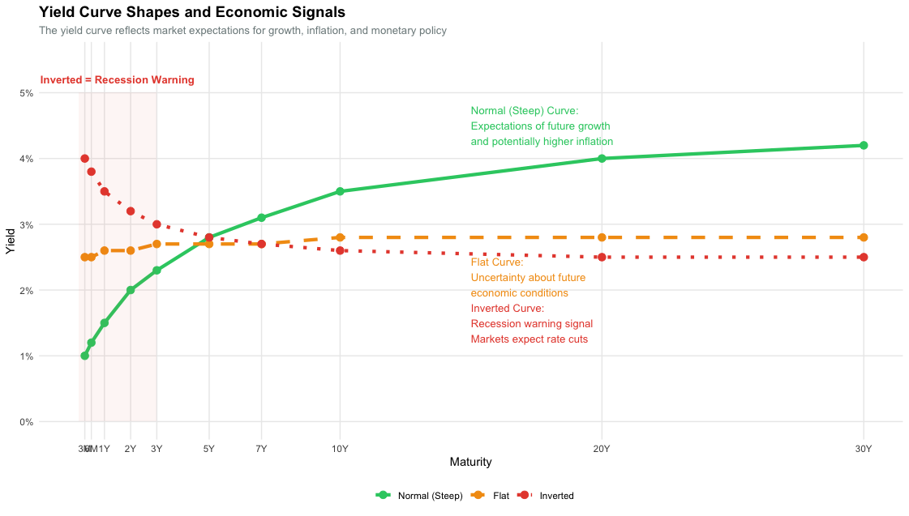
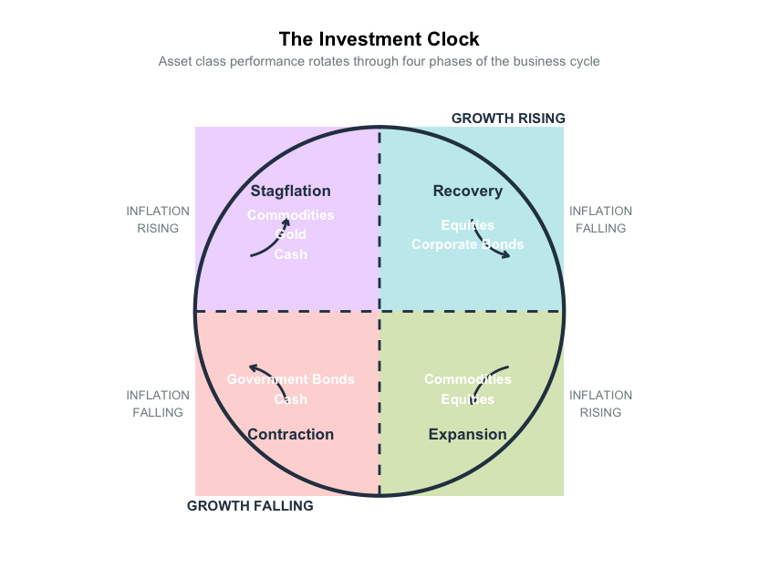
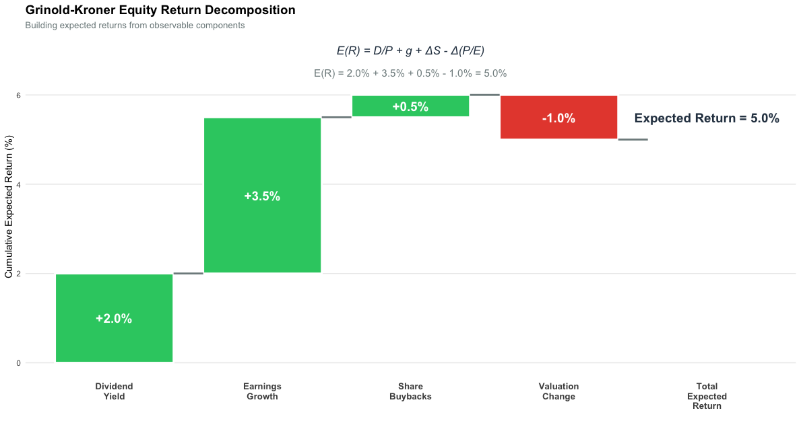
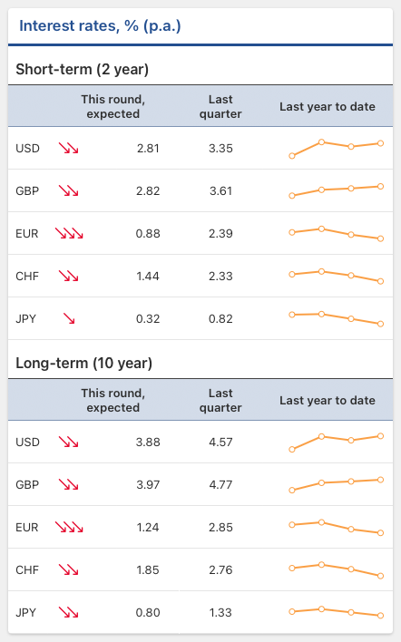
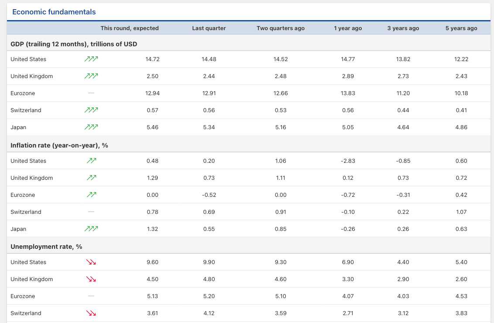
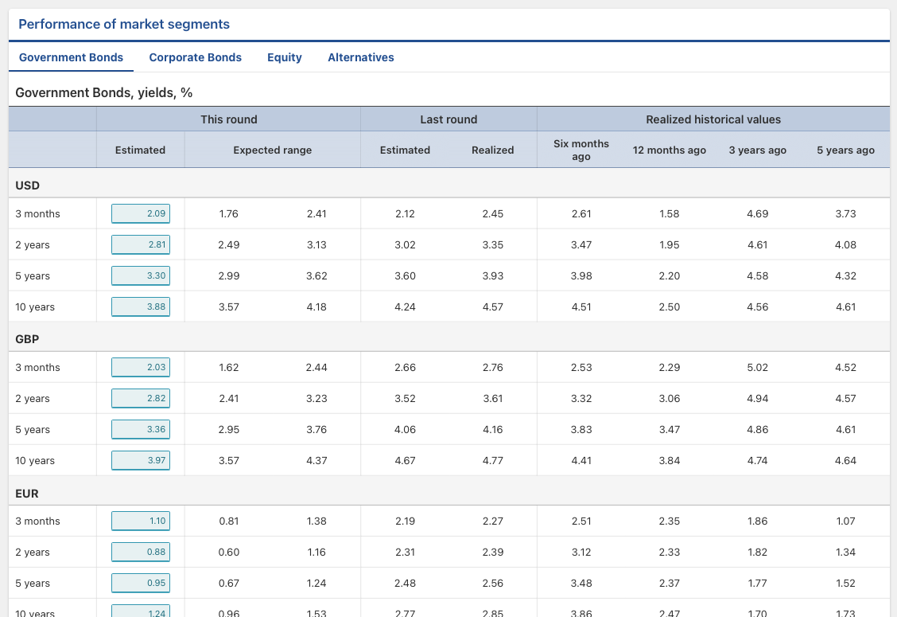

::: {.callout-tip title="Lecture Slides"}
**Associated slides:** [Lesson 4 — Strategic Asset Allocation](../slides/lesson-04-saa.html)
:::

## Introduction

In Chapter 4, we developed a detailed understanding of the Schmidt-Miller family. We examined their life stages, the sources of their wealth, their behavioral biases, and their unique circumstances. We identified their goals, quantified their liquidity needs, assessed their risk tolerance and calculated their return requirements. In Chapter 5, we translated that understanding into an Investment Policy Statement. The IPS establishes the governance framework for all future investment decisions.

The IPS tells us what the clients want to achieve with their portfolio. The core retirement portfolio requires a nominal pre-tax return of 6 to 8 percent. Capital preservation is the binding constraint, driven by Klaus's loss aversion. The IPS tells us how the portfolio will be governed. It will use goal segmentation, diversification principles, and a clear rebalancing policy. The IPS documents the constraints. These include the tax implications of Elke's inherited portfolio, the short time horizons for the art gallery and down payment, and the behavioral guardrails designed to protect Klaus from his own instincts during market downturns.

The IPS does not tell us which asset classes are most likely to deliver that 6 to 8 percent return over the next decade. It does not tell us whether Swiss equities or global bonds should form the core of the portfolio. It does not tell us what expected return Klaus and Elke can realistically obtain from a conservative portfolio, or what losses they might experience in a bear market.

Strategic financial analysis addresses these questions. It is the process of evaluating the long-term financial environment and market conditions to inform investment decisions. It examines historical trends. It analyzes current economic conditions. It develops forward-looking expectations for the risk and return characteristics of different asset classes. These expectations, known as capital market assumptions, serve as inputs for determining how to allocate a client's portfolio across equities, bonds, real assets, and other investment categories.

We will explore how to analyze economic variables such as GDP growth, inflation, and interest rates, and how these variables influence different asset classes. We will examine historical risk and return data, learning what history can tell us about market behavior and where its limitations lie. We will develop methods for forecasting future returns, combining quantitative techniques with qualitative approaches. Regression analysis and Monte Carlo simulation provide one lens. Scenario planning and expert judgment provide another.
We will apply each concept to our case study. This application will build the analytical foundation for the strategic asset allocation decisions we make in Chapter 7.

## The Role of Strategic Financial Analysis

Before we delve into the technical details of economic analysis, forecasting methods, and capital market assumptions, we must understand what strategic financial analysis is, why it matters, and how it fits into the broader investment management process.

### Defining Strategic Financial Analysis

Strategic financial analysis is the systematic process of evaluating the long-term financial environment and market conditions to inform investment decisions. Unlike tactical analysis, which focuses on short-term market movements and opportunistic portfolio adjustments, strategic analysis adopts a long-term perspective, typically spanning five to ten years or more. Its purpose is not to predict the timing of market turning points but to develop expectations for the risk and return characteristics of different asset classes over the whole investment horizon.

At its core, strategic financial analysis addresses a set of questions that every investment advisor must answer. What long-term returns can we expect from equities, bonds, and other asset classes? How much risk is associated with each asset class? How do different asset classes interact with one another? Do they move together, or do they provide diversification benefits? How do economic variables such as inflation, interest rates, and GDP growth influence these risk and return characteristics? What scenarios might unfold over the coming decade, and how would the portfolio perform under each?

These questions cannot be answered with certainty. Markets do not offer guarantees. But systematic analysis provides a disciplined framework for developing reasonable expectations. Those expectations, in turn, guide the allocation of client capital.

### The Relationship to the Investment Policy Statement

The Investment Policy Statement drafted in Chapter 5 establishes the client's objectives, constraints, and risk tolerance. It tells the advisor what the portfolio must achieve and within what boundaries. Strategic financial analysis provides the market context that determines how those objectives can realistically be pursued.

The IPS and strategic financial analysis exist in a dynamic relationship. The IPS sets the target. Strategic analysis assesses whether the target is achievable given current market conditions and long-term historical patterns. If capital market assumptions suggest that a portfolio aligned with the client's risk tolerance cannot reasonably achieve the required return, the advisor must return to the client. The conversation shifts from portfolio construction to goal adjustment. Spending expectations may need to be reduced. Time horizons may need to be extended. The required return may need to be revisited. If capital market assumptions confirm that the target is achievable, the IPS can be implemented with greater confidence. The client understands not only what the portfolio aims to achieve but also the market environment in which it will operate.

### The Connection to Strategic Asset Allocation

Strategic financial analysis provides the inputs for strategic asset allocation. Chapter 7 will examine how to determine the optimal mix of asset classes for a given client. That optimization process requires three inputs for each asset class under consideration: expected return, expected volatility, and expected correlation with other asset classes. These inputs are the capital market assumptions produced by strategic financial analysis.

Without well-reasoned capital market assumptions, asset allocation becomes arbitrary. The advisor might default to a standard balanced portfolio without considering whether that allocation is appropriate for current market conditions. With disciplined assumptions, the advisor can construct a portfolio that reflects both the client's unique circumstances and a sober assessment of the investment landscape.

Strategic financial analysis is not a one-time exercise. It is an ongoing discipline. Capital market assumptions must be reviewed regularly and updated as market conditions change. Valuations shift. Economic growth prospects evolve. Inflation expectations adjust. Assumptions that were reasonable five years ago may no longer reflect current realities. The advisor who fails to update capital market assumptions risks constructing portfolios based on outdated expectations, a form of anchoring bias at the institutional level.

The process flows in a logical sequence. Historical data, current market conditions, and economic forecasts serve as inputs. These feed into three analytical components: economic analysis, historical risk and return analysis, and forecasting methods. Together, these components produce the capital market assumptions. Those assumptions become the inputs for strategic asset allocation, which determines the portfolio's long-term mix of asset classes. The strategic allocation is then documented in the Investment Strategy Summary that accompanies the IPS, completing the bridge from client analysis to portfolio implementation.

{#fig-elementwise}

## Analyzing Economic Variables
Capital market assumptions do not emerge from a vacuum. They rest on a foundation of economic analysis. Understanding the variables that drive growth, inflation, and interest rates is essential for developing realistic expectations about asset class returns and for forecasting how portfolios might perform under different conditions. This section examines the key economic indicators that shape the investment landscape, the business cycle that governs their interaction, and the transmission mechanisms through which economic conditions affect equities, bonds, and alternative assets

### The Key Economic Variables
Investment professionals track a range of economic indicators that provide signals about the health of the economy and the likely direction of financial markets. While specific indicators vary by region, several variables are universally important. They form the vocabulary of economic analysis and the raw material for capital market assumptions.

#### Gross Domestic Product
Gross domestic product measures the total value of goods and services produced within an economy over a specified period, typically a quarter or a year. It is the most comprehensive indicator of economic activity. GDP can be stated in nominal terms, reflecting current prices, or in real terms, adjusted for inflation to isolate changes in actual output. The growth rate of real GDP is calculated as the percentage change from one period to the next.

$$
\text{GDP Growth} = \frac{\text{Real GDP}_t - \text{Real GDP}_{t-1}}{\text{Real GDP}_{t-1}} \times 100
$$

For investors, GDP growth matters because it directly influences corporate earnings. When the economy expands, companies sell more goods and services. Revenues rise. Profits follow. Equity markets tend to appreciate in response. When the economy contracts, earnings decline, and equities typically suffer.
The relationship between GDP growth and asset returns is not uniform across all asset classes. Equities are most sensitive to growth expectations because corporate profits are a direct function of economic activity. Bonds are affected through a different channel. Strong growth often prompts central banks to raise interest rates to prevent overheating, and higher rates reduce bond prices. Real assets such as real estate and commodities tend to perform well during periods of robust growth, as demand for physical resources increases.

#### Inflation
Inflation measures the rate at which the general level of prices for goods and services rises over time. The most widely followed measure is the Consumer Price Index, which tracks the cost of a representative basket of goods and services purchased by households. The inflation rate is calculated as the percentage change in the index.

$$
\pi = \frac{\text{CPI}_t - \text{CPI}_{t-1}}{\text{CPI}_{t-1}} \times 100
$$

For investors, inflation erodes the purchasing power of investment returns. A portfolio that earns 5 percent in a year when inflation is 2 percent delivers a real return of only 3 percent. In periods of high inflation, maintaining purchasing power becomes a primary investment objective. Different asset classes respond differently to inflation. Equities have historically provided some protection against moderate inflation, as companies can raise prices to pass through cost increases. In periods of very high or volatile inflation, however, equity returns suffer as uncertainty rises and discount rates increase. Bonds are particularly vulnerable because their fixed payments lose value when prices rise. Real assets such as commodities, real estate, and inflation-linked bonds provide more direct protection.

#### The Fisher Equation
The relationship between nominal returns, real returns, and inflation is formalized in the Fisher equation. First proposed by Irving Fisher (1930), this identity serves as the foundation for all valuation models by separating the 'price of time' from the 'erosion of value' caused by inflation. In its exact form:

$$
1 + r_{\text{nom}} = (1 + r_{\text{real}})(1 + \pi^e)
$$

Where $ r_{\text{nom}} $is the nominal rate, $ r_{\text{real}} $ is the real rate, and $ \pi^e $ is expected inflation. The approximate form, widely used in practice, is:

$$
r_{\text{nom}} \approx r_{\text{real}} + \pi^e
$$

This relationship underpins the pricing of all financial assets. When inflation expectations rise, nominal yields must rise to deliver the same real return. When inflation expectations fall, nominal yields can fall. For bond investors, the Fisher equation explains why unexpected inflation erodes real returns. If actual inflation exceeds expected inflation, the realized real return falls below the ex-ante real rate.

Inflation-linked bonds address this risk by adjusting their principal and coupon payments to reflect changes in the price level. By doing so, they lock in a real return regardless of the path of actual inflation. The difference between the yield on a nominal bond and the yield on an inflation-linked bond of the same maturity provides a market-based measure of inflation expectations, known as the break-even inflation rate.

{#fig-elementwise}

#### Interest Rates
Interest rates, set by central banks and shaped by market forces, represent the price of money. They influence the cost of borrowing for companies and households, the discount rate used to value future cash flows, and the relative attractiveness of different asset classes. Central banks set short-term policy rates to guide economic activity. Market forces determine longer-term yields based on expectations for future policy rates, inflation, and term premiums.

For bonds, the relationship between interest rates and prices is direct. When interest rates rise, the present value of future fixed payments falls, and bond prices decline. When rates fall, bond prices rise. The sensitivity of a bond's price to changes in interest rates is measured by its duration.

For equities, the relationship is more complex. Higher interest rates increase the cost of capital for companies, reducing profitability and investment capacity. They also raise the discount rate applied to future earnings, reducing the present value of those earnings and thus stock prices. Lower rates have the opposite effect, supporting both corporate activity and equity valuations. The transmission is not instantaneous. Markets anticipate rate changes, and the effect of a policy shift may be priced in well before it occurs.

#### Employment and Consumer Confidence
Employment data provide insight into the health of the labor market, which drives consumer spending. The unemployment rate measures the percentage of the labor force that is actively seeking work but unable to find it. Other indicators include labor force participation, job creation figures, and wage growth. When employment is strong and unemployment is low, consumers have income and confidence to spend. This supports corporate earnings and economic growth. When employment weakens, spending typically follows, and the economy slows.

Consumer confidence indices measure how optimistic households feel about their financial situation and the broader economy. High confidence tends to correlate with increased spending on durable goods, housing, and discretionary items. Low confidence can signal a pullback that slows growth further. For investors, these indicators provide early signals about the direction of the economy. They are leading indicators, often turning before the broader economy does. A sustained drop in consumer confidence warrants attention, even if current economic data remain solid.

#### Exchange Rates
For internationally diversified portfolios, exchange rates matter. When an investor holds assets denominated in foreign currencies, changes in exchange rates affect the value of those assets when converted back to the investor's home currency. A strengthening home currency reduces the value of foreign holdings. A weakening home currency increases it. Currency movements can amplify or offset the local-currency returns of international investments.

The decision to hedge currency exposure depends on the investor's objectives, time horizon, and tolerance for short-term volatility. For long-term investors, currency fluctuations tend to even out over time, and the cost of hedging may outweigh the benefits. For those with shorter horizons or specific liability streams in their home currency, hedging can reduce unwanted volatility.

#### The Yield Curve
The yield curve plots the yields of bonds of different maturities at a given point in time. Under normal conditions, the curve slopes upward. Longer-term bonds offer higher yields than shorter-term bonds, compensating investors for the risk of holding fixed payments over extended periods.

The shape of the yield curve provides a signal about market expectations. A steep curve, where the gap between long-term and short-term yields is wide, often signals expectations of stronger growth and potentially higher inflation. A flat curve, where the gap is narrow, signals uncertainty or an expected slowdown. An inverted curve, where short-term yields exceed long-term yields, has historically preceded recessions. The inversion signals that investors expect rates to fall in the future as central banks cut to combat a contraction. The predictive power of the yield curve inversion for future recessions was first documented by Campbell Harvey (1986), who demonstrated that the 'slope' of the curve is an essential leading indicator for the business cycle.

The yield curve is not infallible. It has given false signals, and the lag between inversion and recession can be long and variable. Yet its track record warrants attention. An inverted curve suggests that bond market participants, who have capital at risk, are pricing in a significant probability of economic weakness ahead.
These variables do not operate in isolation. GDP growth, inflation, interest rates, employment, and confidence evolve together through the recurring pattern of expansion and contraction known as the business cycle. Understanding where the economy stands within this cycle, and how these variables interact at different points, is the subject of the next section.

{#fig-elementwise}

### The Business Cycle
Economic variables do not move independently. They evolve together through a recurring pattern of expansion and contraction known as the business cycle. Understanding where the economy stands within this cycle is essential for anticipating how different asset classes will perform and for constructing portfolios positioned for the prevailing environment.

The business cycle refers to the fluctuations in economic activity that occur over time, measured by indicators such as GDP growth, employment, industrial production, and consumer spending. These fluctuations are not regular in duration or amplitude. Expansions have lasted as little as a year and as long as a decade. Recessions have been brief and shallow or prolonged and severe. Yet despite this variation, the cycle follows a recognizable sequence. Activity rises to a peak, declines to a trough, and then begins to rise again. The transition points matter. The peak marks the end of expansion and the onset of contraction. The trough marks the end of recession and the beginning of recovery.

#### Phases of the Business Cycle
The cycle moves through four distinct phases, each defined by a particular configuration of growth, inflation, and monetary policy. The phases do not arrive on a fixed schedule, nor do they always proceed in the same order. Stagflation, for instance, does not occur in every cycle. But the framework provides a mental model for interpreting economic data and positioning portfolios.

Recovery follows a recession and marks the period when growth begins to accelerate from a low base. GDP turns positive after a period of contraction, often posting above-trend rates as idle capacity is brought back online. Unemployment, which tends to lag the broader economy, may remain elevated for some time but eventually stabilizes and begins to decline. Inflation remains subdued. Excess capacity in product and labor markets prevents firms from raising prices, and inflation expectations remain anchored. Central banks maintain accommodative monetary policy, keeping interest rates low to nurture the expansion. In this environment, equities tend to perform strongly. Earnings recover from depressed levels, and valuations expand as confidence returns. Credit spreads narrow as default concerns recede, benefiting corporate bonds. Government bonds may face modest headwinds as investors begin to anticipate eventual rate increases, but the low starting point for yields provides a cushion.

Expansion represents the mature phase of the cycle. Growth is robust, often running above the economy's long-term potential. Labor markets tighten. Unemployment falls to low levels, and wage pressures begin to build as firms compete for scarce workers. Inflation rises. Demand outstrips supply in key sectors, and firms gain pricing power. Central banks respond by shifting toward tighter monetary policy. Interest rates rise to prevent the economy from overheating and to keep inflation expectations from becoming unanchored. Equities may continue to perform well, as strong earnings growth offsets the headwind from rising discount rates. Sectors tied to economic activity, such as industrials and materials, often lead. Commodities perform strongly as demand for physical resources increases and as investors seek hedges against rising inflation. Government bonds typically struggle. Rising rates reduce bond prices, and real returns are compressed.

Contraction, or recession, occurs when growth turns negative. GDP declines. Unemployment rises as firms cut costs in response to falling demand. Inflation falls, and deflation may become a concern if the downturn is severe and prolonged. Central banks reverse course, cutting interest rates to stimulate the economy and prevent a deflationary spiral. Equities fall as earnings disappoint and risk aversion spikes. Defensive sectors, such as consumer staples and healthcare, hold up better than cyclical sectors tied to discretionary spending and industrial activity. Government bonds perform well. Investors seek safety, and falling rates boost bond prices. The negative correlation between equities and government bonds reasserts itself. Credit spreads widen as default concerns rise, and corporate bonds, particularly lower-quality issues, may decline even as government bonds rally.

Stagflation is a distinct phase that combines weak or negative growth with elevated inflation. This combination, most notably experienced during the 1970s, confounds traditional portfolio construction. Equities suffer from weak earnings and from the high discount rates that accompany inflation. Bonds suffer from inflation eroding real returns and from central banks maintaining tight policy to combat price pressures, even in the face of weak growth. Real assets, including commodities and gold, tend to perform best. Commodities benefit from the inflationary impulse and from their role as a store of value when paper currencies lose purchasing power. Gold benefits from declining real interest rates and from safe-haven demand during periods of economic and policy uncertainty.

#### The Investment Clock Framework
The Investment Clock framework maps these four phases to a stylized cycle. It illustrates how the leadership of different asset classes rotates as the economy moves from recovery through expansion, contraction, and stagflation. This framework, known as the 'Investment Clock,' was popularized by Trevor Greetham (2004) at Merrill Lynch to help practitioners rotate capital into assets with the highest 'regime-based' probability of success. The framework does not predict the precise timing of transitions. Cycles vary in duration and amplitude, and not every cycle includes a stagflationary phase. The sequence, however, is consistent enough to provide a useful mental model.

During recovery, equities and corporate bonds lead. Earnings are rebounding, credit conditions are improving, and monetary policy remains supportive. Government bonds, having performed well during the preceding recession, begin to lag as investors rotate toward risk assets and as the outlook for rates shifts.

During expansion, commodities join equities at the forefront. Strong global demand drives consumption of industrial resources, and rising inflation increases the appeal of real assets. Government bonds continue to lag as central banks raise rates and inflation expectations rise.

During contraction, government bonds provide the best returns. Investors flee risk assets and seek the safety of sovereign debt. Falling rates boost bond prices. Equities and commodities fall as earnings decline and demand for physical resources wanes.

During stagflation, cash and real assets offer the best protection. Equities and bonds both struggle. Commodities and gold benefit from the inflationary environment and from their role as alternative stores of value.

The following table summarizes the characteristics of each phase.

| Phase | Growth | Inflation | Monetary Policy | Leading Assets |
|-------|--------|-----------|-----------------|----------------|
| Recovery | Accelerating | Low | Accommodative | Equities, Corporate Bonds |
| Expansion | Robust | Rising | Tightening | Commodities, Equities |
| Contraction | Negative | Falling | Easing | Government Bonds |
| Stagflation | Weak/Negative | Elevated | Tight | Commodities, Gold |

{#fig-elementwise}

#### Drivers of the Business Cycle
The business cycle is driven by several interacting forces. No single factor determines the path of the economy. Instead, monetary policy, fiscal policy, consumer behavior, and exogenous shocks combine to shape the trajectory of growth and inflation.

Monetary policy, set by central banks, influences the availability and cost of credit. By adjusting short-term interest rates and, in some cases, by purchasing assets to suppress longer-term yields, central banks seek to stabilize the economy and maintain price stability. Low rates encourage borrowing and investment, stimulating growth. High rates discourage borrowing and slow the economy. The Taylor rule provides a framework for understanding these decisions. It posits that central banks set nominal interest rates based on the neutral real rate, the deviation of inflation from target, and the deviation of output from potential. The rule captures the dual mandate of many central banks: price stability and maximum employment. The transmission of monetary policy operates with lags, which complicates the timing of adjustments and increases the risk of policy errors.

Fiscal policy, set by governments, influences aggregate demand through taxation and spending. Expansionary fiscal policy, whether through tax cuts or increased government expenditure, can stimulate growth during a downturn. It can also exacerbate inflation during an expansion if the economy is already operating near capacity. Contractionary fiscal policy, through tax increases or spending cuts, can slow an overheating economy and reduce inflationary pressures. The interaction of monetary and fiscal policy shapes the overall policy stance. The two can work in concert, as when both are accommodative during a deep recession. They can also work at cross-purposes, as when fiscal policy is expansionary while monetary policy is tightening to contain inflation.

Consumer demand and consumption represent the largest component of GDP in most developed economies. Household spending depends on disposable income, wealth, and confidence. When employment is strong and wages are rising, consumers spend. When uncertainty rises or balance sheets are stressed, they pull back. The saving rate rises during recessions and falls during expansions. Consumer confidence indices provide leading signals about the direction of spending. The consumer is both a driver of the cycle and a reflection of its underlying health.

Exogenous shocks can alter the trajectory of the cycle abruptly and unpredictably. Geopolitical events, including wars and trade disputes, can disrupt supply chains, shift energy prices, and alter the outlook for growth and inflation. Natural disasters can destroy productive capacity and require rebuilding, creating a temporary drag followed by a boost to activity. Pandemics can shut down entire sectors of the economy. Technological disruptions can reshape industries, rendering established business models obsolete and creating new sources of growth. These shocks must be incorporated into scenario analysis and stress testing rather than point forecasts. The investment process must be robust to their occurrence.
The business cycle framework provides a lens through which to interpret economic data and to form expectations about the future. It does not eliminate uncertainty. It imposes discipline on the investment process by anchoring asset allocation decisions in a coherent view of the economic environment. With this framework established, we now turn to a more detailed examination of the monetary policy rule that guides central bank decisions and shapes the interest rate environment.

### The Taylor Rule
Monetary policy shapes the interest rate environment that drives asset class returns. Understanding how central banks set policy rates is therefore essential for developing capital market assumptions and for anticipating shifts in the investment landscape. The Taylor rule provides a framework for this understanding. Developed by John Taylor (1993), the rule provides a systematic benchmark for determining whether a central bank's policy rate is appropriately calibrated to address inflation and output gaps.

The rule, proposed by economist John Taylor in 1993, offers a formulaic approach to setting the central bank policy rate based on prevailing economic conditions. It captures the dual mandate faced by many central banks: maintaining price stability while supporting maximum employment. The rule is not a mechanical prescription that central banks follow blindly. It is a benchmark. It provides a systematic way to evaluate whether current policy is accommodative, neutral, or restrictive given the state of the economy.

The Taylor rule expresses the nominal policy rate as a function of four components: the neutral real interest rate, current inflation, the deviation of inflation from target, and the deviation of output from potential. In its standard form, the rule is written as follows.

$$ i_t = r^* + \pi_t + 0.5(\pi_t - \pi^*) + 0.5(y_t - y^*) $$

Where the variables are defined as:

- $i_t$: the nominal policy rate set by the central bank
- $r^*$: the neutral real interest rate, the rate consistent with full employment and stable inflation
- $\pi_t$: the current inflation rate
- $\pi^*$: the central bank's target inflation rate
- $y_t$: the log of real GDP
- $y^*$: the log of potential GDP, the level of output the economy can sustain without generating inflationary pressures
- $(y_t - y^*)$: the output gap, measuring the degree of economic slack or overheating

The logic of the rule is straightforward. The first two terms, $r^* + \pi_t$, establish a baseline nominal rate that would prevail if inflation were at target and output at potential. This baseline ensures that the real policy rate equals the neutral rate. The third term, $0.5(\pi_t - \pi^*)$, adjusts the policy rate in response to deviations of inflation from target. When inflation exceeds the target, the rule prescribes a higher nominal rate, which raises the real rate and slows the economy. When inflation falls below target, the rule prescribes a lower rate to stimulate activity. The fourth term, $0.5(y_t - y^*)$, adjusts the policy rate in response to the output gap. When output exceeds potential, signaling an overheating economy, the rule prescribes a higher rate. When output falls short of potential, signaling slack, the rule prescribes a lower rate.

The coefficients of 0.5 on both the inflation gap and the output gap reflect the original calibration proposed by Taylor. In practice, different formulations of the rule may use different weights, and central banks may respond more aggressively to one variable than the other depending on their mandate and the prevailing economic circumstances.

Consider an example. Suppose the neutral real rate is 1 percent, the central bank's inflation target is 2 percent, and current inflation is running at 3 percent. The output gap is estimated at 1 percent, indicating that the economy is operating above potential. The Taylor rule would prescribe a policy rate of:

$$ i_t = 1\% + 3\% + 0.5(3\% - 2\%) + 0.5(1\%) = 1\% + 3\% + 0.5\% + 0.5\% = 5\% $$

The prescribed rate of 5 percent is above the neutral nominal rate of 3 percent (which is $r^* + \pi^* = 1\% + 2\%$). This reflects the need to tighten policy in response to above-target inflation and an overheating economy.

Now consider an alternative scenario. Inflation is at 1 percent, below target, and the output gap is negative 2 percent, indicating a recession. The Taylor rule would prescribe:

$$ i_t = 1\% + 1\% + 0.5(1\% - 2\%) + 0.5(-2\%) = 1\% + 1\% - 0.5\% - 1\% = 0.5\% $$

The prescribed rate of 0.5 percent is well below neutral, reflecting the need for accommodative policy to stimulate the economy and return inflation to target.

The Taylor rule has significant limitations. The neutral real rate, $r^*$, is not directly observable. It must be estimated from economic data, and estimates vary across models and over time. Potential output, $y^*$, is similarly unobservable and subject to revision. The output gap is measured with error, and those errors can lead to policy mistakes. A central bank that overestimates potential output may keep rates too low for too long, fueling inflation. A central bank that underestimates potential may tighten prematurely, choking off a recovery.

No central bank follows the Taylor rule mechanically. Policy decisions incorporate a wider range of information than the rule captures, including financial stability concerns, global economic conditions, and the judgment of policymakers about the likely path of the economy. The rule also does not account for the zero lower bound on nominal interest rates. When the prescribed rate falls below zero, as it did during the 2008 financial crisis and the 2020 pandemic, central banks must resort to unconventional tools such as quantitative easing and forward guidance.

Despite these limitations, the Taylor rule remains a valuable framework. It provides a benchmark against which actual policy can be assessed. When the actual policy rate deviates significantly from the rate prescribed by the rule, it signals that policy is unusually accommodative or restrictive relative to historical norms. Investors can use this information to form expectations about the future path of rates and to assess the risks to their capital market assumptions.

A prolonged period of policy rates below the Taylor rule prescription suggests that monetary policy is stimulative. This may support equity valuations and compress risk premiums in the short term, but it also raises the risk of future tightening and the potential for inflation to become unanchored. A period of rates above the prescription suggests that policy is restrictive, which may slow growth and pressure corporate earnings, but which also creates room for future rate cuts if the economy weakens.

The Taylor rule, combined with an understanding of the business cycle, provides a coherent framework for anticipating the direction of monetary policy and its implications for asset class returns. With this framework established, we now turn to the distinct challenges posed by inflation and deflation, and their effects on portfolio construction.

### Inflation and Deflation
Inflation and deflation represent opposite risks to the purchasing power of investment portfolios. Understanding their causes, consequences, and implications for asset classes is essential for constructing portfolios that can withstand either environment.

#### Inflation
Inflation is a sustained increase in the general price level of goods and services. It erodes the purchasing power of money. A euro today buys less than it did a year ago when inflation is positive. For investors, this erosion is a direct cost. Returns must exceed inflation to increase real wealth.

Inflation arises from several sources. Demand-pull inflation occurs when aggregate demand exceeds the economy's productive capacity. Too much money chases too few goods. This typically happens late in the business cycle when labor markets are tight and consumers are spending freely. Cost-push inflation occurs when input prices rise, forcing firms to raise prices to maintain margins. A sharp increase in energy prices, for example, can ripple through the economy and lift the overall price level. Built-in inflation arises from the wage-price spiral. Workers demand higher wages to keep pace with rising prices, and firms pass those wage costs on to consumers in the form of higher prices, which in turn prompts further wage demands.

The consequences of inflation extend beyond the erosion of purchasing power. Central banks respond to sustained inflation by tightening monetary policy, raising interest rates to slow the economy and anchor inflation expectations. Higher rates, in turn, pressure bond prices and equity valuations. Unexpected inflation is particularly damaging because it is not priced into financial assets. Bondholders receive fixed payments that are worth less in real terms than anticipated. Equity investors face higher discount rates and uncertain profit margins.

#### Deflation
Deflation is a sustained decrease in the general price level. Falling prices may sound appealing to consumers, but deflation poses significant risks to the economy and to investors.
Deflation typically arises from a collapse in aggregate demand. When consumers and businesses pull back spending, firms cut prices to attract buyers, which further reduces revenues and leads to layoffs. The layoffs reduce spending further, and the cycle deepens. Excess capacity in the economy, whether from overinvestment during the prior expansion or from a permanent shift in demand, can also drive prices lower. Technological advances that reduce production costs can contribute to mild, benign deflation in specific sectors, but broad-based deflation is almost always a symptom of economic weakness.

The consequences of deflation are severe. As prices fall, consumers delay purchases in anticipation of even lower prices in the future. This delay further depresses demand. The real burden of debt rises because the nominal value of debt is fixed while the price level falls. Households and firms struggle to service obligations that become larger in real terms. Defaults rise. Central banks face a particular challenge in deflationary environments. Nominal interest rates cannot fall below zero without resorting to unconventional policies. When rates hit the zero lower bound, central banks lose their primary tool for stimulating the economy.

#### Measuring Inflation Expectations
Inflation expectations play a central role in the pricing of financial assets. The Fisher equation established that nominal yields equal real yields plus expected inflation. When expectations shift, asset prices adjust.

Market-based measures of inflation expectations are derived from the difference between the yield on nominal bonds and the yield on inflation-linked bonds of the same maturity. This difference is known as the break-even inflation rate. It represents the average inflation rate over the life of the bonds that would make an investor indifferent between holding the nominal bond and the inflation-linked bond.

$$
\text{Break-even Inflation} = y_{\text{nominal}} - y_{\text{inflation-linked}}
$$

If the ten-year nominal government bond yields 3 percent and the ten-year inflation-linked bond yields 1 percent, the break-even inflation rate is 2 percent. This suggests that market participants expect inflation to average 2 percent over the next decade. If actual inflation exceeds 2 percent, the inflation-linked bond will outperform. If actual inflation falls short, the nominal bond will outperform.

Break-even rates are not perfect forecasts. They incorporate a risk premium that investors demand for bearing inflation uncertainty. They can also be distorted by liquidity differences between nominal and inflation-linked markets. Nevertheless, they provide a real-time, market-implied measure of inflation expectations that complements survey-based measures and economic forecasts.

#### Asset Class Implications
Different asset classes respond differently to inflation and deflation. Understanding these sensitivities is essential for positioning portfolios.

Equities offer a partial hedge against moderate inflation. Companies can raise prices to pass through cost increases, and nominal revenues and earnings tend to rise with the price level over time. This protection is imperfect. During periods of high or volatile inflation, the relationship breaks down. Uncertainty about future costs and pricing power compresses valuations. Central banks raise rates, increasing the discount rate applied to future earnings. Equities can struggle even as the nominal economy grows.

Deflation is unambiguously negative for equities. Falling prices mean falling revenues and profits. The real burden of corporate debt rises. Consumers delay purchases. Earnings decline, and valuations contract as uncertainty rises.

Government bonds are highly vulnerable to unexpected inflation. Their fixed coupon payments and principal repayment lose purchasing power when prices rise faster than anticipated. Inflation-linked bonds address this vulnerability by adjusting their cash flows to reflect changes in the price level. In a deflationary environment, nominal government bonds perform well. Falling prices increase the real value of fixed payments, and central banks typically cut rates, boosting bond prices.

Corporate bonds share the inflation sensitivity of government bonds but add credit risk. In an inflationary environment, rising rates pressure prices, but strong nominal growth may support corporate creditworthiness. In a deflationary environment, falling rates support prices, but rising default risk may offset this benefit, particularly for lower-quality issues.

Real assets provide the most direct inflation protection. Commodities tend to rise with the price level, as the real value of physical resources is preserved. Real estate benefits from rising replacement costs and the ability to increase rents. Gold benefits from falling real interest rates, which typically accompany rising inflation expectations, and from its role as a store of value when confidence in paper currencies erodes.

In deflation, real assets suffer. Commodity prices fall as demand for physical resources collapses. Real estate values decline as rents fall and vacancies rise. Gold may hold up better than other real assets if deflation is accompanied by financial instability and safe-haven demand, but falling prices are generally negative for assets that do not generate fixed cash flows.

The following table summarizes the sensitivity of major asset classes to inflation and deflation.

| Asset Class | Moderate Inflation | High/Volatile Inflation | Deflation |
|-------------|-------------------|------------------------|-----------|
| Equities | Partial hedge | Negative | Negative |
| Nominal Government Bonds | Negative | Negative | Positive |
| Inflation-Linked Bonds | Positive | Positive | Neutral to Negative |
| Corporate Bonds | Negative | Negative | Mixed (rates positive, credit negative) |
| Commodities | Positive | Positive | Negative |
| Gold | Positive | Positive | Mixed (safe-haven may offset) |

The inflation and deflation dynamics described here interact with the business cycle framework established earlier. During recovery and early expansion, inflation is typically low, and deflation risks may linger from the preceding recession. During late expansion, inflation rises and becomes the primary concern. During contraction, inflation falls, and deflation may emerge. During stagflation, high inflation coexists with weak growth. Recognizing where the economy stands within this cycle, and how inflation expectations are evolving, allows investors to position portfolios for the most likely environment while maintaining resilience against alternative scenarios.

### How Economic Variables Affect Asset Classes

The preceding sections have examined economic variables in isolation and in combination through the business cycle. This section synthesizes that material by mapping each major asset class to the economic forces that drive its performance. Understanding these relationships allows investors to form expectations about how different portfolios will behave under varying economic conditions.

#### Equities

Equities represent ownership claims on corporate earnings. Their performance is driven primarily by two forces: the growth of those earnings and the multiple that investors are willing to pay for them. Both forces are sensitive to economic conditions.

GDP growth is the most direct driver of corporate earnings. When the economy expands, companies sell more goods and services. Revenues rise, and profits typically follow. When the economy contracts, earnings decline. This relationship makes equities highly sensitive to the business cycle. Performance is strongest during recovery and early expansion, when earnings are rebounding from depressed levels and valuations are expanding as confidence returns. Performance is weakest during recession, when earnings fall and risk aversion rises.

Interest rates affect equities through the discount rate applied to future earnings. Higher rates reduce the present value of those earnings, pressuring valuations. Lower rates have the opposite effect. This sensitivity explains why equities can struggle during periods of monetary tightening, even when current earnings are strong. The market anticipates the effect of higher rates on future growth and valuations.

Inflation has a mixed relationship with equities. Moderate inflation is generally benign. Companies can raise prices to pass through cost increases, and nominal earnings grow with the price level. High or volatile inflation is more problematic. Uncertainty about future costs and pricing power compresses valuations. Central banks raise rates to combat inflation, increasing the discount rate. The stagflationary combination of weak growth and high inflation is particularly damaging, as equities face headwinds from both falling earnings and rising discount rates.

The following table summarizes equity performance across the business cycle.

| Cycle Phase | Growth | Rates | Typical Equity Performance |
|-------------|--------|-------|---------------------------|
| Recovery | Accelerating | Low | Strong |
| Expansion | Robust | Rising | Moderate to Strong |
| Recession | Negative | Falling | Weak |
| Stagflation | Weak | High | Weak |

#### Government Bonds

Government bonds are contracts to pay fixed sums over time. Their performance is driven by interest rates and inflation expectations. Unlike equities, they do not participate in economic growth. Their value lies in the certainty of their cash flows and their role as a safe haven during periods of market stress.

Interest rates are the primary driver of bond returns. When rates fall, bond prices rise. When rates rise, bond prices fall. The sensitivity of a bond's price to rate changes is measured by its duration. Longer-duration bonds are more sensitive to rate movements than shorter-duration bonds.

Inflation expectations are equally important. Because bonds pay fixed nominal amounts, unexpected inflation erodes their real value. When inflation expectations rise, nominal yields must rise to compensate investors, reducing bond prices. When inflation expectations fall, yields can fall, boosting prices. This relationship explains why government bonds perform poorly during periods of rising inflation and perform well during disinflation or deflation.

Safe-haven flows provide an additional source of demand for government bonds. During periods of market stress, investors sell risk assets and purchase the safety of sovereign debt. This flight to quality can drive bond prices higher even when economic fundamentals might suggest otherwise. The negative correlation between equities and government bonds during crises is a cornerstone of diversified portfolio construction.

Government bonds perform best during recessions. Growth is falling, inflation is falling, and central banks are cutting rates. All three forces align to boost bond prices. They perform worst during expansions when growth is strong and inflation is rising, and during stagflation when inflation is high even as growth weakens.

#### Corporate Bonds

Corporate bonds combine features of government bonds and equities. Like government bonds, they are sensitive to interest rates. Like equities, they are sensitive to the creditworthiness of the issuing companies.

The yield on a corporate bond equals the yield on a comparable government bond plus a credit spread. The credit spread compensates investors for the risk of default. When the economy is strong and corporate balance sheets are healthy, default risk is low, and credit spreads are narrow. When the economy weakens and default concerns rise, spreads widen.

This dual sensitivity produces a distinct pattern across the business cycle. Corporate bonds perform best during recovery, when growth is accelerating and default concerns are receding, but before interest rates have risen significantly. They perform well during early expansion but face headwinds as rates rise. They struggle during recessions when default risk spikes, even though falling rates provide a partial offset. Lower-quality corporate bonds are more sensitive to credit conditions than to interest rates. Higher-quality corporate bonds are more sensitive to interest rates than to credit conditions.

#### Commodities

Commodities are physical assets. Unlike financial assets, they generate no cash flows. Their returns derive from price movements, which are driven by supply and demand for the underlying physical resources.

Global demand is the primary driver of commodity prices. When the global economy is expanding, demand for industrial commodities such as oil, copper, and agricultural products rises. Prices follow. When the economy contracts, demand falls, and prices decline. This sensitivity makes commodities highly cyclical.

Inflation is the second key driver. Commodities are real assets whose value tends to rise with the price level. During periods of unexpected inflation, commodities serve as an effective hedge, preserving purchasing power when financial assets may struggle. This relationship is strongest during stagflation, when commodities can rise even as growth weakens, driven by the inflationary impulse.

Commodities perform best during expansion, when strong global demand and rising inflation align, and during stagflation, when inflation remains elevated even as growth slows. They perform worst during recessions, when demand collapses and prices fall.

#### Gold

Gold occupies a unique position among asset classes. It is both a commodity and a monetary asset. It generates no cash flows, yet it has served as a store of value for millennia.

Real interest rates are the primary driver of gold prices. Gold pays no interest. When real rates are high, the opportunity cost of holding gold is significant, and prices tend to fall. When real rates are low or negative, the opportunity cost diminishes, and prices tend to rise. This relationship explains why gold performs well during periods of accommodative monetary policy and rising inflation expectations, both of which depress real rates.

Risk aversion provides a second source of demand. Gold is perceived as a safe haven during periods of geopolitical uncertainty, financial instability, or currency debasement. When confidence in paper currencies or financial institutions wavers, investors turn to gold.

Gold performs best during stagflation, when weak growth and high inflation combine to depress real rates, and during recessions, when risk aversion spikes and central banks cut rates. It performs worst during expansions, when real rates are rising and risk appetite is strong.

#### Summary

The following table synthesizes the relationships between asset classes and the economic variables and cycle phases that drive their performance.

| Asset Class | GDP Growth | Inflation | Interest Rates | Best Phase | Worst Phase |
|-------------|------------|-----------|----------------|------------|-------------|
| Equities | Positive | Mixed | Negative | Recovery, Expansion | Recession, Stagflation |
| Government Bonds | Neutral | Negative | Negative | Recession | Expansion, Stagflation |
| Corporate Bonds | Positive | Negative | Negative | Recovery | Recession |
| Commodities | Positive | Positive | Negative | Expansion, Stagflation | Recession |
| Gold | Neutral | Positive | Negative | Stagflation, Recession | Expansion |

These relationships are not mechanical. They are tendencies, not certainties. The magnitude and timing of asset class responses vary across cycles. Structural changes in the economy can alter historical patterns. Yet the framework provides a starting point for understanding how economic conditions drive portfolio outcomes. It allows investors to form expectations that are grounded in economic logic rather than simple extrapolation of past returns.

With this understanding of economic variables and their effects on asset classes, we now turn to the historical record. Historical risk and return analysis provides the empirical foundation upon which forward-looking capital market assumptions are built.

## Historical Risk and Return Analysis

Capital market assumptions look forward. They are built, however, on a foundation of past data. Historical risk and return analysis examines how asset classes have performed over previous market cycles, how they have behaved during crises, and what long-term relationships exist between them. This analysis provides context and discipline for the forward-looking assumptions we develop.

### What Historical Analysis Can Tell Us

Historical analysis provides several insights that inform capital market assumptions.

History reveals the range of possible outcomes. For global equities, historical data shows that while average returns have been 8 to 10 percent, individual years have ranged from gains exceeding 50 percent to losses exceeding 40 percent. Understanding this range helps investors prepare for the volatility they will experience. A 20 percent loss in a single year is not a signal that the strategy has failed. It is a normal part of equity investing that has occurred many times in the past.

History shows how asset classes behave during periods of market stress. In the 2008 financial crisis, global equities lost nearly 40 percent. Government bonds gained as investors sought safety. In the 2020 pandemic, equities fell sharply but recovered quickly. Bonds again provided a buffer. These patterns, while not guaranteed to repeat, offer a baseline for understanding how portfolios might perform in future crises.

History reveals the long-term relationships between asset classes. While correlations can change, history provides a baseline understanding of how assets tend to relate to one another. The historical correlation between Swiss equities and global equities has been approximately 0.7. They tend to move together but offer some diversification benefit. The historical correlation between equities and government bonds has been near zero. This relationship has provided the foundation for balanced portfolio construction for decades.

### The Limitations of Historical Analysis

For all its value, historical analysis has significant limitations that must be understood.

The most important limitation is that past returns do not guarantee future returns. A decade of strong equity returns does not ensure that the next decade will be similar. Elevated valuations after a strong period often suggest that future returns will be lower. Relying solely on historical averages would have led investors to overestimate returns after the 1990s bull market and underestimate them after the 2008 crisis.

Structural changes alter relationships between asset classes. Financial markets are not static. The decline of inflation since the 1980s has changed the relationship between bonds and inflation. The integration of global markets has increased correlations between international equities. The rise of passive investing has changed market dynamics. History that spans multiple regimes may not be a reliable guide to a regime that has changed.

Correlations between asset classes are not stable over time. This property is called non-stationarity. In normal times, equities and bonds may be uncorrelated. In a crisis, correlations often increase as investors sell broadly to raise cash. In a deflationary environment, bonds may rise as equities fall. In an inflationary environment, both may fall together. Historical correlations provide a baseline but must be adjusted for current conditions.

Survivorship bias affects historical data. Failed companies, defaulted bonds, and collapsed markets are often excluded from long-term return series. This can overstate historical returns relative to what investors actually experienced. The historical record reflects the winners that survived, not the full universe of investments that existed.

### Beyond the Normal Distribution

Standard deviation is the most common measure of risk in finance. It captures the dispersion of returns around the mean. Under the assumption of a normal distribution, standard deviation provides a complete description of risk. Approximately 68 percent of outcomes fall within one standard deviation of the mean. Approximately 95 percent fall within two standard deviations.

Financial market returns are not normally distributed. They exhibit skewness and kurtosis, two properties that standard deviation alone does not capture. Understanding these properties is essential for realistic risk assessment.

Skewness measures the asymmetry of the return distribution. A positively skewed distribution has a long right tail, indicating a higher probability of large positive returns than a normal distribution would suggest. A negatively skewed distribution has a long left tail, indicating a higher probability of large negative returns. Equity market returns tend to be negatively skewed. Large losses occur more frequently than a normal distribution would predict.

The formula for skewness is:

$$ \text{Skewness} = \frac{n}{(n-1)(n-2)} \sum_{t=1}^{n} \left( \frac{r_t - \bar{r}}{\sigma} \right)^3 $$

Where $r_t$ is the return in period t, $\bar{r}$ is the average return, $\sigma$ is the standard deviation, and n is the number of periods.

Kurtosis measures the fatness of the tails of the distribution. A distribution with high kurtosis, often called leptokurtic, has more extreme outcomes than a normal distribution. Financial market returns exhibit high kurtosis. The extreme events that lie in the tails occur more frequently than standard models assume.

The formula for excess kurtosis is:

$$ \text{Excess Kurtosis} = \frac{n(n+1)}{(n-1)(n-2)(n-3)} \sum_{t=1}^{n} \left( \frac{r_t - \bar{r}}{\sigma} \right)^4 - \frac{3(n-1)^2}{(n-2)(n-3)} $$

Excess kurtosis is measured relative to the normal distribution, which has a kurtosis of 3. A positive value indicates fatter tails than the normal distribution.

The combination of negative skewness and high kurtosis has important implications for investors. Standard deviation underestimates the probability and magnitude of large losses. A portfolio that appears safe based on its historical volatility may be more vulnerable to severe drawdowns than the numbers suggest. The extreme events that lie in the left tail, sometimes called Black Swan events, occur more frequently than standard models assume.

### Correlation Breakdown

Diversification rests on the premise that asset classes do not move in perfect lockstep. When one asset falls, another may hold steady or rise, smoothing the overall portfolio return. Historical correlations provide a baseline for estimating these diversification benefits.

Correlations are not stable. They shift over time and, critically, they tend to rise during periods of market stress. This phenomenon is known as correlation breakdown. When equity markets crash, assets that were previously uncorrelated often move together, all falling simultaneously as investors sell anything they can to raise cash.

The 2008 financial crisis provides a clear example. Equities fell sharply. Corporate bonds fell. Commodities fell. Real estate fell. Even some government bonds in peripheral economies sold off. Only the safest sovereign debt, such as US Treasuries and bonds issued by other reserve currency nations, provided the negative correlation that investors expected from their fixed income allocation. The diversification that worked in normal times partially failed when it was needed most.

The 2020 pandemic offered a similar lesson, though with a faster recovery. In the initial selloff, correlations spiked across risk assets. Equities, corporate credit, and commodities all declined together. Government bonds again provided the primary offset.

For portfolio construction, correlation breakdown has clear implications. Diversification should not be taken for granted. The benefits observed in calm periods may not materialize in crises. The assets that provide true diversification during stress are those with a fundamental reason to behave differently, not merely those with a low historical correlation. Government bonds, particularly those issued by reserve currency sovereigns, offer this fundamental differentiation. Their safe-haven status drives flows that are uncorrelated with, or negatively correlated to, risk assets during crises.

Investors should stress-test portfolios under crisis scenarios that assume higher correlations than the historical average. If a portfolio relies on low correlations to achieve its risk target, it may be more vulnerable than it appears. A prudent approach assumes that in the worst environments, only the highest-quality fixed income will provide the intended diversification.

### Spurious Correlation

Historical data contains patterns. Some of those patterns reflect genuine economic relationships. Others are the product of chance. Distinguishing between the two is a central challenge of historical analysis.

Spurious correlation refers to a statistical relationship between two variables that appears meaningful but is in fact coincidental. With enough data and enough variables, patterns will emerge even where no causal link exists. The classic example is the correlation between ice cream sales and drowning deaths. Both rise in the summer, but neither causes the other. The common cause is warm weather.

Financial markets are fertile ground for spurious correlations. An analyst might discover that the performance of equities is correlated with the outcome of a particular sporting event or the phase of the moon. The correlation is real in the historical data. It has no predictive value for the future.

The risk of spurious correlation is magnified when analysts search through large datasets for relationships without a prior hypothesis. This practice, known as data mining, can produce impressive backtests that fail completely out of sample. The more variables tested and the more specifications tried, the greater the probability of finding a pattern that is purely noise.

Protecting against spurious correlation requires discipline. Relationships should have a plausible economic rationale before they are incorporated into capital market assumptions. The correlation between GDP growth and equity returns is grounded in a clear causal mechanism: growth drives earnings, and earnings drive stock prices. Models should be tested out of sample to see whether relationships hold in periods not used to estimate them. Simpler models with fewer variables often prove more robust than complex models fitted closely to historical noise.

### Key Metrics in Historical Analysis

When analyzing historical data, several metrics provide useful insights.

The average return over a period provides a baseline expectation. Averages can be misleading because they smooth over the variability that investors actually experience. A portfolio that returns 8 percent on average may have experienced years of 30 percent gains and years of 20 percent losses.

$$ \bar{r} = \frac{1}{n} \sum_{t=1}^{n} r_t $$

Volatility, measured by standard deviation, captures the degree of fluctuation around the average return. Higher volatility implies greater uncertainty and a wider range of potential outcomes.

$$ \sigma = \sqrt{\frac{\sum_{t=1}^{n} (r_t - \bar{r})^2}{n - 1}} $$

The maximum drawdown measures the largest peak-to-trough decline experienced by an asset or portfolio. This metric is often more meaningful to investors than volatility. Knowing that a portfolio lost 25 percent at its worst point helps investors prepare for the emotional challenge of market declines.

The Sharpe ratio measures risk-adjusted return. It is calculated as the excess return over the risk-free rate divided by volatility. A higher Sharpe ratio indicates better compensation for the risk taken.

$$ \text{Sharpe Ratio} = \frac{\bar{r} - r_f}{\sigma} $$

Correlation measures the degree to which two assets move together. Correlations range from negative one, indicating perfectly opposite movement, to positive one, indicating perfectly synchronized movement. Low or negative correlations provide diversification benefits.

$$ \rho_{x,y} = \frac{\text{Cov}(r_x, r_y)}{\sigma_x \sigma_y} $$

Where the covariance between the returns of asset x and asset y is calculated as:

$$ \text{Cov}(r_x, r_y) = \frac{\sum_{t=1}^{n} (r_{x,t} - \bar{r}_x)(r_{y,t} - \bar{r}_y)}{n - 1} $$

These metrics provide the foundation for analyzing historical data and for forming expectations about future risk and return. They are not sufficient on their own. The limitations discussed in this section, including non-normality, correlation breakdown, and survivorship bias, must be incorporated into any forward-looking assessment. Historical analysis informs capital market assumptions. It does not determine them. The next section turns to the methods for forecasting future returns, integrating historical analysis with current market conditions and economic judgment.

## Forecasting Future Returns

Forecasting future returns is an exercise in managing uncertainty. The future is not knowable in advance. Economic conditions shift. Valuations expand and contract. Unforeseen events, from technological breakthroughs to geopolitical crises, alter the trajectory of markets in ways that no model can anticipate. Yet the investment process requires a view of the future. Strategic asset allocation, the subject of the next chapter, cannot proceed without expectations for the returns, volatilities, and correlations of the asset classes under consideration. The challenge is to develop those expectations in a disciplined manner while acknowledging their inherent limitations.

A distinction must be drawn between forecasting and prediction. Prediction implies a claim about what will happen. Forecasting, as the term is used here, implies a reasoned expectation about what is likely to happen, accompanied by an explicit recognition of the surrounding uncertainty. The forecaster does not claim to know that equities will return 6.5 percent over the next decade. The forecaster claims that, given current valuations, historical relationships, and a plausible economic outlook, 6.5 percent represents a reasonable central estimate around which actual outcomes will vary. The distinction is not semantic. It shapes how forecasts are constructed, communicated, and used.

Disciplined forecasting matters for strategic asset allocation because the alternative is implicit forecasting. Every portfolio embodies a set of expectations about future returns. A portfolio allocated 60 percent to equities and 40 percent to bonds reflects a belief that this mix offers an acceptable balance of risk and return given the investor's objectives. If that belief is unexamined, it may rest on assumptions that are outdated or inconsistent with current market conditions. Explicit forecasting forces those assumptions into the open. It requires the investor to articulate what returns are expected, why those expectations are reasonable, and what risks might cause actual outcomes to deviate from the central estimate.

The process of explicit forecasting also imposes discipline on the investment process itself. When capital market assumptions are documented, they can be reviewed, debated, and refined. When actual returns deviate from expectations, the reasons for the deviation can be analyzed. Was the forecast flawed? Did an unforeseeable event occur? Did the economic environment evolve differently than anticipated? These questions can be answered only if a forecast was made in the first place. Without explicit assumptions, performance evaluation reduces to observing outcomes without understanding whether those outcomes were reasonable ex ante.

Two broad approaches to forecasting exist. Quantitative methods use mathematical and statistical techniques to project future returns based on historical relationships and current data. They range from simple building block models that decompose returns into observable components to complex econometric models that estimate relationships among dozens of variables. Quantitative methods offer transparency and replicability. They produce forecasts that can be tested and refined. Their limitation is that they rely on historical patterns that may not persist. A model fitted to the past will fail in the future if the underlying relationships change.

Qualitative methods capture factors that are difficult to quantify but essential for forming a complete picture. Scenario analysis develops multiple plausible futures and considers how portfolios would perform under each. Expert judgment incorporates the insights of economists, strategists, and other specialists who can identify emerging risks and opportunities that have not yet appeared in the data. Qualitative methods offer flexibility and forward-looking perspective. Their limitation is that they are subject to the same cognitive biases that affect all human judgment. Overconfidence, anchoring, and recency bias can distort qualitative assessments just as they distort individual investment decisions.

The most robust forecasting processes integrate both approaches. Quantitative models provide a disciplined baseline, anchoring expectations in observable data and historical relationships. Qualitative methods provide context, adjusting the baseline for factors that models miss and for structural changes that render historical patterns obsolete. The integration is iterative. Initial quantitative estimates are reviewed against qualitative assessments. Where discrepancies exist, the underlying assumptions are examined. The final forecast represents a considered judgment that draws on all available information while acknowledging that the future will unfold in ways that no one can fully anticipate.

This section examines the methods that constitute the forecaster's toolkit. Building block models for equities and fixed income provide the foundation. Valuation-based approaches, equilibrium models, and risk premium estimation add additional perspectives. Statistical methods including regression, shrinkage, and simulation address the challenges of estimation error and uncertainty. Qualitative techniques including scenario analysis and expert judgment capture what numbers alone cannot. The goal is not to produce a single infallible forecast. It is to produce a set of capital market assumptions that are reasonable, well-documented, and robust to alternative futures. These assumptions will then serve as the inputs for strategic asset allocation.

### Building Block Approaches

Building block models decompose expected returns into components that can be estimated separately. This approach provides transparency. Rather than producing a single opaque forecast, it reveals the assumptions that drive the final number. Each component can be debated, refined, and updated as new information becomes available. The discipline imposed by this decomposition is valuable even when the resulting forecast proves imprecise.

#### The Grinold-Kroner Model for Equities

The Grinold-Kroner model provides a comprehensive framework for decomposing equity returns. Formulated by Richard Grinold and Kenneth Kroner (2002), the model moves beyond simple historical averages by providing a building block approach that separates the structural drivers of equity performance. It expresses the expected nominal return as the sum of four components: dividend yield, expected earnings growth, expected change in the valuation multiple, and expected change in shares outstanding.

$$ E(R) \approx \frac{D}{P} + g + \Delta(P/E) - \Delta S $$

Each term captures a distinct source of return.

The dividend yield, $\frac{D}{P}$, is the income component of equity returns. It is directly observable. A market index with a current dividend yield of 2 percent begins with a baseline expected return contribution of 2 percent from dividends alone. This component is the least uncertain. Dividends are paid in cash and are relatively stable over time. Changes in dividend policy occur, but they are gradual.

Expected earnings growth, $g$, is the second component. Over long periods, earnings growth drives capital appreciation. The Grinold-Kroner framework uses expected nominal earnings per share growth, which can be further decomposed into real earnings growth and inflation. Real earnings growth, in turn, derives from real GDP growth and changes in corporate profit margins. If the economy is expected to grow at 2 percent in real terms and inflation is expected to average 2 percent, nominal earnings growth would be approximately 4 percent before considering margin changes. If profit margins are expected to remain stable, the 4 percent becomes the earnings growth assumption. If margins are expected to expand, the assumption would be higher. If margins are expected to contract from elevated levels, the assumption would be lower.

The third component, $\Delta(P/E)$, captures the effect of changing valuations. The price-to-earnings ratio reflects the multiple that investors are willing to pay for a given level of earnings. When the multiple expands, returns are enhanced beyond what earnings growth alone would produce. When the multiple contracts, returns are reduced. Over very long periods, valuations tend to mean-revert. High multiples eventually fall. Low multiples eventually rise. The Grinold-Kroner framework requires an explicit assumption about the direction and magnitude of this repricing. If the current P/E ratio is above its long-term average, a downward adjustment may be warranted. If it is below, an upward adjustment may be appropriate. The contribution from this component is often assumed to be zero over long horizons, reflecting the view that valuations are as likely to expand as contract. When current valuations are extreme, however, a non-zero assumption may be justified.

The final component, $\Delta S$, captures changes in shares outstanding. When companies repurchase shares, the share count falls, and earnings per share rise even if total earnings are unchanged. This enhances returns for remaining shareholders. When companies issue new shares, the share count rises, diluting existing shareholders. The net effect depends on the balance between buybacks and issuance. Historically, share buybacks have exceeded issuance in many developed markets, contributing positively to per-share earnings growth. The Grinold-Kroner framework subtracts the change in shares outstanding because a reduction in shares increases returns, while an increase reduces them.

Consider a worked example. A global equity index has a current dividend yield of 2.0 percent. Consensus forecasts suggest nominal earnings growth of 4.5 percent, consistent with real GDP growth of 2.0 percent, inflation of 2.0 percent, and stable profit margins. The current P/E ratio of 18 is modestly above the long-term average of 16, suggesting a gradual mean reversion that might subtract 0.3 percent per year over the next decade. Share buybacks are expected to reduce the share count by 0.5 percent per year. The expected nominal return is:

$$ E(R) = 2.0\% + 4.5\% - 0.3\% - (-0.5\%) = 2.0\% + 4.5\% - 0.3\% + 0.5\% = 6.7\% $$

The result is an expected return of 6.7 percent. The transparency of the model allows each assumption to be examined. Is the earnings growth assumption consistent with the economic outlook? Is the valuation adjustment reasonable given current multiples? Is the buyback assumption sustainable? These questions can be debated and refined.

The strengths of the Grinold-Kroner framework lie in its transparency and its grounding in fundamental drivers of return. It forces the forecaster to articulate a coherent view of how returns will be generated. It also highlights that long-term equity returns are driven primarily by dividend yield and earnings growth. Valuation changes matter over shorter horizons but tend to fade over time.

The limitations are equally clear. The model is sensitive to the assumed earnings growth rate. A difference of one percentage point in the growth assumption changes the expected return by a full percentage point. The valuation adjustment is highly uncertain. Mean reversion is a tendency, not a law. Valuations can remain elevated or depressed for extended periods. The model also does not explicitly account for changes in the equity risk premium, which can drive valuation shifts independent of earnings fundamentals.

#### The Yield-Based Model for Fixed Income

The building block approach for fixed income is simpler than for equities. Bonds are contracts with defined cash flows. Their expected return can be estimated with greater precision, at least for government bonds where default risk is absent.

$$ E(R) = \text{Yield to Maturity} + \text{Reinvestment Income} - \text{Expected Default Losses} $$

The yield to maturity is the internal rate of return that equates the present value of a bond's promised cash flows to its current market price. It is directly observable and provides the starting point for the expected return estimate. For a portfolio of bonds, the yield to maturity is the market-value-weighted average of the yields of the constituent bonds.

Reinvestment income requires an assumption. The yield to maturity calculation assumes that all coupon payments can be reinvested at the same yield. In practice, reinvestment rates will vary. If rates rise, coupons can be reinvested at higher yields, enhancing total return. If rates fall, reinvestment occurs at lower yields, reducing total return. For long-term forecasting, the assumption of reinvestment at the current yield is a reasonable baseline, but it should be recognized as an assumption rather than a certainty.

Expected default losses apply only to corporate bonds and other credit-risky instruments. They represent the reduction in return due to the possibility that some issuers will fail to make promised payments. Expected default losses depend on the credit quality of the portfolio, the assumed default rate, and the recovery rate in the event of default. An investment-grade corporate bond portfolio might have an expected annual default loss of 0.1 to 0.3 percent. A high-yield portfolio might have expected losses of 1 to 2 percent or more.

The distinction between government and corporate bonds is essential. For government bonds issued by stable sovereigns, expected default losses are effectively zero. The expected return is simply the yield to maturity, adjusted for reinvestment assumptions. For corporate bonds, the expected return is the yield to maturity less expected default losses.

Consider a worked example. A portfolio of Swiss government bonds has a yield to maturity of 1.2 percent. With zero default risk and assuming reinvestment at the current yield, the expected nominal return is 1.2 percent. A portfolio of global corporate bonds has a yield to maturity of 4.0 percent. Expected default losses are estimated at 0.2 percent per year based on the credit quality of the portfolio and historical default experience. The expected nominal return is 4.0 percent less 0.2 percent, or 3.8 percent.

The strength of the yield-based approach is its anchoring in observable market prices. The yield to maturity is not a forecast. It is a current market fact. This provides a solid foundation from which to build expectations. The approach also makes clear that when yields are low, expected returns are low. No amount of clever portfolio construction can escape this mathematical reality.

The limitations are primarily associated with reinvestment risk and default estimation. Reinvestment rates will differ from current yields, and the difference can be material over long horizons. Default losses for corporate bonds are uncertain and vary with the economic cycle. In a severe recession, realized losses can far exceed historical averages. The yield-based model provides a reasonable central estimate but does not capture the full distribution of possible outcomes. For that, simulation methods are required.

### Valuation-Based Forecasting

Valuation metrics offer a different lens through which to view expected returns. Rather than building forecasts from components, valuation-based approaches exploit a simple empirical regularity: the price paid for an asset matters. When investors pay high prices relative to fundamentals, subsequent returns tend to be low. When they pay low prices, subsequent returns tend to be high. This relationship is not a theoretical curiosity. It is one of the most robust findings in empirical finance.

The underlying mechanism is mean reversion. Valuations, whether measured by price-to-earnings ratios, price-to-book ratios, or dividend yields, fluctuate over time. They are driven by shifts in investor sentiment, changes in the economic outlook, and variations in the equity risk premium. But they do not wander without bound. When valuations reach extreme levels, the forces pulling them back toward the average tend to assert themselves. High valuations imply that investors are paying a premium for future growth. If that growth fails to materialize, disappointment drives prices lower and valuations contract. Low valuations imply that investors are pricing in pessimism. If outcomes prove better than feared, relief drives prices higher and valuations expand.

The cyclically adjusted price-to-earnings ratio, or CAPE, is the most widely followed valuation metric for long-term forecasting. Developed by economist Robert Shiller, the CAPE divides the current price of a market index by the average of the past ten years of earnings, adjusted for inflation. In their foundational research, Campbell and Shiller (1988) demonstrated that high starting valuations—measured by the cyclically adjusted P/E—are one of the strongest statistical predictors of low future returns over the subsequent decade. The ten-year averaging smooths the effects of the business cycle. It prevents the ratio from spiking during recessions when earnings are temporarily depressed, or plunging during booms when earnings are temporarily elevated. The resulting measure reflects the price investors are paying relative to the sustainable earnings power of the underlying companies.

The historical evidence linking the CAPE to subsequent long-term returns is substantial. When the CAPE has been high, subsequent ten-year returns have been low. When the CAPE has been low, subsequent ten-year returns have been high. The relationship is not perfect. Valuation is not a precise timing tool. Markets can remain expensive for years before mean reversion occurs. But the direction of the relationship is clear, and the signal is strongest at extremes.

Other valuation metrics tell a similar story. The price-to-book ratio compares market value to accounting book value. High price-to-book ratios have historically preceded low returns. Low price-to-book ratios have preceded high returns. The dividend yield, which is simply the inverse of the price-to-dividend ratio, also has predictive power. High dividend yields, which correspond to low valuations, have historically preceded high returns. Low dividend yields, which correspond to high valuations, have preceded low returns.

The following table summarizes typical valuation ranges and their historical implications.

| CAPE Range | Historical Percentile | Typical Subsequent 10-Year Real Return |
|------------|----------------------|----------------------------------------|
| Below 12 | Lowest 20% | 8% to 10% |
| 12 to 20 | Middle 60% | 4% to 7% |
| Above 20 | Highest 20% | 2% to 4% |

These ranges are illustrative. They vary across markets and time periods. The precise thresholds depend on the historical sample. But the pattern is consistent: low valuations precede high returns, and high valuations precede low returns.

Valuation signals are strongest at extremes. When the CAPE is far above or far below its historical average, the signal is clear and the subsequent return experience has been consistent. When valuations are near the middle of their historical range, the signal is weak. The CAPE might be 18, modestly above the long-term average of 16. Does this imply that returns will be slightly below average over the next decade? Perhaps. But the relationship is noisy, and small deviations from the mean provide little predictive power. Valuation-based forecasting is most useful when markets are clearly expensive or clearly cheap.

Valuation signals are also strongest over long horizons. Over one or two years, valuations explain only a small fraction of return variation. Sentiment can drive prices further from fair value in the short term. Over ten years or more, the pull of mean reversion becomes more powerful. The correlation between starting CAPE and subsequent ten-year returns is substantial. The correlation between starting CAPE and subsequent one-year returns is weak.

The practical application of valuation-based forecasting involves adjusting the building block estimates to reflect current valuation levels. The Grinold-Kroner model already includes a term for expected valuation change, $\Delta(P/E)$. Valuation analysis provides the empirical basis for setting that term. If the current CAPE is significantly above its historical average, a negative adjustment to expected returns is warranted. If the CAPE is significantly below, a positive adjustment is appropriate.

The magnitude of the adjustment depends on the assumed speed of mean reversion. If valuations are expected to revert fully to the mean over a decade, the annual adjustment is the total expected repricing divided by ten. If the CAPE is 30 and the historical average is 20, the expected annual repricing is approximately negative 3.3 percent per year, assuming earnings grow at the same rate regardless of valuation. If mean reversion is expected to be partial, or to occur over a longer period, the adjustment is smaller.

Valuation-based forecasting is not without critics. Some argue that the historical average CAPE is not a reliable anchor. Structural changes in the economy, including the shift toward intangible assets, the decline in corporate tax rates, and changes in accounting standards, may have permanently altered the level of sustainable valuations. If the fair value CAPE is higher today than it was historically, using the historical average will systematically underestimate future returns. Others argue that the CAPE is distorted by share buybacks, which reduce the share count and increase earnings per share without requiring growth in total corporate profits. These concerns are valid. They counsel against a mechanical application of historical averages. But they do not invalidate the core insight: the price paid for an asset matters, and extreme valuations warrant caution.

The integration of valuation-based forecasts with building block models proceeds as follows. The building block model provides a baseline expected return based on current dividend yields, earnings growth assumptions, and a neutral valuation assumption. Valuation analysis informs whether that neutral assumption is appropriate. If the market is near fair value, the neutral assumption stands. If the market is significantly overvalued, a negative valuation adjustment reduces the expected return. If the market is significantly undervalued, a positive adjustment increases it.

This integration ensures that forecasts are grounded both in current fundamentals and in the historical tendency of valuations to mean-revert. It acknowledges that the starting point matters. An investor who buys equities at a CAPE of 30 should expect lower long-term returns than an investor who buys at a CAPE of 15. The building blocks of dividend yield and earnings growth may be similar in both cases, but the valuation change component will differ materially. Valuation-based forecasting makes this difference explicit.

### Equilibrium Models

Building block and valuation-based approaches construct expected returns from the bottom up. They begin with current yields, add growth assumptions, and adjust for valuations. Equilibrium models take a different approach. They derive expected returns from the risk that investors bear and the compensation they demand for bearing it. The logic is that assets with similar risk should offer similar expected returns. If they did not, investors would buy the cheaper asset and sell the dearer one until prices adjusted and the expected returns equalized.

Equilibrium models provide a benchmark. They answer the question: given the risk of this asset, what return should it offer in a well-functioning market? When bottom-up forecasts diverge significantly from equilibrium predictions, the discrepancy warrants examination. Either the bottom-up forecast is missing something, or the market is mispriced.

#### The Capital Asset Pricing Model

The Capital Asset Pricing Model, or CAPM, is the foundational equilibrium model of modern finance. Developed in the 1960s by William Sharpe, John Lintner, and others, it provides a simple yet powerful framework for relating expected return to risk. The CAPM, first formalized by William Sharpe (1964), remains the industry standard for determining the neutral expected return based on an asset's systematic risk (Beta).

The CAPM states that the expected return on any asset equals the risk-free rate plus a risk premium that is proportional to the asset's sensitivity to the market portfolio.

$$ E(R_i) = R_f + \beta_i [E(R_m) - R_f] $$

The components are straightforward. $R_f$ is the risk-free rate, the return available on an asset with no default risk and no uncertainty of cash flows. Government bonds of stable sovereigns serve as the proxy. $E(R_m)$ is the expected return on the market portfolio, which in theory includes all risky assets in proportion to their market value. In practice, a broad equity index serves as the proxy. The difference $E(R_m) - R_f$ is the equity risk premium, the excess return that investors demand for bearing the risk of the market portfolio.

Beta, $\beta_i$, measures the sensitivity of the asset's returns to the returns of the market portfolio. An asset with a beta of 1.0 moves in lockstep with the market. An asset with a beta of 1.2 is 20 percent more volatile than the market and, according to the CAPM, should offer a proportionally higher expected return. An asset with a beta of 0.8 is 20 percent less volatile and should offer a proportionally lower expected return.

The CAPM provides a simple method for generating expected return estimates. If the risk-free rate is 2 percent, the equity risk premium is 4 percent, and an asset has a beta of 1.2, its expected return is $2\% + 1.2 \times 4\% = 6.8\%$. The calculation requires only three inputs, two of which are common to all assets. Only beta is asset-specific.

The equity risk premium is the most important input to the CAPM and the most difficult to estimate. It is not directly observable. It must be inferred from historical data, from current market prices, or from surveys of investor expectations.

Historical estimates of the equity risk premium are the most common. Over the long term, global equities have outperformed government bonds by 3 to 5 percent per year, depending on the market and the time period. This realized premium reflects what investors actually earned. It does not necessarily reflect what they expect to earn going forward. If the historical premium was driven in part by falling discount rates and expanding valuations, it may overstate the forward-looking premium.

Forward-looking estimates of the equity risk premium can be derived from the building block models described earlier. The expected return on equities from the Grinold-Kroner model, less the current yield on government bonds, provides an estimate of the forward-looking equity risk premium. If equities are expected to return 6.5 percent and government bonds yield 2.5 percent, the implied equity risk premium is 4.0 percent. This approach anchors the premium in current market conditions rather than historical averages.

Survey-based estimates gather the expectations of professional investors, academics, and corporate managers. These surveys provide a direct measure of what market participants expect, though they are subject to the same behavioral biases that affect all forecasts. Survey estimates of the equity risk premium have typically ranged from 3 to 5 percent.

The appropriate equity risk premium for forecasting depends on the purpose. For strategic asset allocation over a long horizon, a premium in the range of 3.5 to 4.5 percent is reasonable. This range is consistent with historical experience, current valuation levels, and survey evidence. Using a single point estimate, such as 4 percent, provides a workable baseline. Scenario analysis can explore the implications of higher or lower premiums.

The CAPM has significant limitations. Beta does not fully capture risk. Assets with identical betas can have different expected returns if they differ on other dimensions, such as size, valuation, or momentum. The equity risk premium is not stable. It varies over time with economic conditions and investor sentiment. The market portfolio is unobservable. In practice, equity indices are used as proxies, but they exclude many risky assets, including private equity, real estate, and human capital.

Despite these limitations, the CAPM remains a useful benchmark. It provides a simple, transparent framework for thinking about the relationship between risk and expected return. When bottom-up forecasts imply expected returns that are far from CAPM predictions, the discrepancy should be examined. Either the bottom-up forecast is flawed, or the market is offering an unusual opportunity. The CAPM provides the baseline from which such judgments can be made.

#### Multifactor Models

The CAPM posits that a single factor, market risk, explains expected returns. Multifactor models extend this logic to multiple sources of risk. Each factor represents a distinct dimension of systematic risk for which investors demand compensation.

The general form of a multifactor model is:

$$ E(R_i) = R_f + \beta_{i,1} \lambda_1 + \beta_{i,2} \lambda_2 + \cdots + \beta_{i,k} \lambda_k $$

Where $\lambda_k$ is the expected risk premium for factor k, and $\beta_{i,k}$ is the asset's exposure to that factor. The market factor from the CAPM remains, but additional factors are added to capture other dimensions of risk and return.

Common factors in equity markets include size, value, momentum, quality, and low volatility. The size factor captures the historical tendency of smaller companies to outperform larger companies. The value factor captures the tendency of stocks with low prices relative to fundamentals to outperform stocks with high prices relative to fundamentals. The momentum factor captures the tendency of stocks that have performed well recently to continue performing well in the near term. The quality factor captures the tendency of companies with strong profitability, low leverage, and stable earnings to deliver higher risk-adjusted returns. The low volatility factor captures the tendency of stocks with below-average volatility to deliver returns comparable to the market with less risk.

The rationale for factor premiums falls into two categories. Risk-based explanations argue that factors represent exposure to systematic risks that investors are averse to bearing. Value stocks may be riskier because they are more likely to be distressed or to have poor growth prospects. Small stocks may be riskier because they are less diversified and more sensitive to economic conditions. Investors demand compensation for bearing these risks, and the factor premium is that compensation.

Behavioral explanations argue that factor premiums arise from systematic errors in investor decision-making. Overconfidence may lead investors to overpay for growth stocks, leaving value stocks undervalued. Anchoring may lead investors to underreact to new information, creating momentum. Limits to arbitrage may prevent rational investors from fully correcting these mispricings. Under this view, factor premiums are not compensation for risk but rather the result of market inefficiencies.

The distinction matters. Risk-based premiums are likely to persist as long as the underlying risks remain. Behavioral premiums may persist as long as the biases and limits to arbitrage remain, but they are potentially more fragile. If enough investors adopt factor strategies, the premiums may be competed away.

The challenges of multifactor models are substantial. Factor identification is the first challenge. The academic literature has documented hundreds of factors that appear to predict returns. Many are the product of data mining. They worked in the historical sample but have no predictive power out of sample. Distinguishing genuine factors from spurious ones requires economic rationale, out-of-sample testing, and robustness across markets and time periods.

Implementation costs are the second challenge. Factor exposures can be obtained through passive index funds, smart beta products, or active managers. Each approach involves costs. Factor strategies often have higher turnover than market-cap-weighted strategies, generating transaction costs and tax consequences. The net return to investors may be less than the gross factor premium.

Using multifactor models for asset class forecasting requires assumptions about which factors are priced and what their expected premiums are. For broad asset classes like developed market equities, the market factor dominates, and the CAPM provides a reasonable approximation. For more granular asset classes, or for assessing the expected return of specific investment strategies, multifactor models add value. A value-oriented equity portfolio, for example, should have a higher expected return than the broad market, reflecting its exposure to the value factor. The magnitude of that additional expected return depends on the assumed value premium and the portfolio's exposure to it.

The integration of multifactor models with building block approaches proceeds by adjusting the baseline expected return for factor exposures. The building block model provides the expected return for the market portfolio. Multifactor models provide the framework for tilting that expectation based on the characteristics of the specific portfolio under consideration. If a portfolio is tilted toward value and small-cap stocks, its expected return should exceed that of the market portfolio by the amount of the factor exposures multiplied by the assumed factor premiums.

This integration ensures that forecasts reflect both the fundamental drivers of return captured by building block models and the risk-based drivers captured by equilibrium models. It provides a richer and more nuanced view of expected returns than either approach alone.

### Risk Premium Estimation

Risk premiums are the compensation investors demand for bearing uncertainty. They are the difference between the expected return on a risky asset and the return on a risk-free asset. Every forecast of expected returns embeds an assumption about risk premiums, whether explicit or implicit. Making that assumption explicit is essential for disciplined forecasting.

The central role of risk premiums arises from a simple observation. The risk-free rate is observable. The yield on a short-term government bond provides a reasonable proxy. The expected return on any risky asset must exceed this rate by an amount sufficient to compensate investors for the additional risk they bear. That amount is the risk premium. The challenge lies in estimating its magnitude.

#### The Equity Risk Premium

The equity risk premium is the most important risk premium in finance. It is the excess return that investors expect to earn from holding equities rather than risk-free government bonds. It determines the expected return on equities, the cost of capital for companies, and the relative attractiveness of stocks compared to bonds. A difference of one percentage point in the assumed equity risk premium changes the expected return on equities by a full percentage point, with cascading effects on asset allocation, retirement planning, and corporate investment decisions.

The equity risk premium is not directly observable. It must be estimated. Three broad approaches exist, each with strengths and limitations.

Historical realized premiums provide the most common baseline. Over the long term, global equities have outperformed government bonds by 3 to 5 percent per year, depending on the market and the time period. The historical premium for US equities over Treasury bonds from 1900 to the present is approximately 4 to 5 percent. For other developed markets, the premium has been similar, though with greater variability. The historical approach has the virtue of simplicity. It answers the question: what premium did investors actually earn?

The limitation of historical estimates is that the past may not represent the future. The historical equity risk premium was driven in part by factors that may not repeat. Valuations expanded over much of the twentieth century as equity markets matured and the perceived risk of stocks declined. This expansion boosted realized returns above what fundamentals alone would have produced. If valuations do not continue to expand, future returns will be lower than historical averages, and the forward-looking equity risk premium will be lower than the realized premium.

Forward-looking estimates address this limitation. They derive the equity risk premium from current market conditions rather than historical averages. The building block models described earlier provide the framework. The expected return on equities from the Grinold-Kroner model, less the current yield on government bonds, yields an estimate of the forward-looking equity risk premium.

Consider an example. The Grinold-Kroner model produces an expected equity return of 6.5 percent based on a 2.0 percent dividend yield, 4.5 percent earnings growth, and a slight valuation headwind. The current yield on government bonds is 2.5 percent. The implied equity risk premium is $6.5\% - 2.5\% = 4.0\%$. This estimate is forward-looking. It reflects current dividend yields, consensus growth expectations, and current bond yields. It does not rely on historical averages. If bond yields were to rise to 3.5 percent, the implied equity risk premium would fall, all else equal. If equity valuations were to rise, reducing the expected return from equities, the implied premium would also fall.

Forward-looking estimates are not immune to error. The earnings growth assumption is critical and uncertain. The valuation adjustment is subjective. The resulting premium is only as good as the inputs. But the approach anchors the estimate in current market prices rather than in a historical record that may not be representative of the future.

Survey-based estimates gather the expectations of professional investors, academics, and corporate managers. Surveys of chief financial officers, for example, ask directly what equity risk premium they use in capital budgeting decisions. Surveys of professional forecasters ask for expected equity returns and bond yields, from which implied premiums can be derived. Survey estimates of the equity risk premium have typically ranged from 3 to 5 percent, consistent with both historical experience and forward-looking estimates.

Surveys have the advantage of measuring what market participants actually expect. They are not models. They are direct observations of expectations. Their limitation is that they are subject to the same behavioral biases that affect all human judgment. Respondents may anchor on recent experience, extrapolate current trends, or be influenced by the framing of the question. Survey estimates should be viewed as one input among several, not as definitive.

The typical range for the equity risk premium in developed markets is 3 to 5 percent. Estimates below 3 percent imply that equities are expensive relative to bonds or that investors have become much less risk-averse than they were historically. Estimates above 5 percent imply that equities are cheap or that investors have become more risk-averse. For strategic asset allocation over a long horizon, a point estimate of 4 percent is a reasonable baseline. Scenario analysis can explore the implications of higher or lower premiums.

#### Credit Spreads

Credit spreads are the risk premium for bearing default risk. They are the difference between the yield on a corporate bond and the yield on a government bond of the same maturity. The credit spread compensates investors for expected default losses and for the risk that losses will be higher than expected.

Credit spreads are directly observable. The spread on an investment-grade corporate bond index might be 1.2 percent. The spread on a high-yield index might be 4.0 percent. These spreads fluctuate over time, widening during recessions when default concerns rise and narrowing during expansions when default risk is perceived to be low.

The relationship between credit spreads and expected default losses is not one-to-one. The spread is wider than expected losses alone would justify. The difference reflects a risk premium. Investors demand compensation for the uncertainty around default losses and for the fact that defaults tend to cluster in bad economic times when other assets are also performing poorly. This additional compensation is the credit risk premium.

Using current spreads in fixed income forecasts is straightforward. The expected return on a corporate bond portfolio equals the yield to maturity less expected default losses. The current spread provides the starting point for estimating the excess return over government bonds. If the spread is 1.2 percent and expected default losses are 0.2 percent, the expected excess return is 1.0 percent. The total expected return is the government bond yield plus this excess return.

The challenge lies in estimating expected default losses. Historical averages provide a baseline. Investment-grade corporate bonds have experienced annual default losses of approximately 0.1 to 0.2 percent over long periods. High-yield bonds have experienced losses of 1 to 2 percent. These averages mask significant variation across cycles. In a severe recession, realized losses can be multiples of the long-term average.

Forward-looking estimates of default losses can be derived from current credit spreads and historical relationships. When spreads are wide, the market is pricing in higher expected losses. When spreads are narrow, the market expects losses to be low. Using the current spread as an input to the expected return forecast automatically incorporates this market assessment.

#### Other Risk Premiums

The term premium is the excess return that investors demand for holding long-term bonds rather than rolling over short-term bonds. Long-term bonds are more sensitive to interest rate changes and expose investors to greater price volatility. The term premium compensates investors for this risk. The term premium is not directly observable. It must be estimated from the shape of the yield curve and from models of interest rate dynamics. Estimates of the term premium vary over time and can be negative, particularly when central banks are purchasing long-term bonds and suppressing yields. For strategic asset allocation, the term premium is typically assumed to be positive but modest, in the range of 0.5 to 1.0 percent per year for long-term government bonds.

The liquidity premium is the excess return that investors demand for holding assets that cannot be easily sold without affecting the price. Private equity, real estate, and certain fixed income instruments are less liquid than publicly traded stocks and bonds. Investors require compensation for this illiquidity. The liquidity premium varies across asset classes and over time. During periods of market stress, liquidity premiums spike as investors value the ability to sell quickly. Estimates of the liquidity premium for private equity range from 1 to 3 percent per year. For real estate, estimates are similar. The liquidity premium is an important consideration when comparing expected returns across asset classes with different liquidity characteristics.

The integration of risk premium estimates into capital market assumptions requires judgment. No single approach to estimating the equity risk premium is definitive. Historical averages, forward-looking models, and surveys provide a range. The forecaster must weigh the evidence and select a point estimate that is reasonable and defensible. The same is true for credit spreads, term premiums, and liquidity premiums. The resulting capital market assumptions should reflect a coherent view of the risk premiums embedded in current market prices and required by investors to bear the risks of each asset class.

### Statistical and Econometric Methods

Building block models, valuation-based approaches, and equilibrium frameworks provide the economic logic for forecasting returns. Statistical and econometric methods provide the tools for estimating the parameters of those models and for addressing the inherent uncertainty in any forecast. This section examines three statistical approaches: regression analysis for estimating relationships between variables, shrinkage estimators for improving multi-asset forecasts, and time series models for capturing patterns in historical data.

#### Regression Analysis

Regression analysis estimates the statistical relationship between a dependent variable and one or more independent variables. In the context of return forecasting, the dependent variable is typically the return on an asset class, and the independent variables are the economic and market factors that are believed to drive that return.

The simplest form is linear regression with a single independent variable. An analyst might regress equity returns against GDP growth to estimate how sensitive equities are to economic activity. The model takes the form:

$$ R_t = \alpha + \beta \cdot X_t + \varepsilon_t $$

Where $R_t$ is the return in period t, $X_t$ is the value of the independent variable, $\alpha$ is the intercept, $\beta$ is the slope coefficient measuring the sensitivity of returns to the independent variable, and $\varepsilon_t$ is the error term capturing variation not explained by the model.

The coefficient $\beta$ is the key output. It measures the expected change in the dependent variable for a one-unit change in the independent variable. If the regression of equity returns on GDP growth yields a beta of 3.0, the interpretation is that a one percentage point increase in GDP growth is associated with a three percentage point increase in equity returns, on average.

Multiple regression extends the framework to include several independent variables. An analyst might regress equity returns against GDP growth, inflation, and interest rates simultaneously:

$$ R_t = \alpha + \beta_1 \cdot \text{GDP}_t + \beta_2 \cdot \pi_t + \beta_3 \cdot i_t + \varepsilon_t $$

The coefficients $\beta_1$, $\beta_2$, and $\beta_3$ measure the partial effect of each variable, holding the others constant. This allows the analyst to isolate the distinct contribution of each economic driver.

Regression analysis produces not only coefficient estimates but also measures of their precision. The standard error of the coefficient indicates how much sampling variation exists. The t-statistic, calculated as the coefficient divided by its standard error, tests whether the coefficient is statistically different from zero. The R-squared measures the proportion of variation in the dependent variable explained by the model.

The interpretation of regression results requires caution. Correlation does not imply causation. A statistically significant relationship between GDP growth and equity returns does not prove that growth causes returns. Both may be driven by a third factor, or the relationship may be coincidental. Economic theory must guide the specification of the model and the interpretation of the results.

Out-of-sample testing is essential. A model that fits the historical data well may fail completely when applied to new data. This is the problem of overfitting. The model captures not only the genuine relationships but also the idiosyncratic noise in the historical sample. Testing the model on data not used in estimation provides a check against overfitting. If the model performs well out of sample, confidence in its validity increases. If it fails, the model should be discarded or revised.

Stability is a related concern. Economic relationships change over time. The sensitivity of equity returns to GDP growth may differ across decades, across policy regimes, and across market environments. A regression estimated over a long historical period averages across these changes. It may not reflect current relationships. Rolling regressions, which estimate the model over moving windows of data, can reveal whether relationships are stable or evolving.

Regression analysis is best used as a complement to other methods. It provides quantitative estimates of the relationships that building block models and economic analysis suggest should exist. It can help calibrate the sensitivity of asset class returns to economic variables. But it should not be used mechanically. The coefficients must be interpreted in light of economic theory and adjusted for changes in the underlying structure of the economy.

#### Shrinkage Estimators

Forecasting expected returns for multiple asset classes presents a specific statistical challenge. Estimates for individual asset classes are noisy. Some will be too high due to sampling error. Some will be too low. When these noisy estimates are fed into a portfolio optimizer, the result is often an extreme portfolio that concentrates heavily in the assets with the highest estimated returns, regardless of their true expected returns. The optimizer cannot distinguish signal from noise. It takes the estimates as given and produces an allocation that is optimized for the sample but disastrous out of sample.

Shrinkage estimators address this problem. The logic is simple: pull individual estimates toward a common value, reducing the influence of noise. The shrunk estimate is a weighted average of the raw estimate and a prior estimate that reflects equilibrium or cross-sectional norms. This statistical technique, derived from the James-Stein estimator (1961), recognizes that a collective group of estimates is often more accurate when individual outliers are shrunk toward a central mean to reduce sampling error.

$$ \text{Shrunk Estimate}_i = \lambda \cdot \text{Prior}_i + (1 - \lambda) \cdot \text{Raw Estimate}_i $$

Where $\lambda$ is the shrinkage intensity, ranging from zero to one. A value of zero places no weight on the prior and uses the raw estimate. A value of one places full weight on the prior and ignores the raw estimate. Intermediate values blend the two.

The choice of prior depends on the application. Equilibrium returns from the CAPM provide one natural prior. If the CAPM suggests that all assets should earn a return proportional to their beta, deviations from that prediction may reflect estimation error rather than genuine mispricing. Historical averages provide another prior. The long-term average return for an asset class is a reasonable baseline from which to shrink noisy short-term estimates. The cross-sectional mean, which is simply the average of the raw estimates across all asset classes, provides a third alternative. It pulls extreme estimates toward the center of the distribution.

The choice of shrinkage intensity is equally important. A higher value of $\lambda$ produces more stable estimates but may mask genuine differences in expected returns across asset classes. A lower value preserves those differences but retains more noise. The optimal intensity balances these considerations. One approach is to set $\lambda$ based on the precision of the raw estimates. Estimates with high variance receive more shrinkage. Estimates with low variance receive less. Another approach is to choose the intensity that has produced the best out-of-sample results in historical testing.

Shrinkage produces more stable and realistic forecasts. Portfolios constructed from shrunk estimates are better diversified and less prone to extreme allocations. The approach acknowledges the uncertainty inherent in forecasting and imposes a prudent conservatism on the process. It is particularly valuable when forecasting returns for a large number of asset classes, where the risk of estimation error is greatest.

#### Time Series Models

Time series models analyze the patterns in historical data to forecast future values. Unlike regression models, which relate a dependent variable to independent variables, time series models use only the past values of the variable itself to predict its future.

Autoregressive models, or AR models, assume that the current value of a variable depends on its past values. An AR(1) model expresses the current return as a function of the previous period's return:

$$ R_t = \alpha + \phi \cdot R_{t-1} + \varepsilon_t $$

Where $\phi$ measures the persistence of returns. If $\phi$ is positive, returns exhibit momentum. A positive return in one period tends to be followed by a positive return in the next. If $\phi$ is negative, returns exhibit mean reversion. A positive return tends to be followed by a negative return. For most asset classes, $\phi$ is close to zero at annual horizons, indicating that past returns provide little predictive power for future returns.

Moving average models, or MA models, assume that the current value depends on past forecast errors. An MA(1) model expresses the current return as a function of the previous period's error:

$$ R_t = \mu + \varepsilon_t + \theta \cdot \varepsilon_{t-1} $$

ARMA models combine autoregressive and moving average components. The systematic framework for these models, known as the Box-Jenkins methodology (Box & Jenkins, 1970), remains the cornerstone of stationary time-series forecasting in econometrics. ARIMA models extend the framework to non-stationary data by incorporating differencing. These models are widely used in short-term forecasting but have limited application for long-term strategic asset allocation. Over horizons of five to ten years, the predictive power of past returns is minimal. Economic fundamentals dominate.

Volatility forecasting is a distinct application of time series methods. GARCH models, or Generalized Autoregressive Conditional Heteroskedasticity models, capture the tendency of volatility to cluster. Periods of high volatility tend to be followed by high volatility. Periods of calm tend to be followed by calm. This phenomenon of volatility clustering was first modeled by Robert Engle (1982) through ARCH models and later generalized by Tim Bollerslev (1986) as GARCH, providing the mathematical foundation for modern risk management. A GARCH(1,1) model expresses current variance as a function of past variance and past squared returns:

$$ \sigma_t^2 = \omega + \alpha \cdot \varepsilon_{t-1}^2 + \beta \cdot \sigma_{t-1}^2 $$

Where $\sigma_t^2$ is the conditional variance at time t, $\varepsilon_{t-1}^2$ is the squared return shock from the previous period, and $\sigma_{t-1}^2$ is the previous period's variance. The parameters $\alpha$ and $\beta$ capture the persistence of volatility shocks.

GARCH models are useful for forecasting near-term volatility and for stress-testing portfolios. They capture the empirical regularity that volatility is time-varying and persistent. For long-term strategic asset allocation, however, the assumption of constant volatility is often sufficient. The precise path of volatility matters less than the long-term average level.

The limitations of time series models for strategic forecasting are significant. They rely on historical patterns that may not persist. They are subject to overfitting, particularly when many specifications are tested. They provide no economic rationale for why patterns exist or whether they should continue. They are best used as supplements to, not substitutes for, the fundamental and equilibrium approaches described earlier.

### Simulation Methods

The forecasting methods discussed to this point produce point estimates. They answer the question: what is the expected return? Simulation methods address a different question: what is the range of possible outcomes, and how likely are they? This shift from point estimates to probability distributions is essential for understanding risk.

#### Monte Carlo Simulation

Monte Carlo simulation generates a probability distribution of future returns by repeatedly sampling from specified statistical distributions. The name derives from the casinos of Monte Carlo, a nod to the role of chance in the process. Developed by Stanislaw Ulam and Nicholas Metropolis (1949) during the Manhattan Project, this method allows researchers to solve complex problems by using random sampling to generate a distribution of possible outcomes. The technique is widely used in finance to model the uncertainty inherent in investment outcomes.

The inputs to a Monte Carlo simulation are the expected returns, volatilities, and correlations for each asset class in the portfolio. These inputs are the capital market assumptions developed using the methods described in previous sections. The simulation does not eliminate the need for these assumptions. It takes them as given and explores their implications.

The simulation process proceeds in steps. First, a random draw is taken from a multivariate normal distribution with the specified expected returns, volatilities, and correlations. This draw represents one possible set of returns for the asset classes in a single period, typically a year. Second, the portfolio value is updated based on these returns, accounting for any withdrawals or contributions. Third, the process is repeated for the next period, and the next, until the full investment horizon is simulated. Fourth, the entire sequence is repeated thousands of times, producing thousands of possible paths for the portfolio.

The output of a Monte Carlo simulation is a distribution of outcomes. For a retirement portfolio, the simulation might produce the distribution of terminal wealth after thirty years, the probability of running out of money before death, or the maximum sustainable withdrawal rate. These outputs are probabilistic. They do not say what will happen. They say what might happen and with what likelihood.

The following example illustrates the output of a Monte Carlo simulation for a portfolio with an expected return of 6 percent and volatility of 12 percent over a thirty-year horizon.

| Percentile | Terminal Wealth (per €1,000 invested) | Annualized Return |
|------------|---------------------------------------|-------------------|
| 5th | €2,100 | 2.5% |
| 25th | €3,800 | 4.6% |
| 50th | €5,700 | 6.0% |
| 75th | €8,400 | 7.4% |
| 95th | €14,200 | 9.2% |

The median outcome is terminal wealth of €5,700, corresponding to the expected return of 6 percent. But the range is wide. In the worst 5 percent of scenarios, terminal wealth is only €2,100, corresponding to an annualized return of 2.5 percent. In the best 5 percent, terminal wealth is €14,200, corresponding to an annualized return of 9.2 percent. This dispersion is the manifestation of risk.

The advantages of Monte Carlo simulation are substantial. It provides a full picture of risk, not just a single summary statistic. It can incorporate complex interactions among asset classes through the correlation matrix. It can model the effects of withdrawals, contributions, taxes, and fees. It can answer questions that point estimates cannot, such as the probability of achieving a specific goal or the likelihood of exhausting the portfolio before death.

The limitations are equally important. The quality of the simulation depends entirely on the quality of the inputs. If the expected returns are too optimistic, the simulation will produce overly favorable outcomes. If the volatilities and correlations are misestimated, the distribution of outcomes will be distorted. The standard assumption of a multivariate normal distribution is convenient but may not capture the fat tails and skewness that characterize actual market returns. Extensions of the basic Monte Carlo framework can incorporate more realistic distributions, but they add complexity and require additional assumptions.

Monte Carlo simulation is a tool for exploring the implications of assumptions. It does not eliminate the need for good assumptions. Used wisely, it provides valuable insight into the range of possible outcomes and the risks inherent in any investment plan.

#### Bootstrap Simulation

Bootstrap simulation offers an alternative to the parametric approach of Monte Carlo. Rather than drawing from a specified statistical distribution, bootstrap simulation resamples directly from historical data. The method was developed by Bradley Efron (1979) and has become a standard tool in statistics and finance because it allows for the estimation of the sampling distribution of almost any statistic without making rigid parametric assumptions about the underlying data.

The bootstrap process is straightforward. First, a historical dataset of returns is assembled for each asset class. Second, a single year is selected at random from the historical sample, and the returns for all asset classes in that year are recorded. Third, the selected year is returned to the sample, a process known as sampling with replacement. Fourth, the process is repeated until a full sequence of returns spanning the desired investment horizon is constructed. Fifth, the entire sequence is generated thousands of times to produce a distribution of outcomes.

The key feature of bootstrap simulation is that it preserves the empirical distribution of returns. If the historical data contains fat tails, skewness, and correlation breakdowns, the bootstrap simulation will reproduce those features. No assumption about the shape of the distribution is required. The data speaks for itself.

Bootstrap simulation also preserves the contemporaneous correlations among asset classes as they actually occurred. If equities and corporate bonds fell together in 2008, that relationship is captured in the simulation whenever 2008 is selected. The method does not require estimating a correlation matrix, which can be unstable and may not capture tail dependence.

The primary limitation of bootstrap simulation is its reliance on history. The method assumes that the future will resemble the past, not just in broad statistical terms but in the specific configuration of returns that occurred. If the historical sample does not contain a particular type of event, the bootstrap simulation will not generate it. If the future is fundamentally different from the past, the bootstrap will misrepresent the risks.

The length of the historical sample also constrains the bootstrap. If only thirty years of data are available, the simulation can only resample from those thirty years. The range of possible outcomes is limited to what has already occurred. In contrast, parametric Monte Carlo simulation can generate outcomes that are more extreme than anything in the historical record. Whether this is an advantage or a disadvantage depends on whether the historical record adequately captures the true distribution of returns.

In practice, both Monte Carlo and bootstrap simulation provide useful perspectives. Monte Carlo simulation, with its parametric assumptions, can explore a wider range of outcomes and is not limited by the historical sample. Bootstrap simulation, with its fidelity to the empirical distribution, avoids distributional assumptions and preserves the complex dependencies present in the data. Using both methods and comparing the results provides a more robust assessment of risk than relying on either alone.

### Qualitative Methods

Quantitative methods provide discipline and transparency. They anchor forecasts in data and historical relationships. But they cannot capture everything. Structural changes in the economy, shifts in the geopolitical landscape, and emerging risks that have no historical precedent lie outside the scope of quantitative models. Qualitative methods address this gap. They incorporate judgment, narrative, and expert insight into the forecasting process.

#### Scenario Analysis

Scenario analysis develops multiple plausible futures and considers how the portfolio would perform under each. Rather than relying on a single point forecast, scenario analysis acknowledges uncertainty by exploring a range of possibilities. The question shifts from "what will happen?" to "what could happen, and how would the portfolio fare?"

A typical scenario analysis includes three cases. The base case represents the most likely path for the economy and markets. It is the central scenario around which the strategic asset allocation is built. The optimistic case represents a favorable set of outcomes: stronger growth, lower inflation, higher corporate profits, and rising asset prices. The pessimistic case represents an adverse set of outcomes: recession, market disruption, or a sustained period of poor returns.

Each scenario is defined by a coherent narrative that links economic variables to asset class returns. The narrative ensures internal consistency. An optimistic scenario for equities should not be paired with a pessimistic scenario for corporate bonds unless there is a specific reason for divergence. The economic drivers must align with the asset class implications.

The following table illustrates a simple scenario framework for a global equity portfolio.

| Scenario | GDP Growth | Inflation | Interest Rates | Expected Equity Return | Probability |
|----------|------------|-----------|----------------|------------------------|-------------|
| Base Case | 2.5% | 2.0% | Stable | 6.5% | 60% |
| Optimistic | 3.5% | 2.5% | Stable to Lower | 8.5% | 20% |
| Pessimistic | 0.5% | 1.0% | Lower | 2.0% | 20% |

Probabilities are assigned to each scenario to reflect the forecaster's degree of confidence. These probabilities are subjective. They represent judgment, not statistical frequency. The expected return under this scenario framework is the probability-weighted average of the scenario-specific returns:

$$ E(R) = 0.60 \times 6.5\% + 0.20 \times 8.5\% + 0.20 \times 2.0\% = 6.0\% $$

The probability-weighted expected return of 6.0 percent is close to the base case but incorporates the possibility of both better and worse outcomes. The pessimistic scenario, though assigned only a 20 percent probability, exerts a meaningful drag on the overall expectation.

Scenario analysis serves several purposes. It identifies vulnerabilities by stress-testing the portfolio under adverse conditions. A strategy that performs well in the base case but collapses in the pessimistic scenario is fragile. Adjustments may be warranted to improve resilience, even at the cost of somewhat lower expected returns in the base case. Scenario analysis also prepares investors for the range of outcomes they may experience. A client who has considered the pessimistic scenario is less likely to panic when markets decline, having already contemplated that possibility in advance.

The limitations of scenario analysis lie in the choice of scenarios. The future may unfold in ways that lie outside the considered set. The scenarios may be too narrow, missing important risks. They may be too optimistic, underestimating the severity of downturns. They may be too pessimistic, causing unnecessary conservatism. Scenario analysis is most effective when the scenarios are developed with care, grounded in economic logic, and updated as conditions change.

#### Expert Judgment and the Delphi Method

Expert judgment incorporates the insights of economists, strategists, and other specialists into the forecasting process. Experts bring deep knowledge of particular markets, sectors, or regions. They can identify emerging trends and structural shifts that have not yet appeared in the data. They can assess the likely impact of policy changes, technological disruptions, or geopolitical events that quantitative models cannot anticipate.

The challenge with expert judgment is that experts are subject to the same cognitive biases as everyone else. Overconfidence leads experts to underestimate uncertainty and to state forecasts with excessive precision. Anchoring leads them to fixate on recent experience and to adjust insufficiently to new information. Confirmation bias leads them to seek evidence that supports their existing views and to discount contradictory evidence. Groupthink leads panels of experts to converge on a consensus that may be wrong, suppressing dissenting views.

The Delphi method was developed to address these limitations. Originating at the RAND Corporation in the 1950s, the Delphi method was first formalized by Dalkey and Helmer (1963) as a structured communication technique to elicit high-quality consensus from a panel of independent experts. The anonymity reduces the influence of dominant personalities and encourages the expression of diverse views. After each round, participants see the aggregate responses, including the range of opinions and the median forecast. They can then revise their views in light of the group's collective judgment. The process continues for several rounds until convergence is reached or until additional rounds no longer produce meaningful changes.

The Delphi method has several strengths. It captures the collective wisdom of a group while mitigating the social dynamics that can distort face-to-face deliberations. It allows experts to reconsider their views without publicly admitting error. It produces a range of forecasts, not just a point estimate, preserving information about the dispersion of opinion.

The method is not immune to bias. The composition of the panel shapes the outcome. If all panelists share a common worldview, the Delphi process will refine that consensus but will not challenge its fundamental assumptions. The framing of the questions matters. Subtle differences in wording can produce different responses. The anonymity of the process, while reducing social pressure, may also reduce accountability.

Despite these limitations, expert judgment and the Delphi method provide valuable inputs to the forecasting process, particularly when forecasting variables for which no clear quantitative model exists. The expected impact of a regulatory change, the pace of technological adoption, or the likelihood of a geopolitical crisis are all domains where structured expert elicitation can improve upon unaided judgment.

#### Integration with Quantitative Methods

Qualitative methods are not substitutes for quantitative analysis. They are complements. The most robust forecasting processes integrate both. Quantitative models provide a disciplined baseline. Scenario analysis explores the implications of alternative futures. Expert judgment identifies factors that models miss and helps adjust for structural changes that historical data does not reflect.

The integration is iterative. Initial quantitative forecasts are reviewed against qualitative assessments. Where discrepancies exist, the underlying assumptions are examined. Perhaps the quantitative model is anchored in a historical period that is no longer relevant. Perhaps the expert judgment is influenced by recency bias. The dialogue between quantitative and quantitative perspectives sharpens both.

The final capital market assumptions represent a considered judgment that draws on all available information: historical data, current market prices, economic relationships, and expert insight. They are not mechanical outputs of a model. They are forecasts, made by humans, for use by humans, in a world that will unfold in ways that no one can fully anticipate.

### Discounted Cash Flow Models

The discounted cash flow framework is the foundation of all valuation. It expresses the value of any asset as the present value of its expected future cash flows. The relationship between price, cash flows, and expected return is fundamental: given the current price and the expected cash flows, the expected return is the discount rate that equates the two.

For equities, the cash flows are dividends or free cash flow to equity. The standard DCF model projects cash flows over an explicit forecast period, typically five to ten years, and then estimates a terminal value to capture cash flows beyond the forecast horizon. The terminal value is usually calculated using a perpetual growth model, assuming that cash flows grow at a constant rate indefinitely. This specific application, widely known as the Gordon Growth Model (Gordon, 1959), provides the mathematical link between a company's required return, its dividend payout, and its long-term growth rate. The discount rate is the cost of equity, derived from the CAPM or a multifactor model.

The DCF process is intensive. It requires detailed projections of revenue, margins, capital expenditures, and working capital. It requires assumptions about the long-term growth rate and the appropriate discount rate. Small changes in these assumptions can produce large changes in the estimated value. For this reason, DCF models are more commonly applied to individual securities than to broad asset classes. The analyst can develop a deep understanding of a single company and make informed judgments about its future prospects. For an entire asset class, the required assumptions become more speculative.

Despite these challenges, the DCF logic underpins all valuation-based forecasting. The Grinold-Kroner model is a simplified DCF framework expressed in terms of aggregate market variables rather than firm-specific cash flows. The yield-based model for fixed income is a DCF model in which the cash flows are contractually specified. The core insight remains: the price paid for an asset determines the expected return. When prices are high relative to cash flows, expected returns are low. When prices are low, expected returns are high.

### Integrating Approaches

No single forecasting method is sufficient. Each has strengths and limitations. Building block models provide transparency but are sensitive to growth assumptions. Equilibrium models provide a risk-based benchmark but rely on unobservable premiums. Valuation models exploit mean reversion but offer weak signals when valuations are near average. Statistical methods quantify relationships but assume stability. Qualitative methods capture forward-looking judgment but are subject to bias.

The integration of multiple methods produces more robust forecasts than any single method alone. The process begins with a baseline forecast from the building block approach, anchored in current yields and observable fundamentals. Valuation analysis informs whether the baseline should be adjusted for mean reversion. Equilibrium models provide a sanity check: does the forecast imply a reasonable risk premium given the asset's risk characteristics? Scenario analysis explores the range of plausible outcomes. Expert judgment identifies factors that models may miss.

The integration is iterative. Discrepancies among methods are not errors to be ignored. They are signals that warrant investigation. If the building block forecast is substantially higher than the equilibrium forecast, the assumptions about growth or valuation change may be too optimistic. If the valuation-based forecast is substantially lower than the building block forecast, the mean reversion assumption may be too aggressive. The forecaster revisits the assumptions, refines them, and arrives at a considered judgment that draws on all available perspectives.

Documenting the rationale is essential. The final capital market assumptions should be accompanied by a clear explanation of how they were derived, which methods were given the most weight, and what key assumptions underpin them. This documentation serves multiple purposes. It provides a record that can be reviewed and refined over time. It communicates the logic to clients and other stakeholders. It imposes discipline on the forecaster, who must articulate and defend the assumptions rather than relying on intuition or convention.

The following table illustrates the integration process for a global equity forecast.

| Method | Forecast | Weight | Rationale |
|--------|----------|--------|-----------|
| Grinold-Kroner | 6.7% | 40% | Transparent, fundamental anchor |
| Valuation (CAPE) | 5.5% | 20% | Mean reversion signal from elevated valuations |
| CAPM (ERP = 4%) | 6.5% | 20% | Equilibrium benchmark |
| Survey Consensus | 6.0% | 10% | Market participant expectations |
| Expert Judgment | 6.5% | 10% | Qualitative adjustment for technology and productivity |
| **Final Forecast** | **6.5%** | | Considered judgment across methods |

The weights reflect the forecaster's assessment of each method's reliability in current conditions. The building block approach receives the highest weight because it is anchored in observable fundamentals. Valuation analysis receives a lower weight because the signal, while negative, is not extreme. The final forecast of 6.5 percent is a judgment, not a mechanical average. It reflects a synthesis of the available evidence.

### Common Pitfalls in Forecasting

Forecasting is difficult. Even the most rigorous process will produce errors. Awareness of common pitfalls can reduce their frequency and severity.

Overreliance on historical averages is perhaps the most pervasive error. The historical record is a sample, not the population. It reflects a particular sequence of economic and market conditions that may not repeat. Extrapolating historical averages without adjusting for current valuations and yields produces forecasts that are disconnected from market realities.

Ignoring valuation extremes is a related error. When valuations are far from historical norms, the signal for future returns is strong. Dismissing this signal because "this time is different" is sometimes correct but often wrong. A disciplined forecaster adjusts expectations when valuations are extreme, even if the precise timing of mean reversion is uncertain.

Assuming stable correlations is a specific instance of the broader problem. Correlations shift over time and tend to rise during crises. A portfolio built on the assumption of stable, low correlations may be more fragile than it appears.

Data mining and spurious relationships plague quantitative forecasting. With enough data and enough variables, patterns will emerge that are purely coincidental. Testing models out of sample and insisting on economic rationale are the primary defenses.

Overconfidence in point estimates leads forecasters to state expectations with excessive precision. The appropriate response is to acknowledge uncertainty explicitly, through ranges, scenarios, and probability distributions.

Anchoring to recent experience causes forecasts to be unduly influenced by the recent past. After a bull market, forecasts tend to be optimistic. After a bear market, they tend to be pessimistic. The forecaster must consciously adjust for this tendency.

Failing to update forecasts as conditions change renders them obsolete. Capital market assumptions are not static. They should be reviewed regularly and revised when market prices, economic conditions, or the structural environment warrant.

### Summary Table of Forecasting Methods

| Method | Asset Class | Key Inputs | Primary Strength | Primary Limitation |
|--------|------------|------------|------------------|-------------------|
| Grinold-Kroner | Equities | D/P, g, Δ(P/E), ΔS | Transparent, fundamental | Sensitive to growth assumptions |
| Yield to Maturity | Fixed Income | Current YTM | Observable, market-based | Reinvestment assumption |
| CAPM | All | Rf, β, ERP | Risk-based framework | Single factor, ERP unobservable |
| Multifactor Models | Equities | Factor exposures, premiums | Richer risk description | Factor stability concerns |
| Valuation Models | Equities | CAPE, P/B | Mean reversion anchor | Weak signal mid-range |
| Regression | All | Economic variables | Quantifies relationships | Relationships unstable |
| Shrinkage | Multi-Asset | Raw estimates, prior | Reduces estimation error | Prior and intensity choices |
| Monte Carlo | Portfolio | E(R), σ, ρ | Full distribution | Quality depends on inputs |
| Bootstrap | Portfolio | Historical returns | No distributional assumptions | Assumes future resembles past |
| Scenario Analysis | Portfolio | Narrative scenarios | Acknowledges uncertainty | May miss tail events |
| Delphi Method | All | Expert panel | Captures unquantifiable | Still subject to biases |
| DCF Models | All | Cash flows, discount rate | Fundamental valuation logic | Intensive, assumption-sensitive |

The methods described in this section constitute the forecaster's toolkit. No single tool is sufficient for every task. The skilled forecaster selects the appropriate tools for the context, integrates their outputs thoughtfully, and remains humble about the inherent uncertainty of the exercise. The resulting capital market assumptions provide the foundation for strategic asset allocation, the subject of the next chapter.

## Developing Capital Market Assumptions

The preceding sections have examined the components of strategic financial analysis: economic variables, the business cycle, historical risk and return patterns, and methods for forecasting future returns. We now bring these components together. The output of strategic financial analysis is a set of capital market assumptions. These assumptions cover the expected returns, volatilities, and correlations for each asset class under consideration. They serve as the inputs for strategic asset allocation. With them, we can apply the tools of portfolio theory to construct allocations that align with client objectives and constraints.

### What Are Capital Market Assumptions?

Capital market assumptions are forward-looking estimates of the risk and return characteristics of different asset classes over a specified investment horizon, typically five to ten years. They are not predictions in the sense of claiming to know what will happen. They are expectations about the distribution of future outcomes, explicitly acknowledging the surrounding uncertainty.

Three components comprise a complete set of capital market assumptions. Expected return is the annualized return an investor can reasonably anticipate from holding the asset class over the long term. It is a central tendency around which actual outcomes will vary. It is not a guarantee.

Expected volatility is the annualized standard deviation of returns. It measures the degree of fluctuation an investor can expect around the average return. Higher volatility implies greater uncertainty and a wider range of potential outcomes. Volatility is the most common measure of risk in portfolio construction.

Expected correlations describe the degree to which different asset classes move together. Correlations range from negative one, indicating perfectly opposite movement, to positive one, indicating perfectly synchronized movement. Low or negative correlations provide diversification benefits. They smooth overall portfolio returns and reduce the severity of worst-case outcomes. The correlation matrix is as important as the return and volatility assumptions. A portfolio's risk depends not only on the volatility of its constituents but on how those constituents interact.

Capital market assumptions are typically expressed in nominal terms, before adjusting for inflation. They may also be expressed in real terms, after subtracting expected inflation. For long-term planning, real return assumptions are often more meaningful because they directly address the preservation of purchasing power. The distinction between nominal and real returns is particularly important for clients whose spending needs are tied to inflation.

### Approaches to Developing Capital Market Assumptions

No single correct method exists for developing capital market assumptions. Different firms and practitioners employ different approaches. A robust process draws from multiple sources, integrating the methods described throughout this chapter.

Historical analysis provides the empirical foundation. By examining how asset classes have performed over past market cycles, we can identify patterns and establish baseline expectations. Over the past century, global equities have delivered average nominal returns of approximately 8 to 10 percent, with volatility of 15 to 20 percent. Government bonds have delivered 4 to 6 percent, with volatility of 5 to 10 percent. These long-run averages anchor the discussion.

The limitations of historical analysis must be acknowledged. Past returns are not a reliable guide to future returns, particularly over shorter horizons. Structural changes in the economy can alter the behavior of asset classes in ways that history does not capture. The decline of inflation over recent decades, the integration of global markets, and the rise of passive investing all represent shifts that may affect future risk and return patterns. Historical analysis provides context. It does not provide a forecast.

Current market conditions provide a second perspective. Valuations have demonstrated predictive power for long-term returns. When valuations are high, as measured by metrics such as the price-to-earnings ratio or the cyclically adjusted price-to-earnings ratio, future returns tend to be lower. When valuations are low, future returns tend to be higher. If equities are trading at historically elevated valuations, we may reduce the expected return assumption relative to the historical average. The adjustment should be proportional to the degree of overvaluation and the assumed speed of mean reversion.

Current yields provide direct information about expected returns for fixed income. The yield to maturity on a bond portfolio is a reasonable estimate of its expected return over the bond's duration, assuming no defaults and assuming reinvestment at the same yield. When bond yields are low, expected returns on bonds will be correspondingly low. This relationship is mathematical, not speculative.

For equities, the dividend yield provides a starting point. Expected earnings growth and valuation change must be added, as described in the Grinold-Kroner framework. The building block approach anchors equity forecasts in observable fundamentals while requiring explicit assumptions about growth and repricing.

Economic forecasting integrates macroeconomic analysis into the assumptions. By developing expectations for GDP growth, inflation, interest rates, and corporate earnings, we can build estimates of what different asset classes should return based on underlying economic conditions. The expected return on equities depends on earnings growth, which depends on GDP growth and profit margins. The expected return on bonds depends on the path of interest rates, which depends on inflation and monetary policy. Economic forecasting ties the capital market assumptions to a coherent view of the future economy.

The challenge of economic forecasting is that it requires judgments about uncertain variables. We cannot know with certainty what GDP growth will be over the next decade, or how central banks will adjust policy rates. By developing scenarios and considering a range of possibilities, we can build assumptions that are grounded in a coherent view of the economy without pretending to precision that markets do not offer.

### Building a Coherent Set of Assumptions

The final step in developing capital market assumptions is ensuring coherence. The assumptions for different asset classes must be consistent with one another and with the underlying economic view. An assumption of strong equity returns paired with an assumption of weak economic growth is incoherent unless accompanied by a specific rationale, such as a dramatic expansion of profit margins. An assumption of rising interest rates paired with an assumption of strong bond returns is mathematically inconsistent.

Coherence also requires that risk and return assumptions align. Asset classes with higher expected returns should have higher expected volatility, reflecting the risk-return trade-off that underpins equilibrium models. If an assumption set implies that a low-volatility asset class offers a higher expected return than a high-volatility asset class, the rationale must be explicit and defensible.

Correlation assumptions must be internally consistent. The correlation matrix should be positive definite, a mathematical property required for valid portfolio optimization. In practice, this means that the assumed correlations cannot imply impossible relationships among the asset classes.

The following table presents a simplified set of capital market assumptions for a representative set of asset classes, illustrating the typical format.

| Asset Class | Expected Return | Expected Volatility | Yield | Key Rationale |
|-------------|----------------|--------------------|-------|---------------|
| Global Equities | 6.5% | 16% | 2.0% | Moderate growth, elevated valuations temper returns |
| Swiss Equities | 6.0% | 14% | 2.5% | Stable domestic economy, lower volatility |
| Global Government Bonds | 2.5% | 6% | 2.5% | Current yields anchor low expected returns |
| Swiss Government Bonds | 1.5% | 4% | 1.2% | Safe-haven status, exceptionally low yields |
| Global Corporate Bonds | 4.0% | 8% | 4.0% | Yield premium over governments, credit risk |
| Global Real Estate | 5.5% | 15% | 3.0% | Income plus growth, inflation sensitivity |
| Commodities | 3.0% | 18% | 0.0% | Inflation hedge, no expected real return |
| Cash | 1.0% | 1% | 1.0% | Short-term policy rate |

These assumptions reflect a deliberate conservatism. Bond returns are anchored to current yields, which are low by historical standards. Equity returns are adjusted downward from historical averages to reflect elevated valuations. The result is a set of assumptions that acknowledges the current investment environment and provides a realistic foundation for strategic asset allocation.

Capital market assumptions are not static. They should be reviewed regularly, typically annually, and updated as market conditions change. A significant shift in valuations, a change in the interest rate environment, or a revision to the economic outlook should prompt a reassessment. The assumptions documented in the Investment Policy Statement serve as the baseline. Material changes should be communicated to the client and reflected in the strategic asset allocation.

With capital market assumptions established, we now have the inputs required for strategic asset allocation. The next chapter will examine how to combine these asset classes into portfolios that balance risk and return in accordance with client objectives and constraints.

## Application to the Schmidt-Miller Family

The preceding sections have developed the theoretical framework for strategic financial analysis. We now apply that framework to the Schmidt-Miller family. The objective is to produce a set of capital market assumptions tailored to the family's circumstances, investment universe, and the economic environment in which their portfolio will operate.

### The Investment Universe

The Schmidt-Miller family's Investment Policy Statement, developed in Chapter 5, established the permissible asset classes. The family will invest in a diversified mix of global and domestic securities, with a focus on high-quality, liquid instruments. The investment universe consists of five core asset classes: global equities, Swiss equities, global government bonds, Swiss government bonds, and global corporate bonds. Real estate and commodities are available as diversifying assets but are not core holdings.

This universe reflects the family's circumstances. Klaus's loss aversion demands a portfolio with limited downside risk, which argues for a meaningful allocation to high-quality bonds. Elke's inherited portfolio of Swiss equities, valued at €2.5 million and carrying a low cost basis, introduces a concentration that must be accommodated. The family's residence and spending are in Switzerland, which argues for a home-country bias in both equities and fixed income to reduce currency risk. The investment universe is designed to provide sufficient diversification while respecting these constraints.

### Economic Environment

The Schmidt-Miller family resides in a stable Central European jurisdiction with a strong economy. The economic outlook for the region is for moderate growth, low inflation, and accommodative monetary policy. GDP growth is expected to average 1.5 to 2.0 percent over the next five to ten years. Inflation is expected to remain near the central bank's target of 2 percent. Interest rates are expected to remain low, with the policy rate staying below historical norms and long-term bond yields anchored by global forces.

This environment has direct implications for the family's capital market assumptions. Low interest rates mean that bond returns will be modest. The expected return on Swiss government bonds, currently yielding approximately 1.2 percent, is unlikely to exceed 1.5 percent over the next decade. Global government bonds offer slightly higher yields but remain low by historical standards. The low-yield environment places greater burden on equities to generate the 6 to 8 percent return required by the family's goals.

Moderate economic growth supports equity returns but does not suggest a boom. Corporate earnings are expected to grow roughly in line with nominal GDP, which combines real growth of 1.5 to 2.0 percent with inflation of 2 percent, producing nominal growth of 3.5 to 4.0 percent. Dividend yields add an additional 2 to 2.5 percent. The combination suggests equity returns in the mid-single digits, consistent with the capital market assumptions developed below.

### Capital Market Assumptions for the Schmidt-Miller Portfolio

The following capital market assumptions are developed for the Schmidt-Miller family using the methods described in this chapter. The assumptions reflect a synthesis of historical analysis, current market conditions, and economic forecasting, with adjustments for the specific characteristics of each asset class.

| Asset Class | Expected Return | Expected Volatility | Key Rationale |
|-------------|----------------|--------------------|---------------|
| Global Equities | 6.5% | 16% | Moderate growth, elevated valuations temper returns |
| Swiss Equities | 6.0% | 14% | Stable domestic economy, lower volatility than global peers |
| Global Government Bonds | 2.5% | 6% | Current yields anchor low expected returns |
| Swiss Government Bonds | 1.5% | 4% | Safe-haven status, exceptionally low yields |
| Global Corporate Bonds | 4.0% | 8% | Yield premium over governments, moderate default risk |

The expected return for global equities is set at 6.5 percent. This reflects a starting dividend yield of approximately 2.0 percent, expected earnings growth of 4.5 percent (consistent with nominal GDP growth), and a slight valuation headwind of 0.3 percent per year as elevated multiples gradually mean-revert. The expected volatility of 16 percent is consistent with long-term historical experience.

Swiss equities are assigned a slightly lower expected return of 6.0 percent, reflecting the lower volatility and more defensive nature of the Swiss market. The dividend yield on Swiss equities is higher than the global average, approximately 2.5 percent, but earnings growth is expected to be slower due to the mature nature of the Swiss economy. The expected volatility of 14 percent is below the global average, consistent with the historical stability of Swiss equities.

Global government bonds are assigned an expected return of 2.5 percent, anchored to current yields. The yield to maturity on a diversified portfolio of developed market government bonds is approximately 2.5 percent. With no default risk and assuming reinvestment at the same yield, the expected return equals the yield. The expected volatility of 6 percent reflects the interest rate sensitivity of intermediate-term bonds.

Swiss government bonds are assigned an expected return of 1.5 percent, reflecting the current yield on the ten-year Swiss government bond of approximately 1.2 percent plus a slight upward adjustment for the yield curve. The expected volatility of 4 percent is low, consistent with the stability of Swiss interest rates and the safe-haven status of Swiss debt.

Global corporate bonds are assigned an expected return of 4.0 percent. This reflects the current yield to maturity of approximately 4.0 percent less expected default losses of 0.2 percent per year, plus a small reinvestment adjustment. The credit spread over government bonds is approximately 1.5 percent, compensating investors for default risk. The expected volatility of 8 percent is higher than government bonds, reflecting credit risk and the higher correlation with equities during market stress.

### Correlation Assumptions

The correlation matrix captures the relationships among the asset classes. These assumptions are based on historical correlations, adjusted for current market structure and the expected economic environment.

|                     | Global Eq | Swiss Eq | Global Gov | Swiss Gov | Corp Bond |
|---------------------|-----------|----------|------------|-----------|-----------|
| Global Equities     | 1.00      |          |            |           |           |
| Swiss Equities      | 0.75      | 1.00     |            |           |           |
| Global Government Bonds | 0.10  | 0.05     | 1.00       |           |           |
| Swiss Government Bonds  | 0.05  | 0.10     | 0.70       | 1.00      |           |
| Global Corporate Bonds  | 0.50  | 0.40     | 0.55       | 0.50      | 1.00      |

Global and Swiss equities are positively correlated at 0.75, reflecting their common exposure to global economic growth. The correlation is less than perfect because the Swiss market has a distinct sector composition, with heavy weightings in healthcare, financials, and consumer staples, and because currency movements create divergence.

Government bonds are largely uncorrelated with equities. Global government bonds have a correlation of 0.10 with global equities. Swiss government bonds have a correlation of 0.05. These low correlations provide diversification benefits. During periods of market stress, the correlations often become negative, with government bonds rising as equities fall.

Corporate bonds occupy a middle ground. Their correlation with equities is 0.50, reflecting the credit risk that corporate bonds share with equities. Their correlation with government bonds is 0.55, reflecting their common sensitivity to interest rates. Corporate bonds provide higher expected returns than government bonds but offer less diversification.

### Implications for the Schmidt-Miller Portfolio

The capital market assumptions have direct implications for the family's portfolio.

The low expected returns on bonds create a challenge. Swiss government bonds, with an expected return of 1.5 percent, will barely keep pace with inflation and may lose purchasing power after taxes. Global government bonds, at 2.5 percent, offer only a modest real return. A portfolio heavily weighted toward bonds will not achieve the 6 to 8 percent return target documented in the IPS.

This reality forces a trade-off. To achieve the required return, the portfolio must include a meaningful allocation to equities. The expected return on global equities is 6.5 percent. A portfolio allocated 60 percent to global equities and 40 percent to bonds has an expected return of approximately 5.1 percent, calculated as follows:

$$ E(R) = 0.60 \times 6.5\% + 0.40 \times 3.0\% = 3.9\% + 1.2\% = 5.1\% $$

This falls short of the 6 to 8 percent target. To reach 6.5 percent, the equity allocation would need to approach 80 percent, which would expose the portfolio to volatility and drawdowns that Klaus cannot tolerate.

The resolution lies in the goal-based segmentation documented in the IPS. The near-term goals—the art gallery funding and the down payment for Lukas—are held in conservative instruments with low expected returns but high certainty. The long-term retirement portfolio can accept a higher equity allocation because the near-term spending needs are protected. This segmentation allows the long-term portfolio to pursue the required return without subjecting Klaus to the full volatility of an aggressive allocation.

The correlation assumptions inform the diversification strategy. Swiss equities and global equities are not perfectly correlated. Combining them provides some diversification benefit. Government bonds are uncorrelated with equities and provide a buffer during market declines. Corporate bonds offer a middle ground, enhancing yield without the full volatility of equities.

Elke's inherited portfolio of Swiss equities, valued at €2.5 million, must be integrated into the overall allocation. The inherited holdings have a low cost basis, making immediate sale tax-inefficient. The IPS provides that a core holding of the most emotionally significant inherited stocks may be maintained, subject to a concentration limit of 5 percent of total portfolio value. The remaining inherited assets will be gradually diversified over time. The capital market assumptions confirm that Swiss equities are a suitable core holding, with expected returns and volatility that align with the family's objectives.

### Scenario Analysis for the Schmidt-Miller Portfolio

The capital market assumptions represent a base case. Scenario analysis explores alternative futures and their implications for the family's goals.

In the optimistic scenario, global growth exceeds expectations, corporate earnings rise faster than anticipated, and interest rates remain low. Expected equity returns increase to 8.5 percent. Expected bond returns remain at 2.5 percent. The portfolio exceeds its return target, and the family may have the option to reduce risk or increase spending.

In the pessimistic scenario, a recession occurs. Earnings decline, equity markets fall, and the portfolio suffers losses. Expected equity returns over the subsequent decade might be only 3.0 percent as valuations reset lower. Government bonds provide a buffer, with expected returns of 2.0 percent as rates fall. The portfolio's expected return falls below the target, and the family may need to adjust spending or delay discretionary goals.

The probability of the pessimistic scenario is not zero. The portfolio must be robust to this possibility. The goal-based segmentation provides this robustness. Even in a recession, the near-term spending needs are funded with conservative instruments that are not exposed to equity market risk. The long-term portfolio can ride out the downturn and participate in the eventual recovery.

### Conclusion

The capital market assumptions developed in this section provide the foundation for the strategic asset allocation to be undertaken in Chapter 7. The assumptions reflect a careful synthesis of historical analysis, current market conditions, and economic forecasting. They acknowledge the challenging environment of low bond yields and moderate equity returns. They are tailored to the Schmidt-Miller family's investment universe and constraints.

The central insight is that the required return of 6 to 8 percent cannot be achieved without a meaningful allocation to equities. This allocation will expose the portfolio to volatility that tests Klaus's loss aversion. The goal-based segmentation documented in the IPS provides the mechanism for managing this tension. The near-term goals are protected in conservative instruments. The long-term portfolio pursues growth. The combination allows the family to pursue their objectives while respecting Klaus's psychological boundaries.

With capital market assumptions established, we now turn to the task of strategic asset allocation. Chapter 7 will determine the specific mix of asset classes for each segment of the Schmidt-Miller portfolio, using the assumptions developed here as inputs to the optimization process.

## Strategic Financial Analysis in the IMAG Simulation

The framework developed in this chapter translates directly into the IMAG simulation. The same analytical sequence we applied to the Schmidt-Miller family, moving from economic data to capital market assumptions, becomes the process by which we form return expectations for our portfolio. The Economic Outlook tab provides the data we need. Our task is to interpret it.

### Reading the Economic Outlook

The Economic Outlook presents several categories of information, each of which connects to a concept from this chapter.

{#fig-elementwise}

Interest rates are reported across five currencies and the full maturity spectrum, from short-term policy rates through ten-year government bond yields. These rates anchor our fixed income return expectations through the yield-based building block approach. The current yield to maturity on a government bond portfolio is the starting point for its expected return. When yields are low, as they are in EUR and JPY, expected bond returns are correspondingly low. When yields are higher, expected returns rise. The shape of the yield curve in each currency provides additional information. A steep curve suggests expectations of stronger growth and potentially higher inflation. A flat or inverted curve signals caution about the economic outlook.

{#fig-elementwise}

Economic fundamentals track GDP, inflation, unemployment, and consumer and business confidence across the United States, United Kingdom, Eurozone, Switzerland, and Japan. These variables are the raw material for the business cycle analysis we developed earlier in this chapter. Where does each economy stand? The US, with rising confidence, improving GDP, and falling unemployment, shows signs of recovery. Europe reports rebounding growth alongside inflation below one percent and continued quantitative easing from the European Central Bank, suggesting an accommodative policy environment. Japan presents steady GDP growth paired with persistent unemployment and a stock market that has lagged the global rally, a mixed picture that demands careful interpretation. Identifying each region's position in the business cycle tells us which asset classes are likely to lead and which to lag.

{#fig-elementwise}

Narrative reports provide context that numbers alone cannot capture. The global economic report frames the central question of the current environment. A strong equity rally following a downturn forces us to assess whether the recovery is sustainable or temporary. Regional outlooks add detail about growth trajectories, inflation dynamics, and central bank policy. The industry and factor outlook highlights sector-specific developments and factor performance trends. A breakthrough in healthcare may boost the sector while analysts remain skeptical about commercial potential, creating both opportunity and uncertainty. Factor returns on value, momentum, and robustness reveal which investment styles are currently driving performance.

{#fig-elementwise}

Historical performance data covers government bonds, corporate bonds, equities, and alternative assets. These figures provide the empirical context discussed in our historical risk and return analysis. Past returns establish a baseline but must be interpreted with caution. Strong recent equity performance does not guarantee strong future performance. The relationship between current yields and subsequent bond returns is more mechanical. The data also reveals how different segments have behaved under varying economic conditions, informing our assessment of how they might behave going forward.

Corporate credit spreads and equity factor returns complete the dataset. Credit spreads tell us how the market is pricing default risk and risk appetite. Narrow spreads suggest confidence. Wide spreads signal concern. Equity factor returns indicate whether value, momentum, or robustness strategies are contributing to or detracting from overall equity performance.

### Building Capital Market Assumptions

The simulation structures the investment universe along two dimensions: asset class and currency. Four asset classes are available: government bonds, corporate bonds, equities, and alternatives. Each is divided into five currency segments: USD, GBP, EUR, CHF, and JPY. Alternatives are available only in USD. A market segment is the intersection of the two, such as EUR corporate bonds or CHF equities.

We must develop return expectations for each market segment. The process follows the logical chain we established in this chapter. Government bond yields provide the foundation. The current yield to maturity anchors the expected return. Adjustments for expected rate changes, reinvestment income, and the shape of the yield curve refine the estimate. Corporate bond expectations build on government bond yields by adding credit spreads and subtracting expected default losses. Equity expectations build from the risk-free rate and the equity risk premium, adjusted for factor exposures that may tilt returns above or below the broad market.

The simulation provides analyst estimates as a starting point. These represent a baseline forecast grounded in the data. We can accept these estimates or adjust them based on our own interpretation of the economic environment. If we believe the European recovery will accelerate, we might raise expected returns for EUR equities. If we see inflation risks building in the US, we might lower expected returns for long-duration USD government bonds. Each adjustment reflects a judgment about how economic conditions will translate into asset class performance.

Consistency across our assumptions is essential. An assumption of strong equity returns paired with weak economic growth requires a specific rationale, such as expanding profit margins. An assumption of rising bond yields paired with falling inflation is incoherent. The business cycle framework helps maintain this consistency. If the US is in recovery, we expect equities and corporate bonds to lead while government bonds lag. If Europe remains in an accommodative policy environment, low bond yields are consistent with supportive conditions for risk assets. Our capital market assumptions must tell a coherent story across asset classes and currencies.

The output of this process is the set of expected returns, volatilities, and correlations that will serve as inputs for our strategic asset allocation. The quality of these assumptions depends on how carefully we read the data, how thoughtfully we apply the analytical frameworks from this chapter, and how honestly we acknowledge the uncertainty inherent in any forecast.
