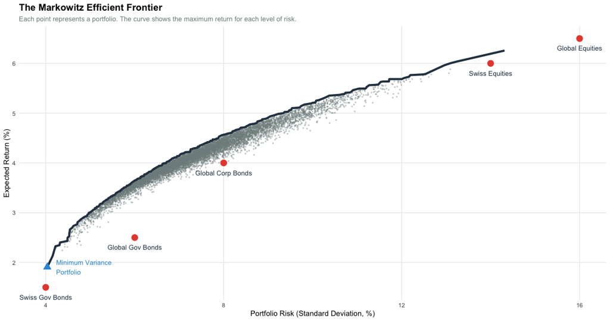
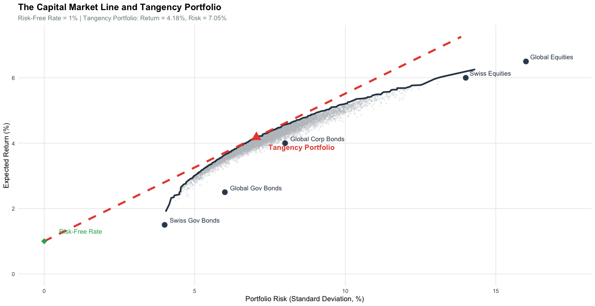
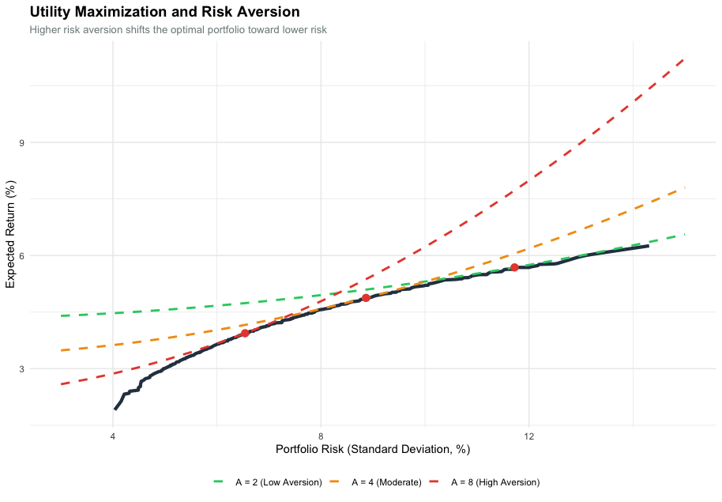
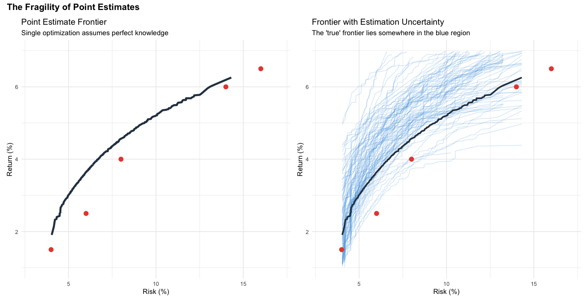

::: {.callout-tip title="Lecture Slides"}
**Associated slides:** [Lesson 4 — Strategic Asset Allocation](../slides/lesson-04-saa.html)
:::

## 7.1 Introduction

Chapter 6 established the capital market assumptions. We now have expectations for returns, volatilities, and correlations. These assumptions describe the investment landscape. They do not, by themselves, tell us how to combine asset classes into a portfolio.

Strategic asset allocation answers this question. It is the process of establishing a long-term policy mix. This mix balances risk and return against the investor's objectives and constraints. The resulting allocation is the policy portfolio. It serves as the anchor for all investment decisions.

The policy portfolio is not a forecast. It does not predict which asset class will outperform next year. It states how the portfolio will be positioned over the long term to achieve its goals. This positioning reflects the investor's willingness and ability to bear risk, expressed through the strategic beta of the portfolio. Strategic beta is the long-term exposure to systematic risk factors that drive returns over full market cycles.

Strategic asset allocation differs from tactical asset allocation. Tactical allocation seeks to exploit short-term market dislocations. It temporarily deviates from the policy mix. If the strategic allocation calls for 50 percent equities, a tactical overlay might increase that to 55 percent when equities appear cheap or reduce it to 45 percent when they appear expensive. Tactical allocation is about market timing. Strategic allocation is about discipline.

This distinction matters. Tactical allocation requires skill in forecasting short-term market movements. Evidence suggests this skill is rare and difficult to sustain. Strategic allocation requires discipline in maintaining exposure to the asset classes that deliver returns over time. The policy portfolio is not abandoned when markets fall. It is rebalanced back to target. Assets that have become cheaper are bought. Assets that have become dearer are sold.

This discipline is simple in concept. It is difficult in practice. It is also a primary source of long-term investment success. This is supported by the landmark study by @brinson1986determinants, which concluded that asset allocation policy accounts for over 90% of the variation in a portfolio's quarterly returns.

This chapter develops the framework for strategic asset allocation. We begin with the investment guidelines that translate IPS constraints into actionable boundaries. We then examine mean-variance optimization and its modern extensions. We consider the Black-Litterman model. We explore geographic and currency decisions. We examine methods for determining the asset mix and the behavioral considerations that shape implementation. The chapter concludes with the application of these concepts to the Schmidt-Miller family.

## 7.2 Establishing Investment Guidelines

Before determining the optimal mix of assets for any client, we must establish the investment guidelines that will govern the allocation process. These guidelines translate the client's documented objectives and constraints into actionable parameters that define the boundaries within which the portfolio will be constructed. They serve as the bridge between the Investment Policy Statement and the quantitative methods used to derive the strategic asset allocation.

**Return Objective**
The first guideline is the return objective. This is derived directly from the client's goals documented in the IPS. Whether the objective is capital appreciation, income generation, or preservation of purchasing power, it must be expressed in measurable terms—typically as an expected annualized return over the investment horizon. This target provides the benchmark against which the portfolio's performance will be evaluated and guides the selection of asset classes with appropriate return characteristics.

**Risk Tolerance**
Risk tolerance is perhaps the most critical guideline. As documented in the IPS, risk tolerance has two components: the client's ability to bear risk, which depends on time horizon, wealth, and the flexibility of goals, and the client's willingness to bear risk, which reflects their emotional comfort with volatility. When these diverge, the lower of the two must serve as the binding constraint. This guideline translates into a maximum acceptable drawdown—the worst loss the portfolio might experience in a severe bear market—which constrains how much equity risk the portfolio can take.

**Time Horizon**
The investment time horizon determines how long the portfolio has to recover from market downturns. Longer horizons typically allow for greater exposure to growth-oriented assets like equities, as there is time to ride out volatility. Shorter horizons require a greater emphasis on capital preservation. The time horizon may vary across different goals, requiring a segmented approach where funds are allocated to separate buckets with their own investment guidelines.

**Liquidity Requirements**
Liquidity refers to the need for readily accessible cash to fund near-term expenses. Some goals—such as a down payment on a home or funding a business venture—require specific sums of money at specific future dates. Others, such as retirement income, require ongoing cash flow. These liquidity needs dictate that a portion of the portfolio must be held in cash or highly liquid, low-volatility assets. Funds with no near-term liquidity needs can be invested with a longer-term orientation.

**Tax Constraints**
Tax considerations can significantly affect investment decisions. Assets held in tax-advantaged accounts have different implications than assets held in taxable accounts. Positions with embedded capital gains create a disincentive to sell. The client's marginal tax rate affects the after-tax return of different investment types. These constraints must be incorporated into the guidelines, influencing both asset location decisions and the timing of portfolio adjustments.

**Permissible Asset Classes**
Not all asset classes are suitable for every client. The guidelines should specify which asset classes are permissible based on the firm's investment philosophy and the client's objectives and constraints. For each asset class, permissible ranges should be established, reflecting its expected role in the portfolio. Equities provide growth potential but introduce volatility. Bonds provide stability and income. Alternatives may offer diversification and inflation protection. These ranges set the boundaries for the optimization process.

**Rebalancing Policy**
Over time, market movements will cause the portfolio to drift from its target allocation. The rebalancing policy specifies how and when the portfolio will be brought back into alignment. Common approaches include calendar-based rebalancing (e.g., quarterly or annually) and threshold-based rebalancing (e.g., when any asset class deviates by more than five percentage points from its target). The policy should also specify whether rebalancing will be accomplished through new cash flows or through selling overweight positions, with consideration given to transaction costs and tax consequences.

**Currency Policy**
For portfolios with international holdings, currency exposure is an important consideration. The guidelines should specify how currency risk will be managed. Options include leaving exposures unhedged to benefit from diversification, hedging all currency exposure back to the client's home currency, or a hybrid approach where certain currencies are hedged and others are not. The decision depends on the client's risk tolerance, investment horizon, and expectations about currency movements.

With these guidelines established, the advisor has a clear framework for the asset allocation process. The guidelines define the boundaries within which the portfolio will be constructed, ensuring that the resulting allocation is consistent with the client's documented objectives and constraints. They also provide a basis for the quantitative methods—such as mean-variance optimization and Monte Carlo simulation—that will be used to derive the optimal mix of assets.

## 7.3 Mean-Variance Optimization

Mean-variance optimization, first formalized by @markowitz1952portfolio, provides the theoretical foundation for portfolio construction. Markowitz’s work transformed finance by moving the focus from individual security selection to the statistical relationships between all assets in a portfolio. It offers a systematic method for combining assets to achieve the highest expected return for a given level of risk, or the lowest risk for a given level of expected return. The inputs are the capital market assumptions from Chapter 6: expected returns, volatilities, and correlations for each asset class. The output is a set of efficient portfolios. Each portfolio on the efficient frontier offers the maximum expected return for its level of risk. No portfolio exists with a higher expected return for the same risk, or with lower risk for the same expected return.

The mathematics is straightforward. The expected return of a portfolio is the weighted average of the expected returns of its constituents. The portfolio's risk, measured by variance, depends on both the variances of the individual assets and the covariances among them. Assets that move together offer less diversification than assets that move independently. This is the core insight of modern portfolio theory: risk depends not only on what you own but on how those holdings interact.

{#fig-efficient-frontier}

The introduction of a risk-free asset transforms the problem. A risk-free asset offers a guaranteed return with zero volatility. In practice, short-term government bonds serve as the proxy. When a risk-free asset is available, investors can combine it with any portfolio on the efficient frontier. This combination creates a straight line in risk-return space, extending from the risk-free rate to the chosen risky portfolio.

The Capital Market Line is the steepest possible line from the risk-free rate to the efficient frontier. It touches the frontier at exactly one point: the tangency portfolio. This portfolio offers the highest Sharpe ratio of any portfolio on the frontier. The Sharpe ratio measures the excess return per unit of risk:

$$
\text{Sharpe Ratio} = \frac{E(R_p) - R_f}{\sigma_p}
$$

The tangency portfolio maximizes this ratio. All investors, regardless of their risk aversion, should hold a combination of the risk-free asset and the tangency portfolio. More risk-averse investors hold more of the risk-free asset. Less risk-averse investors hold more of the tangency portfolio, and may even borrow at the risk-free rate to invest more than 100 percent in the tangency portfolio.

The equation of the Capital Market Line is:

$$
E(R_p) = R_f + \sigma_p \left( \frac{E(R_m) - R_f}{\sigma_m} \right)
$$

Where $E(R_p)$ is the expected return of the combined portfolio, $R_f$ is the risk-free rate, $\sigma_p$ is the portfolio's volatility, and $E(R_m)$ and $\sigma_m$ are the expected return and volatility of the tangency portfolio. The term in parentheses is the Sharpe ratio of the tangency portfolio.

This result is powerful. It separates the investment decision into two parts. Known as the 'Separation Theorem' (@tobin1958liquidity), this principle states that the technical task of finding the optimal risky portfolio is independent of the investor’s personal risk preferences. First, identify the tangency portfolio. This is a purely technical exercise, requiring only the capital market assumptions. Second, decide how much to allocate to the tangency portfolio versus the risk-free asset. This depends on the investor's risk aversion.

{#fig-cml}

The investor must select a portfolio from the efficient frontier. When no risk-free asset exists, this selection requires a utility function. A common formulation is:

$$
U = E(R_p) - \frac{1}{2} A \sigma_p^2
$$

Where $A$ is the coefficient of risk aversion. A higher value of $A$ indicates greater aversion to risk. The investor chooses the portfolio that maximizes utility. 

{#fig-utility}

With a risk-free asset available, the problem simplifies. Every investor holds the same tangency portfolio of risky assets. Only the mix between the risk-free asset and the tangency portfolio varies.

The elegance of mean-variance optimization is also its weakness. The framework is highly sensitive to the input assumptions. Small changes in expected returns produce large changes in the optimal portfolio weights, including the composition of the tangency portfolio. The optimizer takes the inputs as given. It lacks skepticism. It produces an allocation that is optimal for the specific set of assumptions but may be fragile in practice.

This sensitivity is known as the garbage-in, garbage-out problem. If the expected return assumptions are noisy, the optimizer amplifies that noise. It concentrates the portfolio in asset classes with seemingly high returns and excludes those with seemingly low returns. 

{#fig-fragility}

The practical consequence is that raw mean-variance optimization often produces concentrated portfolios that lack diversification. The optimizer identifies the asset class with the highest expected return and allocates heavily to it. When the future unfolds differently than the point estimates anticipated, the concentrated portfolio suffers disproportionately.

## 7.4 Improving MVO: Resampling and Constraints

The sensitivity of mean-variance optimization to estimation error requires a response. Two complementary approaches have emerged: the imposition of constraints and the use of resampling techniques.

Constraints translate qualitative guidelines into mathematical bounds. An equity allocation cap prevents the optimizer from allocating too heavily to equities, regardless of what the expected return assumptions suggest. A minimum position size ensures that every asset class receives some allocation. Constraints impose structure on the problem. They reflect the belief that a portfolio concentrated in a single asset class is not reasonable for a long-term investor. They also serve a statistical purpose. By limiting the optimizer's freedom, constraints reduce the influence of estimation error. The optimizer can no longer chase small differences in expected returns into extreme allocations. The resulting portfolio is less sensitive to the precise values of the inputs.

Resampling offers a different perspective. Developed by @michaud1989markowitz, resampled efficiency recognizes that the inputs to the optimization are estimates, not known parameters. Michaud demonstrated that by averaging many simulated frontiers, an advisor can create portfolios that are significantly more robust to estimation error than traditional Markowitz models. The method uses Monte Carlo simulation to generate many alternative sets of capital market assumptions, each consistent with the estimated means and the uncertainty around those estimates. The process is straightforward. A multivariate normal distribution is specified with means equal to the point estimates of expected returns. Random draws are taken from this distribution, producing new sets of expected returns that differ from the point estimates but are statistically plausible. An optimization is performed using each set of drawn returns. The process is repeated hundreds or thousands of times.

The recommended portfolio weights are the averages of the weights from all the simulations. The result is a resampled efficient frontier that is smoother than the traditional frontier. Portfolios on the resampled frontier are better diversified and less sensitive to small changes in the input assumptions. The logic is compelling. The point estimates are our best guess, but they are not the truth. There is a distribution of plausible true values around each estimate. Resampling explores that distribution. It asks what allocation would be optimal across the range of plausible scenarios. The answer is an allocation that does not bet heavily on any single scenario.

The distinction between constraints and resampling matters. Constraints are explicit. They reflect stated preferences and judgment about what constitutes a reasonable portfolio. Resampling is statistical. It reflects the uncertainty inherent in the estimation process. Both move the allocation away from the fragile optimum of a single optimization toward a more robust portfolio. These methods do not eliminate the need for judgment. The choice of constraints and the specification of the resampling process require decisions. But they provide a disciplined framework for incorporating uncertainty into the allocation process.

## 7.5 Risk Perspectives: Shortfall and Downside Risk

The mean-variance framework focuses on expected return and volatility. For many clients, particularly those in or near retirement, a different metric is more salient: the probability of falling short of their goals. This is shortfall risk.

Shortfall risk addresses a simple question. What is the probability that the portfolio fails to meet the minimum return required to fund the client's objectives? The probability can be estimated using Monte Carlo simulation. Given the portfolio's expected return and volatility, the simulation generates a distribution of outcomes. The proportion of outcomes in which the portfolio fails to meet the threshold return is the shortfall probability.

A portfolio with an expected return of 7 percent and volatility of 14 percent might have a shortfall probability of 25 percent against a 6 percent threshold. A portfolio with an expected return of 5.5 percent and volatility of 8 percent might have a shortfall probability of only 15 percent. Despite the lower expected return, the second portfolio offers greater certainty of meeting the threshold. This trade-off is central to the allocation decision for a loss-averse client.

The Safety-First criterion, developed by @roy1952safety, formalizes this intuition. @roy1952safety provides a mathematical framework for investors whose primary concern is not maximizing utility, but rather minimizing the probability of a 'disastrous' outcome. Roy's ratio measures the distance between the portfolio's expected return and the threshold return, expressed in units of volatility:

$$
SF = \frac{E(R_p) - R_{\text{threshold}}}{\sigma_p}
$$

A higher ratio indicates a lower probability of falling short, assuming normally distributed returns. The portfolio that maximizes Roy's ratio is the one that minimizes the shortfall probability. This is a different objective than maximizing expected return for a given level of risk. It explicitly incorporates the threshold that matters to the client.

Shortfall risk addresses the probability of missing a target. It does not directly measure the magnitude of potential losses. For a loss-averse client, understanding the severity of possible losses is as important as understanding their likelihood.

Value at Risk, or VaR, addresses this need. VaR measures the maximum expected loss over a specified time horizon at a given confidence level. A one-year 95 percent VaR of 15 percent means that there is a 5 percent probability of losing more than 15 percent of the portfolio's value in a given year. VaR is expressed as a single number. It is easy to communicate. A client can understand that, in most years, losses will not exceed a certain threshold.

VaR has limitations. It does not describe the severity of losses beyond the threshold. If the 5 percent tail event occurs, how bad could it be? VaR provides no answer.

Conditional Value at Risk, or CVaR, addresses this limitation. CVaR measures the expected loss given that the loss exceeds the VaR threshold. It is the average of all losses in the tail of the distribution. If the 95 percent VaR is 15 percent, the 95 percent CVaR might be 22 percent. This tells the client that, in the worst 5 percent of outcomes, the average loss is 22 percent.

The difference between VaR and CVaR is substantial for portfolios with fat-tailed return distributions. As discussed in Chapter 6, financial returns exhibit negative skew and high kurtosis. Extreme losses occur more frequently than a normal distribution would predict. VaR, which only looks at the threshold, may understate the true risk. CVaR, which averages across the entire tail, provides a more complete picture.

*[Placeholder for Figure 7.6: VaR and CVaR for a hypothetical portfolio return distribution]*

The Safety-First criterion and the downside risk metrics serve complementary roles. Roy's ratio addresses the probability of missing the return threshold. VaR and CVaR address the magnitude of potential losses. Together, they provide a comprehensive framework for evaluating portfolios from the perspective of a loss-averse client.

These metrics translate qualitative loss aversion into quantitative constraints. The advisor might specify that the one-year 95 percent VaR cannot exceed a certain threshold, or that the 95 percent CVaR must be contained within a specified limit. These constraints become additional inputs to the optimization process.

The integration of these risk perspectives changes how candidate portfolios are evaluated. A portfolio that looks attractive under mean-variance optimization may be rejected when evaluated against shortfall and downside risk metrics. The concentrated equity portfolio produced by naive optimization has a high expected return but also high VaR and CVaR. More balanced portfolios have lower expected returns but also lower downside risk metrics.

The final allocation should perform well across multiple risk dimensions. It should offer a reasonable expected return. It should have a high probability of meeting the threshold return. It should limit the magnitude of potential losses in adverse scenarios. No single metric captures all aspects of risk. A comprehensive evaluation requires considering the portfolio from multiple perspectives.

## 7.6 The Black-Litterman Model

The Black-Litterman model, developed by @black1992global, addresses the instability of mean-variance optimization from a different angle. By utilizing a Bayesian framework, Black and Litterman allowed practitioners to blend market equilibrium with subjective investor views to produce stable, diversified asset weights. Rather than constraining or resampling from historical estimates, the model starts from market equilibrium and tilts only where the investor has specific views.

The insight is powerful. Market prices reflect the collective wisdom of all investors. The market portfolio, in which each asset is held in proportion to its market capitalization, is the ultimate benchmark. If the investor has no special information, the market portfolio is the optimal portfolio. Deviations from the market portfolio should be based on views that the investor holds with conviction.

This starting point is fundamentally different from the traditional approach. Mean-variance optimization begins with expected return estimates, often derived from historical data or building block models. These estimates are noisy. The optimizer amplifies the noise. The Black-Litterman model begins with the implied equilibrium returns that are consistent with the market portfolio. These returns are derived through reverse optimization: given the market weights of each asset class and the covariance matrix, what expected returns would make those weights optimal?

The resulting implied returns are stable. They reflect the market's collective assessment of risk and return. They do not require forecasting. They are the returns that justify the current market capitalization of each asset class.

The investor then specifies views. A view is a statement about the expected return of one or more asset classes, expressed with a degree of confidence. For example, the investor might hold the view that domestic equities will outperform global equities by a certain margin over the next decade. Or that corporate bonds will underperform government bonds. Each view is accompanied by a confidence level, reflecting the investor's uncertainty.

The model combines the implied equilibrium returns with the investor's views using Bayesian updating. The resulting expected returns are a weighted average of the equilibrium returns and the views. The weights depend on the confidence in the views and the precision of the equilibrium estimates. A view held with high confidence receives more weight. A view held with low confidence receives less weight. If the investor has no views, the model simply returns the equilibrium portfolio.

The formula for the combined expected return vector is:

$$
E(R) = [(\tau\Sigma)^{-1} + P^T\Omega^{-1}P]^{-1} [(\tau\Sigma)^{-1}\Pi + P^T\Omega^{-1}Q]
$$

Where $\Pi$ is the vector of implied equilibrium returns, $\Sigma$ is the covariance matrix, $\tau$ is a scaling parameter reflecting uncertainty in the equilibrium returns, $P$ is a matrix specifying the investor's views, $Q$ is the vector of view expected returns, and $\Omega$ is the covariance matrix of the views, reflecting their uncertainty.

The mathematics is complex. The intuition is simple. Start with the market. Tilt only where you have a genuine insight.

The parameters $\tau$ and $\Omega$ control how far the portfolio tilts away from the market equilibrium. Understanding these parameters is essential for applying the model effectively.

The parameter $\tau$ represents the overall uncertainty in the equilibrium returns. A higher value of $\tau$ indicates less confidence in the equilibrium estimates, allowing the investor's views to have greater influence on the final allocation. A lower value of $\tau$ indicates greater confidence in equilibrium, anchoring the portfolio more firmly to market weights. In practice, $\tau$ is often set to a small value, reflecting the belief that market prices contain substantial information. A common choice is to set $\tau$ inversely proportional to the number of historical observations used to estimate the covariance matrix, or simply to use a value between 0.01 and 0.05.

The matrix $\Omega$ captures the uncertainty in each view. It is a diagonal matrix when views are independent, with each diagonal element $\omega_k$ representing the variance of the $k$-th view. A smaller $\omega_k$ indicates higher confidence in that view. A larger $\omega_k$ indicates lower confidence.

The relationship between $\tau$ and $\Omega$ determines the relative weight given to equilibrium versus views. The weight on the views is proportional to $(\tau\Sigma)^{-1}$ relative to $P^T\Omega^{-1}P$. When $\Omega$ contains small values, indicating high confidence in the views, the term $P^T\Omega^{-1}P$ becomes large, and the views dominate the final expected returns. When $\Omega$ contains large values, indicating low confidence, the equilibrium returns dominate.

Consider an example. Suppose the equilibrium return for an asset class is 5 percent. The investor holds a view that the return will be 7 percent. If the investor has high confidence in this view, the corresponding $\omega$ is small, and the final expected return might be 6.5 percent. If the investor has low confidence, $\omega$ is large, and the final expected return might be 5.2 percent. The difference reflects the strength of conviction.

The calibration of $\Omega$ is a critical step. One approach is to set $\omega_k$ equal to the variance of the view portfolio, scaled by the investor's confidence. If the view is that asset A will outperform asset B by 2 percent, and the historical volatility of a long-short portfolio capturing this view is 10 percent, then $\omega_k$ might be set to $0.10^2 = 0.01$. A more confident investor might scale this down by a factor of two or four. A less confident investor might scale it up.

The interplay between $\tau$ and $\Omega$ means that the same view can produce different portfolio tilts depending on how these parameters are set. An investor who sets $\tau$ very low and $\Omega$ very high will stay close to the market portfolio regardless of views. An investor who sets $\tau$ higher and $\Omega$ lower will tilt more aggressively.

The practical benefits of the Black-Litterman model are substantial. Portfolios constructed using this approach are better diversified and more aligned with market weights. They do not exhibit the extreme concentrations that plague raw mean-variance optimization. They are also more stable over time. Small changes in the input assumptions do not produce large changes in the recommended allocation.

The model also addresses a practical problem in institutional asset management. Investment committees often struggle to agree on expected return assumptions. The Black-Litterman framework separates the problem into two parts. The equilibrium returns are derived from observable market weights and the covariance matrix. They are not subject to debate. The views are the only part of the process that requires judgment. The committee can focus its discussion on the areas where it has genuine insights, rather than trying to forecast returns for every asset class.

The Black-Litterman model has become an institutional standard for strategic asset allocation. It combines the discipline of mean-variance optimization with the stability of market equilibrium and the flexibility to incorporate investor-specific views. It produces portfolios that are theoretically sound, practically robust, and defensible to clients and committees.

The model does not eliminate the need for judgment. The choice of views, the calibration of $\tau$ and $\Omega$, and the estimation of the covariance matrix all require careful thought. But the framework provides a structured way to incorporate judgment into the allocation process. It anchors the portfolio in the market consensus and requires a reason to deviate. That discipline prevents the optimizer from chasing noise and produces allocations that are more likely to perform well in the future.

## 7.7 Geographic and Currency Diversification

The strategic asset allocation framework developed to this point assumes a single-currency world. Investors operate in a multi-currency environment. The assets they hold are denominated in different currencies. Their spending is in their home currency. This introduces currency risk.

Home bias is the tendency of investors to overweight domestic assets relative to their share of the global market portfolio. The phenomenon is pervasive. Investors in every country hold more domestic equities than global market capitalization would justify. In Switzerland, domestic equities represent approximately 3 percent of global market capitalization, yet Swiss investors typically allocate 15 to 30 percent of their equity portfolios to Swiss stocks.

This bias is not entirely irrational. Domestic assets are familiar. They are not subject to currency risk, as their returns and the investor's spending are in the same currency. Their performance is more correlated with the domestic economy and, by extension, with the investor's labor income and the value of their home. In a severe global downturn, domestic assets may hold up better than foreign assets.

The cost of home bias is reduced diversification. By overweighting domestic assets, the investor forgoes the risk reduction that comes from holding a globally diversified portfolio. The optimal balance depends on circumstances. A young investor with a long horizon and flexible spending may benefit from a global market-cap-weighted portfolio. A retiree whose spending is entirely in the home currency may benefit from a modest home bias.

Currency hedging addresses a related question. When the portfolio holds foreign assets, it is exposed to movements in exchange rates. A strengthening home currency reduces the home-currency value of foreign holdings. A weakening home currency increases it.

For fixed income, the case for currency hedging is strong. Foreign bonds offer a yield that may differ from domestic bonds. Currency movements can overwhelm this differential. A favorable yield pickup can be erased by an adverse currency movement. Hedging isolates the yield differential and reduces portfolio volatility. The cost of hedging is typically low.

For equities, the case is less clear. Currency movements and equity returns are often negatively correlated. When the home currency strengthens, it often coincides with global risk aversion. Foreign equity prices fall, but the currency loss is partially offset. This natural hedge reduces the need for explicit hedging.

A pragmatic approach, common in institutional practice, is to hedge the currency exposure of the fixed income allocation while leaving the equity allocation unhedged. This captures the volatility reduction benefits where the case is strongest while preserving the diversification of unhedged equities.

## 7.8 Methods for Determining the Asset Mix

Several distinct philosophies compete for the attention of asset allocators. Each offers a different perspective on how to combine asset classes into a portfolio.

The traditional 60/40 portfolio allocates 60 percent to equities and 40 percent to bonds. It is simple, transparent, and has a long track record. For many investors, it remains a reasonable baseline. The 60/40 portfolio provides growth through equities and stability through bonds. Its primary limitation is that it concentrates risk in the equity allocation. In a severe bear market, the equity decline dominates performance. A 60/40 portfolio might experience 90 percent or more of its total risk from equities. It is not balanced from a risk perspective.

Risk parity addresses this limitation. Rather than allocating capital equally, risk parity allocates risk equally. Each asset class is weighted so that its contribution to total portfolio risk is the same. This approach, formalized by @qian2005risk as 'Risk Parity,' seeks to build a portfolio that can perform across different economic regimes by diversifying risk rather than just capital. This typically results in a much higher allocation to bonds than a 60/40 portfolio. Because bonds have lower volatility, a larger capital allocation is required for them to contribute the same amount of risk.

The expected return of a risk parity portfolio is lower than that of a 60/40 portfolio. To bring the expected return up, leverage is applied. The portfolio borrows to invest more in the risk parity mix. This introduces additional costs and risks. If borrowing costs rise or assets perform poorly, the leveraged portfolio can experience magnified losses. Risk parity also requires accurate estimates of volatilities and correlations, as the risk contributions depend on these estimates.

Goal-based allocation takes a different approach. It does not treat the portfolio as a single pool. It recognizes that different goals have different time horizons and different risk tolerances. Near-term goals are funded with conservative instruments. Long-term goals are funded with growth-oriented assets.

The goal-based framework begins with an inventory of the client's goals. Each goal is assigned a time horizon and a priority. Assets are allocated to distinct buckets. The liquidity bucket holds cash and short-term bonds. The medium-term bucket holds a balanced mix. The long-term bucket holds growth-oriented assets.

This approach offers transparency. The client sees exactly how each goal is funded. The trade-offs are visible. If spending on a near-term goal increases, the impact on the long-term portfolio is clear. There is also a psychological benefit. Knowing that near-term spending is protected may increase willingness to accept volatility in the long-term portfolio.

Goal-based allocation does not produce a single optimal portfolio in the mean-variance sense. It produces a set of portfolios, each aligned with a specific goal. The overall allocation is the sum of the parts.

Each method has its place. The traditional 60/40 portfolio suits investors who prefer simplicity. Risk parity suits those who seek a balanced risk profile and accept leverage. Goal-based allocation suits those with distinct goals and time horizons. The choice depends on circumstances, preferences, and investment philosophy.

## 7.9 Behavioral Considerations in Asset Allocation

The strategic asset allocation must be implemented. This is where behavioral considerations become paramount. A theoretically optimal allocation that the client cannot adhere to is not optimal.

Regret aversion is the tendency to avoid decisions that could later be a source of regret. An investor who fears regret may delay investing altogether, preferring the perceived safety of cash to the possibility of an immediate loss. This bias is particularly acute after a large liquidity event, such as the sale of a business or the receipt of an inheritance. The investor has a lump sum. The market feels uncertain. The fear of investing just before a downturn is paralyzing.

A glide path addresses this concern. Rather than investing the full amount immediately, the allocation to equities is phased in over time. The first tranche is invested at the outset. The second tranche follows six months later. The third after a year. This reduces the risk of investing everything at a market peak. The expected return is slightly lower due to the time out of the market, but the psychological benefit may justify the cost. For a client paralyzed by regret aversion, a glide path can be the difference between implementing the plan and remaining in cash indefinitely.

The glide path must be documented. It is not a tactical decision to time the market. It is a behavioral accommodation, a structured way to ease the client into the target allocation. The schedule is set in advance and followed regardless of market movements.

Framing matters. How the allocation is presented affects how it is perceived. A portfolio with an expected volatility of 12 percent sounds risky. The same portfolio, framed as having a 90 percent probability of meeting the client's spending needs over thirty years, sounds reassuring. Both statements are true. The framing determines which aspect of the distribution the client focuses on.

Loss aversion, introduced in Chapter 4, makes framing particularly important. A loss-averse client experiences the pain of a decline more intensely than the pleasure of an equivalent gain. Presenting the allocation in terms of standard deviation emphasizes the potential for decline. Presenting it in terms of goal achievement emphasizes the long-term outcome. The Monte Carlo simulation from Chapter 6 provides the tool. The advisor can show the distribution of terminal wealth and highlight the high probability of success.

Mental accounting also shapes implementation. Clients often treat different pools of money differently, even when the pools are part of the same economic whole. An inheritance is treated as more sacred than earned income. A retirement account is treated as untouchable. The strategic allocation must accommodate these mental accounts. The goal-based segmentation discussed in Section 7.8 provides a natural framework. Each bucket aligns with a mental account, and the allocation within each bucket respects the client's emotional relationship with that money. This behavioral accommodation is grounded in @thaler1985mental theory of Mental Accounting, which describes the human tendency to categorize funds into non-fungible 'bins' based on their source or intended use.

Behavioral considerations do not change the strategic allocation. They change how it is implemented and communicated. A successful advisor anticipates the behavioral obstacles and builds the implementation plan to navigate around them.

## 7.10 Incorporating Sustainability and Global Trends

Many investors now wish to align their portfolios with environmental, social, and governance values. ESG investing has moved from a niche interest to a mainstream consideration. The strategic asset allocation must address how these preferences are incorporated.

ESG implementation takes several forms. Negative screening excludes companies or industries that conflict with the investor's values. Tobacco, weapons, and fossil fuels are common exclusions. Positive screening seeks companies with strong ESG practices relative to their peers. ESG integration considers ESG factors alongside traditional financial metrics in the investment process. Impact investing targets measurable social or environmental outcomes alongside financial returns.

The effect of ESG constraints on expected returns is debated. One view holds that ESG screens reduce the investable universe and therefore reduce expected returns. Excluding entire sectors, such as fossil fuels, reduces diversification and eliminates potential sources of return. The portfolio is constrained, and constraints reduce expected utility.

The opposing view holds that companies with strong ESG practices are better managed and face lower risks. They may be less likely to experience environmental disasters, regulatory penalties, or reputational damage. This lower risk profile may translate into a lower cost of capital and, over time, superior risk-adjusted returns. The constraint is not a cost but a source of alpha.

The academic evidence is mixed. Some studies find that ESG screens have no material effect on returns. Others find a small positive effect. Others find a small negative effect. The variation across time periods, markets, and methodologies makes definitive conclusions difficult.

What is clear is that ESG constraints affect portfolio construction. Exclusionary screens reduce diversification and may introduce tracking error relative to broad market benchmarks. The magnitude depends on the breadth of the screens. A screen that excludes only tobacco has minimal impact. A screen that excludes all fossil fuel companies has a material impact on sector weights.

The debate over ESG and expected returns may miss the point. For many investors, the objective is not to maximize expected return. It is to achieve a satisfactory return while aligning the portfolio with their values. The strategic asset allocation should accommodate these preferences while being transparent about the trade-offs involved.

## 7.11 Revisiting and Adjusting the Allocation

Strategic asset allocation is not a one-time decision. It requires ongoing maintenance. Markets move. Asset classes perform differently. The portfolio drifts from its target allocation.

Rebalancing is the process of restoring the portfolio to its target weights. It serves two purposes. First, it maintains the portfolio's risk profile, preventing the equity allocation from becoming larger than intended after a bull market. Second, it enforces a discipline of buying low and selling high, which can enhance long-term returns.

The frequency and method of rebalancing matter. Continuous rebalancing incurs transaction costs and, in taxable accounts, capital gains taxes. Infrequent rebalancing allows the portfolio to drift, altering its risk profile. A common approach is to rebalance when asset class weights deviate from their targets by more than a specified tolerance band, such as five percentage points. This threshold-based approach balances the benefits of maintaining the target allocation against the costs of trading.

Tax considerations complicate rebalancing. Selling assets that have appreciated triggers capital gains taxes. For a client with embedded gains, such as an inherited portfolio with a low cost basis, the tax cost of rebalancing can be substantial. The rebalancing policy should accommodate this constraint.

The first line of defense is to use cash flows. New contributions, dividends, and interest payments can be directed to underweight asset classes. This rebalances the portfolio without triggering taxes. Only when cash flows are insufficient should sales be considered.

The second line of defense is to widen the tolerance bands for assets with embedded gains. A typical band might be five percentage points. For a highly appreciated position, the band might be widened to ten percentage points. The portfolio is allowed to drift further before rebalancing is triggered.

The third line of defense is to prioritize sales of assets with the highest cost basis. Within an asset class, specific lots can be selected to minimize the realized gain. This requires careful record-keeping and coordination with the client's tax advisor.

The strategic allocation itself should be reviewed periodically, typically annually, or when material changes occur in the client's circumstances or the capital market assumptions. A significant shift in valuations, a change in the interest rate environment, or a revision to the economic outlook may warrant an adjustment to the policy weights. The review process is documented in the IPS. It ensures that the allocation remains aligned with the client's objectives and with the evolving investment landscape.

## 7.12 Application: The Schmidt-Miller Family

We now apply the strategic asset allocation framework to the Schmidt-Miller family. The objective is to produce a policy portfolio that respects the constraints documented in the IPS, incorporates the capital market assumptions from Chapter 6, and addresses the behavioral considerations identified in Chapter 4.

The family's goals require a segmented approach. The liquidity bucket funds the art gallery and the first year of retirement spending. The medium-term buckets fund Lukas's down payment and the Lake Garda property. The long-term bucket funds the ongoing retirement spending and the legacy goal. Each bucket has its own time horizon and risk tolerance.

The long-term portfolio is the core of the family's wealth. It must generate the 6 to 8 percent return required to sustain retirement spending while respecting Klaus's binding constraint on risk. The equity allocation is capped at 50 percent. Portfolio volatility is capped at 10 percent.

We evaluate candidate allocations using the methods developed in this chapter. Mean-variance optimization, constrained by the equity cap and volatility limit, provides a starting point. Resampling addresses estimation uncertainty. The Safety-First criterion ensures a high probability of meeting the threshold return.

The recommended strategic allocation for the long-term portfolio is as follows.

| Asset Class | Weight | Rationale |
|---|---|---|
| Global Equities | 35% | Core growth exposure, diversified across regions |
| Swiss Equities | 15% | Home bias, lower volatility, currency match |
| Global Government Bonds | 10% | Crisis protection, negative correlation with equities |
| Swiss Government Bonds | 10% | Safety, currency match, low volatility |
| Global Corporate Bonds | 30% | Enhanced yield with moderate credit risk |

This allocation has an expected return of 5.3 percent and expected volatility of 9.0 percent. The expected return is at the lower end of the target range but is achievable within Klaus's risk constraints. The Roy's ratio, using a threshold return of 6 percent, is approximately negative 0.08. This indicates a meaningful probability of falling short of the threshold, a reality that must be communicated clearly.

The overall portfolio, including the conservative buckets, has an expected return of approximately 5.0 percent and expected volatility of 7.5 percent. The total equity allocation across all buckets is 45 percent, below the 50 percent cap.

Klaus will want to know how this portfolio would have performed in a severe crisis. We stress-test the allocation using historical data from the 2008 financial crisis. The long-term portfolio would have declined by approximately 22 percent from peak to trough. The overall portfolio, including the conservative buckets, would have declined by approximately 16 percent.

This is the level of decline Klaus must be prepared to accept. The historical record shows that declines of this magnitude occur periodically. It also shows that the portfolio would have recovered. By 2010, the portfolio would have returned to its pre-crisis value. By 2015, it would have grown substantially beyond it.

The stress test provides a concrete basis for the conversation with Klaus. It moves the discussion from abstract percentages to the lived experience of a past crisis. Klaus can assess whether he could tolerate a decline of this magnitude in exchange for the long-term returns required to fund the family's goals.

Elke's inherited portfolio of Swiss equities, valued at €2.5 million, is integrated into the Swiss equity allocation. The inherited holdings have a low cost basis. Selling them would trigger a 20 percent capital gains tax. The rebalancing policy accommodates this constraint. Cash flows are directed to other asset classes to maintain the target allocation. Sales from the inherited portfolio are minimized and occur only when deviations exceed a widened tolerance band of ten percentage points.

The final strategic allocation across all segments of the Schmidt-Miller portfolio is summarized in the following table.

| Asset Class | Liquidity | Medium-Term 1 | Medium-Term 2 | Long-Term | Total | Weight |
|---|---|---|---|---|---|---|
| Global Equities | — | — | 200,000 | 6,436,500 | 6,636,500 | 31% |
| Swiss Equities | — | — | 200,000 | 2,758,500 | 2,958,500 | 14% |
| Global Gov Bonds | — | 200,000 | 600,000 | 1,839,000 | 2,639,000 | 12% |
| Swiss Gov Bonds | — | 200,000 | 600,000 | 1,839,000 | 2,639,000 | 12% |
| Corporate Bonds | — | — | 400,000 | 5,517,000 | 5,917,000 | 28% |
| Cash | 660,000 | — | — | — | 660,000 | 3% |
| **Total** | **660,000** | **400,000** | **2,000,000** | **18,390,000** | **21,450,000** | **100%** |

This allocation represents a compromise. It pursues the highest expected return achievable within Klaus's binding constraint on risk. It respects Elke's emotional attachment to her inherited assets while providing a path toward greater diversification. It protects near-term goals in conservative instruments while positioning long-term capital for growth.

The compromise is visible in the numbers. The expected return of 5.0 to 5.3 percent falls slightly short of the 6 to 8 percent target. The shortfall probability is not zero. The family may need to adjust expectations, reduce spending, or accept a slightly higher probability of falling short. The IPS review process provides the mechanism for monitoring outcomes and making adjustments over time.

The allocation is not static. It will be rebalanced according to the policy documented in the IPS. It will be reviewed annually. It provides the framework within which all future investment decisions will be made. The Investment Policy Statement and the strategic asset allocation together form a complete plan, grounded in the family's circumstances and adaptable to the unfolding future.

