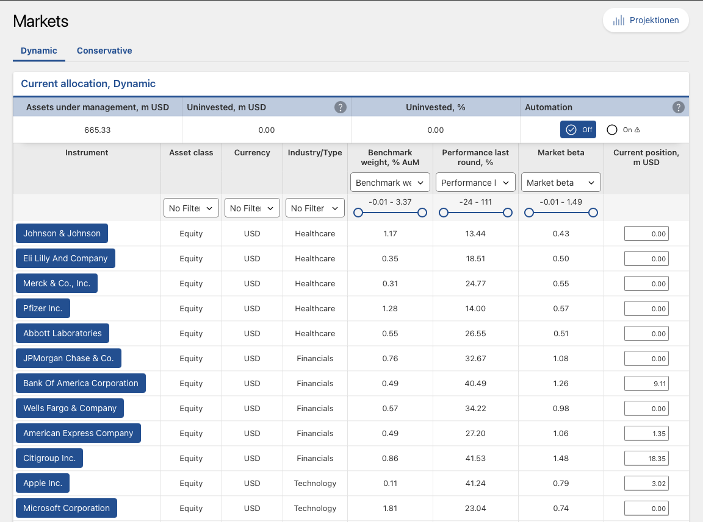

::: {.callout-tip title="Lecture Slides"}
**Associated slides:** [Lesson 5 — Tactical Allocation & Security Selection](../slides/lesson-05-taa-security.html)
:::

## 11.1 Introduction: The Transition from Paper to Market

The strategic asset allocation has been determined. The tactical framework is established. The securities are selected. What remains is execution—turning model weights into settled positions in a live portfolio. This transition is often treated as an afterthought, a minor operational detail to be handled by the trading desk. That perception is expensive.

Implementation is where value is preserved or destroyed. An elegant allocation executed poorly will underperform a mediocre allocation executed well. The frictions discussed in Chapter 9—commissions, spreads, market impact, and taxes—are not theoretical. They are measured in basis points deducted from the client's return, year after year. A portfolio that looks attractive on a spreadsheet can be eroded by the cumulative cost of trading before it has a chance to deliver on its design.

The Schmidt-Miller family presents an implementation challenge in concentrated form. Klaus's €18 million windfall from the sale of his practice must be deployed into the strategic allocation without moving markets. An order of that size, if executed carelessly, can push prices against the buyer. The market impact alone could consume the first year's expected excess return. Elke's inherited portfolio adds a separate layer of complexity. The holdings carry a low cost basis. Selling them to align with the strategic allocation triggers a 20 percent capital gains tax. The implementation plan must respect the allocation targets while minimizing the tax liability that hasty execution would create.

Alignment is the final check. The model portfolio from Chapter 7 specifies weights. The physical portfolio holds securities. The two must match within the tolerance bands specified by the tactical corridors. If the model says 35 percent global equities, the physical portfolio should hold approximately 35 percent global equities. Drift is inevitable. Markets move. Securities pay dividends. Cash accumulates. But sustained misalignment means the portfolio is not doing what it was designed to do. The implementation process must include a mechanism for comparing the physical portfolio to the model and correcting deviations before they become material.

This chapter addresses the practical challenges of building a live portfolio from the plans developed in earlier chapters. We examine trading strategies that minimize market impact. We address the tax-aware transition of legacy holdings. We explore the operational infrastructure—custody, settlement, and reporting—that supports the investment process. The distance between a spreadsheet and a brokerage statement is longer than it appears. The Schmidt-Miller family is about to cross it.

## 11.2 Implementation Vehicles: The How

The strategic allocation specifies asset classes. Security analysis identifies attractive securities. But before a single trade is placed, a more fundamental decision must be made: the wrapper. The same exposure to Swiss equities can be obtained through an ETF, an index fund, a mutual fund, a separately managed account, or by buying the underlying stocks directly. Each vehicle has different costs, different tax implications, and different degrees of control. The choice of wrapper affects net returns as much as the choice of what to buy.

Exchange-traded funds dominate modern portfolio implementation. Their structure is elegant. Authorized participants create and redeem shares in large blocks, exchanging a basket of the underlying securities for ETF shares or vice versa. This mechanism keeps the market price close to net asset value. When the price deviates, authorized participants arbitrage the difference away, profiting from the spread while restoring alignment. The investor benefits from intraday liquidity, transparent pricing, and, in most cases, low expense ratios.

They are not free. The total cost of ownership extends beyond the headline expense ratio. Bid-ask spreads must be crossed on every purchase and sale. The ETF may deviate from its benchmark, incurring tracking error. Securities lending revenue, which some providers share with investors and others retain, can offset costs or widen the gap between gross and net returns. A cost-conscious investor evaluates the total package, not just the management fee. An ETF with a 0.05 percent expense ratio that tracks its index loosely may be more expensive in practice than one with a 0.10 percent ratio that tracks perfectly.

Index funds offer a similar proposition with a different structure. They price once daily at net asset value, eliminating bid-ask spreads for the investor but also removing intraday liquidity. For long-term investors who do not need to trade during the day, this distinction is largely irrelevant. The choice between an ETF and an index fund often comes down to platform availability, fee structure, and personal preference. Both provide low-cost, diversified exposure to an asset class. Both have largely replaced traditional active mutual funds as the default choice for core allocation building blocks.

Active vehicles introduce manager selection risk in exchange for the possibility of excess returns. The evidence, discussed in Chapter 8, is sobering. Most active funds underperform their benchmarks after fees. The few that outperform cannot be reliably identified in advance. For most investors, most of the time, passive vehicles are the better choice. That does not make active management worthless—certain asset classes and strategies offer greater scope for skill to add value—but it raises the bar. An active vehicle must demonstrate a credible edge before it earns a place in the portfolio.

Separately managed accounts, or SMAs, occupy a distinct niche. Rather than commingling assets with other investors, the client owns the underlying securities directly in a segregated account. The manager trades on the client's behalf, but legal ownership of each security remains with the client. This structure carries significant advantages for taxable investors. The portfolio can be customized to reflect existing holdings, avoiding the realization of embedded gains. Tax-loss harvesting can be implemented at the individual security level, selling specific lots with losses to offset gains elsewhere. The cost is typically higher than a mutual fund, reflecting the operational complexity of managing separate accounts. Whether the tax benefits justify that additional cost depends on the client's tax rate, the size of the embedded gains, and the expected holding period.

Alternative assets present different wrapper considerations. Commodities cannot be held physically in a securities account. Exchange-traded products, or ETPs, provide exposure through futures contracts or, in some cases, physical storage. Physical gold ETPs hold bars in a vault. Synthetic commodity ETPs replicate returns through swap agreements with counterparties. The distinction matters. Physical ETPs avoid counterparty risk but incur storage costs. Synthetic ETPs offer precise tracking but introduce the risk that the swap counterparty fails. The choice depends on which risk is more acceptable in the context of the overall portfolio.

Direct indexing represents the furthest evolution of passive implementation. Rather than buying an ETF that tracks an index, the investor buys all the underlying stocks directly. The portfolio mirrors the index but is held as individual securities. The advantage is granular tax management. Every stock is a separate tax lot. When one declines, it can be sold to realize the loss while a similar stock is purchased to maintain factor exposures. The harvested losses offset gains elsewhere, reducing the overall tax burden. Direct indexing has grown rapidly as trading costs have declined and software has automated the process. It is most valuable for taxable investors in high marginal brackets who can benefit from continuous loss harvesting over many years. For tax-exempt accounts or investors in low brackets, the additional complexity may not justify the incremental benefit.

The wrapper decision is not glamorous. It involves no earnings forecasts, no competitive analysis, no assessment of management quality. Yet it directly affects the net return the client receives. An allocation implemented through high-cost, tax-inefficient vehicles will underperform the same allocation implemented through low-cost, tax-efficient ones—every year, without fail. The difference compounds. The choice of wrapper is among the most consequential decisions in the implementation process and deserves the same analytical rigor as the strategic allocation itself.

## 11.3 Trading and Execution: Managing Friction

The decision to trade is made in a conference room. The trade itself is executed in a market. The market extracts a price for the service it provides, and that price extends well beyond the commission line on a trade confirmation.

Explicit costs are visible and have collapsed over the past two decades. Commissions on equity trades approach zero at many brokers. Exchange fees are published. Stamp duties, where applicable, are known in advance. For liquid securities in developed markets, these costs no longer present a material barrier to implementation. The real costs lie elsewhere.

Implicit costs are larger and harder to measure. The bid-ask spread is the difference between what a dealer will pay and what they will charge. Crossing that spread costs money, even though it appears nowhere on a statement. For large-cap stocks, the spread may be a few basis points. For smaller companies, less liquid bonds, or thinly traded funds, it can be substantial. Market impact is more subtle still. A large buy order absorbs available supply and pushes the price upward. A large sell order does the reverse. The price moves against the trader simply because the trade exists.

Opportunity cost completes the triangle. An order executed slowly minimizes impact but risks adverse price movement while it sits unfilled. An order executed quickly locks in the price but maximizes impact. Somewhere between urgency and patience lies the optimal path, and finding it is the central challenge of execution. The more patient the trader, the lower the market impact—but the greater the risk that the market moves away. The more aggressive the trader, the higher the impact—but the sooner the position is established and the uncertainty resolved.

The implementation shortfall framework, developed by André Perold in the 1980s, integrates these costs into a single measure. It captures the total friction between the decision to trade and the settled position.

$$
\text{Implementation Shortfall} = \frac{P_{\text{exec}} - P_{\text{decision}}}{P_{\text{decision}}} + \text{Commissions} + \text{Opportunity Cost}
$$

Where $P_{\text{decision}}$ is the market price when the trade is authorized and $P_{\text{exec}}$ is the volume-weighted average price achieved. A positive shortfall means the trade cost money. A negative shortfall—possible if prices move favorably during execution—means the trade earned money relative to the decision price.

The framework decomposes into three pieces. Delay cost captures price movement between decision and the start of execution. It reflects the time spent preparing the order, obtaining approvals, or waiting for market conditions to improve. Execution cost captures the impact of the order itself, including the bid-ask spread and the price movement caused by the trade. Opportunity cost captures the unfilled portion—the shares that were not purchased before the price moved away, or not sold before it fell. Together these three components provide a complete accounting of what happened between intention and outcome. A trader who measures implementation shortfall systematically can identify where costs are being incurred and adjust the process accordingly.

Liquidity and volume determine how long an order takes to execute without excessive impact. The days-to-trade calculation is straightforward:

$$
\text{Days to Trade} = \frac{Q}{\text{ADV} \times \text{Participation Rate}}
$$

Where $Q$ is the order quantity, $\text{ADV}$ is average daily volume, and the participation rate is the maximum percentage of volume the trader is willing to represent. A lower participation rate reduces impact but extends the execution timeline—and with it, the opportunity cost. A higher rate speeds execution but moves the market. The choice depends on urgency, liquidity, and volatility. A forced trade in a volatile market demands speed. A discretionary trade in calm conditions rewards patience.

Algorithms now dominate execution. Volume-weighted average price, or VWAP, algorithms slice orders into small pieces distributed throughout the day according to historical volume patterns. The goal is to achieve an average price close to the market VWAP, a standard benchmark for execution quality. Implementation shortfall algorithms go further, using real-time data to balance impact against opportunity cost. They accelerate when liquidity appears and slow down when it dries up. They adapt to changing market conditions in ways that a human trader, managing multiple orders across multiple securities, cannot match.

The rise of algorithmic trading has reduced execution costs for most market participants. But the benefits are not automatic. An algorithm must be configured appropriately for the order it is executing. The participation rate, the urgency level, and the choice of benchmark must reflect the characteristics of the security and the objectives of the trade. An algorithm set too aggressively will generate excessive impact. One set too passively will incur excessive opportunity cost. The trader's judgment—how to configure the algorithm, when to intervene, when to let it run—remains essential.

Execution is not mechanical. It is a series of judgments about translating intention into action at minimum cost. The decisions made during this process affect portfolio returns for years to come. An elegant allocation executed poorly will underperform a mediocre one executed well. The market cares about orders, not plans. The trader who understands this—who measures costs precisely, who adapts execution to market conditions, who treats implementation as a source of alpha rather than a necessary evil—adds value that compounds over the life of the portfolio.

## 11.4 Tax-Aware Implementation

Taxes are the largest expense most investors will ever pay. They exceed management fees, trading costs, and in many years, the rate of inflation. Yet tax considerations are often treated as an afterthought—a problem for the accountant to address after the investment decisions have been made. This is a mistake. Tax-aware implementation integrates tax considerations into every stage of the portfolio process, from the initial transition through ongoing rebalancing and eventual liquidation.

Cost-basis management is the foundation. Every share purchased has a cost basis—the price paid, adjusted for corporate actions and distributions. When the share is sold, the difference between the sale price and the cost basis is the realized gain or loss. The tax liability depends on which shares are sold. The default method in many jurisdictions is first-in, first-out, or FIFO. The oldest shares, which often have the lowest basis and the largest embedded gain, are deemed sold first. This maximizes the immediate tax liability.

A tax-aware investor may instead use highest-in, first-out, or HIFO. The shares with the highest cost basis—those purchased most recently or at the highest price—are sold first. This minimizes the realized gain and defers the tax liability on the older, more appreciated shares. The deferral is valuable. A tax liability postponed is a tax liability reduced in present value terms. The capital that would have been paid in taxes remains invested, compounding in the portfolio rather than financing government expenditures.

Specific identification offers the greatest control. Rather than relying on a default ordering, the investor specifies exactly which lots to sell. The decision can be optimized to realize losses when they are valuable—offsetting gains elsewhere in the portfolio—and to defer gains when they are not. This granularity is particularly valuable during rebalancing, when sales in one asset class can be matched against realized losses in another to minimize the net tax impact.

Tax-loss harvesting transforms a losing position into a valuable asset. When a security trades below its cost basis, selling it realizes a loss. That loss can offset realized gains, reducing the current tax bill. Any excess loss can typically offset ordinary income up to a statutory limit, with the remainder carried forward to future years. The proceeds from the sale are reinvested in a similar but not identical security, maintaining the portfolio's exposure while capturing the tax benefit.

The math is compelling. Suppose a security purchased at €100,000 has declined to €80,000. Selling it realizes a €20,000 loss. At a 20 percent capital gains rate, that loss is worth €4,000 in tax savings—either as a reduction in taxes owed on other gains or as a credit against ordinary income. The portfolio reinvests the €80,000 in a substitute security. If the substitute recovers to €100,000, the portfolio is whole, but the investor has booked a €4,000 tax benefit that would not exist had the original position been held.

The tax alpha from systematic loss harvesting can be material. Over a full market cycle, a disciplined harvesting strategy can add tens of basis points per year to after-tax returns, depending on the frequency of drawdowns, the investor's tax rate, and the availability of substitute securities. The benefit is highest in volatile markets, where drawdowns are frequent, and for investors in high tax brackets. It is lowest in calm, steadily rising markets where few positions trade below their cost basis.

Wash sale rules constrain the strategy. Most jurisdictions prevent an investor from claiming a loss on a security if a substantially identical security is purchased within a defined window—typically thirty days before or after the sale. The rule prevents investors from selling a security to realize a loss and immediately repurchasing it, leaving the position unchanged while harvesting the tax benefit. The solution is to purchase a similar but not identical substitute. An ETF tracking a different index, a fund with a different manager, or a security from the same sector with different characteristics may maintain the desired exposure without triggering the wash sale rule. The substitute must be close enough to preserve the portfolio's risk profile but different enough to satisfy the tax authorities.

Asset location complements loss harvesting. The decision is not only which securities to hold but where to hold them. Tax-inefficient assets—those that generate ordinary income, short-term capital gains, or frequent distributions—belong in tax-advantaged accounts where their income can compound untaxed. Tax-efficient assets—those that generate qualified dividends, long-term capital gains, or minimal distributions—belong in taxable accounts.

Bonds are the classic tax-inefficient asset. Their coupon payments are taxed as ordinary income at marginal rates that can reach 40 percent or more. Placing bonds in a tax-advantaged account shelters that income from current taxation. Equities, by contrast, can be relatively tax-efficient. Their dividends may be taxed at preferential rates. Capital gains are only realized when the investor chooses to sell. Holding equities in taxable accounts allows the investor to defer gains indefinitely, potentially until death when the cost basis may be stepped up and the tax liability eliminated entirely.

The asset location decision interacts with the strategic allocation. If the tax-advantaged account is too small to hold the entire bond allocation, the excess must go into the taxable account. That portion should be invested in tax-exempt bonds, if available, or in bonds with lower coupons and longer maturities that defer the tax impact. The efficient frontier, introduced in Chapter 7, can be adjusted for taxes by using after-tax expected returns as the inputs to the optimization. The resulting after-tax efficient frontier will differ from the pre-tax version, sometimes substantially.

Tax-aware implementation is not a one-time exercise. It is an ongoing discipline that requires monitoring cost bases, identifying harvesting opportunities, and adjusting asset location as the portfolio evolves. The benefits compound. A portfolio that systematically minimizes taxes will outperform an identical pre-tax portfolio, year after year, by the amount of the tax savings. That alpha, unlike market alpha, is reliable. It does not depend on forecasting skill or market timing. It depends only on the discipline to execute.

## 11.5 Portfolio Rebalancing: Maintaining the Blueprint

A portfolio is not a static object. Markets move. Asset classes deliver different returns. The equity allocation that was 50 percent at inception becomes 55 percent after a bull market, then 60 percent. The bond allocation shrinks. What was balanced drifts toward concentration, and with concentration comes risk the client did not agree to bear.

This drift is natural. It is the consequence of equities doing what they are supposed to do—growing faster than bonds over time. Left unchecked, a 60/40 portfolio becomes 70/30, then 80/20. The client who signed up for moderate risk now holds an aggressive portfolio. They did not make a decision. The market made it for them. Rebalancing is the act of taking back control.

It serves two purposes, one mechanical and one behavioral. Mechanically, it restores the portfolio to its strategic weights, keeping the risk profile aligned with the IPS. Behaviorally, it enforces the discipline of buying low and selling high—trimming what has performed well and adding to what has lagged. This feels wrong in the moment. Selling winners is painful. Buying losers feels reckless. But the discipline, applied consistently, improves long-term outcomes.

Three approaches govern when rebalancing occurs.

Calendar-based rebalancing is the simplest. The portfolio is reset to target on a fixed schedule—quarterly, annually, whatever the IPS specifies. Easy to implement. Easy to explain. Its flaw is that it ignores market conditions entirely. A portfolio rebalanced on December 31 is restored to target whether markets have been placid or violent.

Threshold-based rebalancing responds to the portfolio rather than the calendar. Tolerance bands are set around each strategic weight. When an asset class breaches its band, it is rebalanced. If equities are targeted at 50 percent with a 5 percent band, nothing happens until they reach 55 percent or fall to 45 percent. Small deviations are ignored. Only material drift triggers a trade.

The band width reflects the asset's volatility. High-volatility assets need wider bands to avoid constant trading. A 5 percent band for equities will be breached regularly. The same band for government bonds may never be triggered. Some managers use volatility-based bands, scaling the tolerance to each asset's expected fluctuation. A band set at two standard deviations of monthly returns adapts as volatility changes.

Rebalancing is not free. Every trade incurs costs. In taxable accounts, selling appreciated assets triggers capital gains taxes that can consume the risk benefit of rebalancing. The decision to rebalance must clear a cost hurdle, not just a tolerance band.

Tax-aware rebalancing minimizes the friction. Cash flows come first. Dividends, interest, and new contributions are directed to underweight assets rather than reinvested where they originated. This rebalances silently, without a trade confirmation or a tax bill. When sales are unavoidable, the highest cost-basis lots are sold first, minimizing realized gains. Patience is the final tool. A band breach does not demand instant action. If markets are volatile, waiting a week or a month may allow the drift to reverse on its own, avoiding a round-trip trade.

Rebalancing across major asset classes is straightforward. Rebalancing within them—between global and Swiss equities, between government and corporate bonds—adds layers. The same principles apply. Cash flows are prioritized. Tax lots are selected with care. The process is mechanical, but the mechanics serve a purpose: preventing the portfolio from becoming something the client never chose.

## 11.6 Performance Measurement and Reporting

Performance measurement answers the question every client eventually asks: how did we do? The answer depends on how the question is framed. A portfolio that has grown by 8 percent may have performed brilliantly or poorly, depending on the benchmark, the risk taken, and the timing of cash flows. Measurement provides context. Reporting communicates that context to the client.

Two methodologies dominate performance calculation. Time-weighted return, or TWR, measures the manager's skill by eliminating the effect of external cash flows. It calculates the geometric return for each sub-period between contributions and withdrawals, then chains those sub-period returns together. The result reflects the pure investment return of the portfolio, independent of whether the client added or withdrew money. TWR is the standard for evaluating managers. If a manager claims to have outperformed a benchmark, the comparison should be made using time-weighted returns.

Money-weighted return, or MWR, tells a different story. It calculates the internal rate of return on the portfolio, incorporating the size and timing of cash flows. A large contribution made just before a market rally will boost the MWR relative to the TWR. A large withdrawal made just before a rally will depress it. MWR answers the question the client actually cares about: what was the return on my money, given when I put it in and took it out?

The distinction is not academic. A manager may deliver excellent time-weighted returns while the client's money-weighted returns are poor, simply because the client invested heavily before a downturn and withdrew during the recovery. This is common. It is also a source of misunderstanding. The manager claims skill, measured by TWR. The client sees disappointing outcomes, measured by their account balance. Both are correct. The gap between them is the behavioral return—the cost of poor timing decisions—and it can be larger than any management fee.

Reporting transforms measurement into communication. A statement that shows a portfolio return of 6.3 percent with a tracking error of 2.1 percent is accurate. It is also unintelligible to most clients. The challenge is to present the information in a way that informs without overwhelming, that is honest about risk without inducing panic.

Goal-based reporting addresses this challenge. Rather than leading with returns and benchmarks, it leads with what the client cares about: progress toward goals. A retirement portfolio that has drifted slightly above its target path is reported as being on track. A portfolio that has fallen behind is flagged for discussion. The numbers are the same. The framing is different.

The Global Investment Performance Standards, or GIPS, provide an ethical framework for performance reporting. They establish standardized methods for calculating returns, constructing composites, and presenting results to prospective clients. The standards are designed to prevent cherry-picking—the practice of showcasing only the best-performing accounts while hiding the rest. A firm that claims GIPS compliance commits to a rigorous, auditable process. For the client, this provides assurance that the numbers presented are real.

Risk reporting complements return reporting. The standard deviation and maximum drawdown calculated in earlier chapters are not merely academic exercises. They should appear in the client report, presented in context. A drawdown of 15 percent is alarming in isolation but may be entirely normal for the portfolio's risk profile. The report should show not only the current drawdown but the historical distribution of drawdowns, so the client understands whether what they are experiencing is routine or exceptional. A client who expects volatility is less likely to panic when it arrives.

## 11.7 Machine Learning and AI in Implementation

Technology is reshaping portfolio implementation. Algorithms have executed trades for decades. Machine learning extends automation into areas that once required human judgment: signal detection, pattern recognition, and predictive analytics. The tools are new. The discipline they serve is old.

Smart order routing is among the most mature applications. A trader who wants to buy a security may find it available on multiple exchanges, each with different prices, different liquidity, and different fee structures. A smart order router evaluates these venues in real time, directing the order to the exchange that offers the best combination of price and execution certainty. Machine learning enhances this process by learning from past executions—which venues provided the best outcomes under which market conditions—and adapting the routing strategy accordingly. The improvements are measured in fractions of a basis point per trade. Multiplied by thousands of trades, they compound.

Predictive rebalancing applies a similar logic to portfolio maintenance. Traditional threshold-based rebalancing is reactive. It waits for an asset class to breach its band, then acts. Machine learning models can anticipate drift before it occurs. By analyzing the trajectory of market movements, volatility patterns, and correlations, a model can estimate whether a current trend is likely to persist or reverse. If the model predicts that a drift will continue, early rebalancing may reduce the eventual trade size and cost. If it predicts mean reversion, waiting may avoid an unnecessary round-trip. The model does not replace the rebalancing policy. It refines its execution.

The rise of robo-advisors has brought automated implementation to a broad audience. These platforms collect client information, construct a strategic allocation, and implement it through low-cost ETFs. Rebalancing, tax-loss harvesting, and reporting are automated. The cost is a fraction of traditional wealth management. The advice is generic. For clients with straightforward circumstances and modest assets, robo-advice is a viable alternative to human advisors.

For clients with complex circumstances—multiple goals, concentrated legacy positions, strong behavioral biases—the human advisor remains essential. The Schmidt-Miller family, with its blend of earned and inherited wealth, its conflicting risk tolerances, and its emotional attachments to specific assets, falls squarely into this category. The emerging model is hybrid. Technology handles the operational tasks: execution, rebalancing, tax-loss harvesting, and reporting. The human advisor handles the judgment tasks: understanding the client, navigating family dynamics, and making the discretionary decisions that no algorithm can replicate.

This hybrid model, sometimes called cyborg advising, combines the efficiency of automation with the empathy of human judgment. The machine does what machines do well. The human does what humans do well. The client benefits from both. As machine learning tools become more sophisticated, the boundary between what is automated and what is advised will shift. But the core of the advisory relationship—trust, understanding, and judgment under uncertainty—remains stubbornly human. That is not a limitation to be overcome. It is the foundation on which the entire investment process rests.

## Case Study: Implementing the Schmidt-Miller Plan

**The Trade List:** Translating the weights from Chapter 7 into a multi-million euro buy/sell list.

**The "Step-In" Strategy:** Using a 6-month Glide Path to invest the cash to manage Klaus’s "Regret Aversion."

**Elke’s Inheritance:** A detailed look at how the "HIFO" tax-lot method was used to keep her capital gains tax to a minimum during the diversification process.

## Portfolio Implementation in the IMAG Simulation

The framework developed in this chapter is applied directly in the IMAG simulation. The strategic allocation has been set. The tactical tilts have been determined. The securities have been selected. What remains is execution: translating the model portfolio into actual positions that deliver the returns our clients expect. Implementation is where the plans from earlier chapters meet the market, and where the frictions we examined—trading costs, taxes, and operational constraints—either erode returns or are managed effectively.

### From Allocation to Positions

The simulation handles the transition from allocation to positions through its automation layers. When asset-level automation is enabled, the tactical allocation is translated into specific holdings within each market segment. Equities are distributed according to market value weights by default. Other segments use equal weighting. This automation reflects the principle that for most market segments, the allocation decision drives the bulk of returns. The specific securities within the segment are secondary.

{#fig-imag-markets}

When we disable the automation, we take direct control over which assets populate each segment. This is the point where security analysis meets implementation. The same discipline applies: deviate from the automated benchmark only when we have a specific, analytically grounded reason. If our analysis identified a corporate bond with an attractive spread or a quality equity fund with lower downside capture, we can overweight those positions. Without such a thesis, the automation provides a cost-effective implementation.

The Markets page provides the data we need to make these decisions. Performance figures, benchmark weights, and factor loadings are visible for every asset. We can filter by asset class, currency, and industry. Clicking on an asset reveals historical prices and fundamental data. This is the same information set we used to construct the Schmidt-Miller portfolio: screening for quality, evaluating factor exposures, and ensuring that each position serves the client's objectives without violating their constraints.

### The Flow of Funds Between Rounds

Between rounds, portfolio weights drift. Assets deliver different returns. The equity allocation that was 35 percent becomes 38 percent after a strong quarter. Bonds decline relative to equities. Fund inflows from new clients add capital. Outflows from redemptions remove it. The simulation handles these changes automatically, but the implementation discipline we discussed in this chapter determines whether the resulting portfolio remains aligned with its design.

New funds are invested using the existing allocation weights. If the automation is enabled, the portfolio is then rebalanced back to target at the start of each round. This mirrors the threshold-based rebalancing we examined. Assets that have drifted above their target are sold. Assets that have drifted below are bought. The process maintains the risk profile that the strategic allocation was designed to achieve.

The friction of implementation is present, though not always visible as a line item. Frequent trading generates costs. Selling appreciated positions in taxable accounts realizes gains. The simulation does not itemize every commission or spread, but the cumulative effect of these frictions is embedded in the portfolio's net performance. The discipline we advocated applies: trade with conviction, minimize unnecessary turnover, and use cash flows to rebalance where possible rather than selling existing positions.

### Evaluating Implementation Quality

The quality of our implementation is ultimately judged by the results. The market report provides the competitive context. It shows our market share by both number of clients and assets under management, segmented by client type. These figures reveal whether our implementation is attracting and retaining clients relative to our competitors.

{#fig-imag-market-report}

The ranking table provides a more granular view. Cumulative profit, assets under management, and return metrics are displayed alongside those of competing teams. The Sharpe ratio and Information Ratio, which we examined in this chapter and the previous one, translate our implementation quality into comparable metrics. A high Sharpe ratio relative to competitors suggests that our portfolio is generating returns efficiently per unit of risk. A positive Information Ratio confirms that our tactical tilts and security selection are adding value relative to the benchmark.

The connection to the chapter is direct. Implementation is not merely operational. It is where the theoretical portfolio becomes a real one, subject to the frictions we discussed. The simulation rewards the same discipline: manage costs, respect constraints, rebalance with purpose, and evaluate outcomes against both absolute and relative benchmarks. The market report tells us whether we are succeeding.