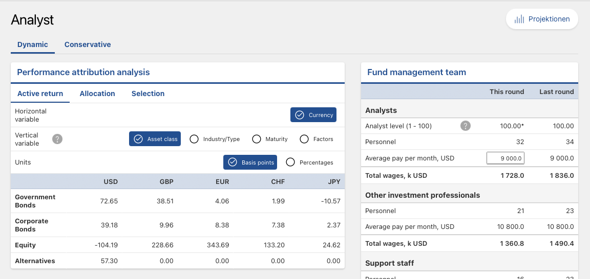
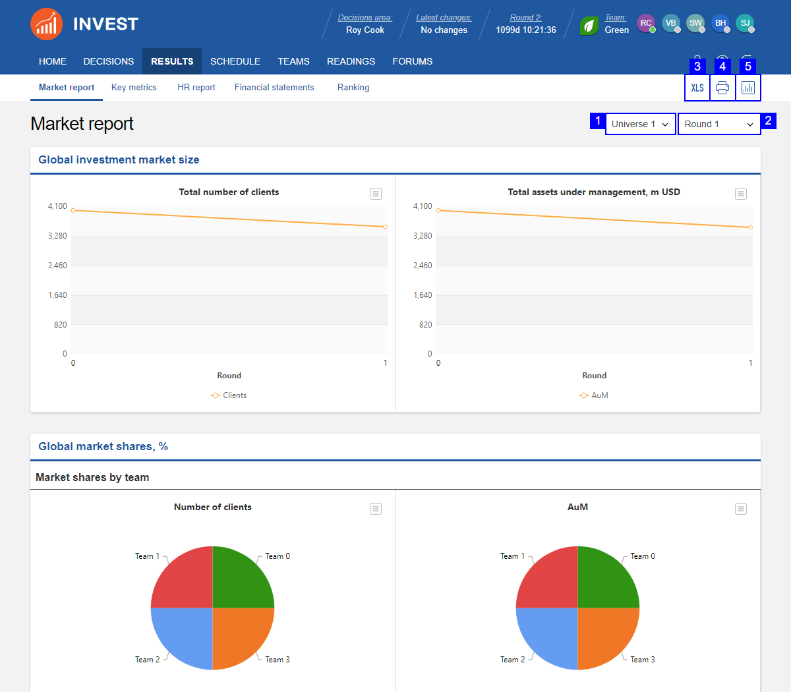

::: {.callout-tip title="Lecture Slides"}
**Associated slides:** [Lesson 6 — Performance Measurement & Feedback Loop](../slides/lesson-06-performance.html)
:::

## Introduction

The investment process is a cycle. It begins with understanding the client. It proceeds through setting policy, constructing the strategic allocation, considering tactical tilts, selecting securities, and implementing the portfolio. Performance analysis is the final stage—the point at which the cycle closes and begins again. It asks what happened, why it happened, and what should change as a result.

Without performance analysis, the investment process operates without feedback. Decisions are made, outcomes occur, but no systematic effort connects the two. A process that cannot learn from its results will repeat its mistakes. A client who cannot see how returns were generated cannot assess whether the advisor earned the fees charged. Accountability requires transparency. Transparency requires analysis.

Three distinct questions structure the inquiry. Measurement establishes the raw return—what the portfolio earned over the period, expressed in absolute terms and relative to an appropriate benchmark. Attribution decomposes that return into its sources. How much came from the strategic allocation? How much from tactical tilts? How much from security selection? Attribution reveals not only whether value was added but where. Appraisal passes judgment on the results. A positive return may reflect skill, or it may reflect a rising tide that lifted all boats. A negative return may reflect poor decisions, or it may reflect a market environment in which even sound decisions lost money. Appraisal attempts to distinguish the two.

The distinction matters because the implications for action differ. If the strategic allocation added value, the policy weights were well chosen and should be maintained. If tactical tilts detracted, the process for generating those tilts needs review. If security selection underperformed, the choice of funds or managers should be revisited. Attribution points to where the problem lies. Appraisal determines whether it is a problem at all.

The Schmidt-Miller family will receive a year-end report that embodies this framework. It will show the portfolio's return, decomposed into its components. It will compare that return to the benchmark and to the objectives documented in the IPS. It will assess whether the family is on track to meet its goals—the €160,000 annual withdrawal, the gallery, the Lake Garda property, the legacy. The report will be honest about what worked and what did not. Klaus, analytical by nature, will read it carefully. He will ask questions. The analysis must be robust enough to answer them.

This chapter develops the tools of performance analysis. We begin with measurement—the calculation of returns using methodologies that are standard across the industry. We then turn to attribution, revisiting the Brinson-Fachler framework from Chapter 9 and extending it to multi-asset, multi-currency portfolios. We address the benchmarks against which performance should be evaluated and the common pitfalls that make performance appear better or worse than it truly is. The chapter concludes with the Schmidt-Miller performance review, a concrete application of the framework to the family's portfolio after its first year of operation.

## Performance Measurement

Performance measurement begins with a simple question: what was the return? The answer depends on who is asking and why.

Time-weighted return, or TWR, measures the manager's investment skill by removing the effect of external cash flows. It divides the measurement period into sub-periods bounded by each contribution or withdrawal, calculates the return for each sub-period, and chains those returns together geometrically. The formula is straightforward:

$$
(1 + r_{\text{TWR}}) = (1 + r_1) \times (1 + r_2) \times \cdots \times (1 + r_n)
$$

Where $r_1, r_2, \ldots, r_n$ are the returns for each sub-period between cash flows. A contribution or withdrawal starts a new sub-period. The TWR calculation is unaffected by whether the client added or removed money. A portfolio that earned 8 percent with a large inflow just before a rally and a portfolio that earned 8 percent with a large outflow just before the same rally produce identical time-weighted returns—as they should, because the manager's investment decisions were identical.

Money-weighted return, or MWR, tells a different story. It is the internal rate of return that equates the present value of all cash flows, including the beginning and ending portfolio values, to zero.

$$
\sum_{t=0}^{n} \frac{CF_t}{(1 + \text{MWR})^t} = 0
$$

Where $CF_t$ is the net cash flow at time $t$, with contributions treated as negative outflows and withdrawals as positive inflows. The MWR is the discount rate that makes the net present value of these flows equal to zero.

MWR captures the client's actual experience. If Klaus invested heavily just before a market decline, his money-weighted return will be lower than the time-weighted return, reflecting the unfortunate timing. If he invested heavily just before a rally, his MWR will be higher. The difference is not an error in calculation. It is a reflection of the timing decisions that affect real wealth outcomes.

The choice between TWR and MWR depends on the question being asked. For evaluating the manager, TWR is correct. The manager does not control when the client deposits or withdraws money. A performance comparison that penalizes the manager for a client's ill-timed contribution is unfair. For evaluating the client's experience, MWR is correct. The client cares about the growth of their actual wealth, not the abstract return of a hypothetical portfolio with no cash flows.

The two measures diverge when cash flows are large relative to the portfolio's value and when market returns are volatile around those flows. For a portfolio with small, regular contributions—a monthly savings plan, for example—the divergence is typically modest. For a portfolio undergoing a significant transition, such as the Schmidt-Miller deployment of €18 million over six months, the divergence can be material.

Gross and net returns add a further distinction. Gross return is what the portfolio earns before deducting fees, trading costs, and taxes. Net return is what the client actually receives. The gap between them is the cost of implementation. A manager who generates a gross excess return of 2 percent but charges a 1.5 percent fee and incurs 0.5 percent in trading costs delivers a net excess return of zero. The client paid for alpha and received none.

Reporting should present both gross and net returns. Gross returns enable the client to evaluate the manager's investment skill. Net returns enable the client to evaluate the value received after all costs. The GIPS standards, introduced in Chapter 11, require that both be disclosed. A firm that reports only gross returns is telling an incomplete story. A firm that reports only net returns is obscuring the source of the client's outcome.

For the Schmidt-Miller family, the performance report will present TWR for evaluating the investment process and MWR for evaluating their actual wealth growth. Gross returns will be shown alongside the deduction of management fees, custody costs, and the tax impact of realized gains. The net return is the number that matters for their goals. The gross return is the number that matters for judging whether the advisory fees are justified. Both will be clearly labeled, clearly explained, and clearly distinguished. Klaus is too analytical to tolerate obfuscation, and the advisory relationship is too important to risk it.

## Risk-Adjusted Performance Appraisal

A high return is meaningless without knowing the risk taken to achieve it. Two portfolios can both earn 8 percent. One achieved it through low-cost index funds that tracked the market. The other achieved it through leveraged bets that happened to pay off. The returns are identical. The quality of the outcomes is not. Risk-adjusted appraisal distinguishes between them. It asks not just what was earned but whether the return was adequate compensation for the risk borne.

The Sharpe ratio is the most widely used measure of risk-adjusted performance. It expresses the excess return—the return above the risk-free rate—per unit of total risk, measured by standard deviation.

$$
S_p = \frac{R_p - R_f}{\sigma_p}
$$

Where $R_p$ is the portfolio return, $R_f$ is the risk-free rate, and $\sigma_p$ is the portfolio's standard deviation. A Sharpe ratio of 0.5 means the portfolio earned half a percentage point of excess return for every percentage point of volatility. A Sharpe ratio of 1.0 means it earned one-for-one.

The Sharpe ratio is intuitive. It answers the question: was the volatility worth it? A portfolio with high returns and high volatility may have a lower Sharpe ratio than a portfolio with moderate returns and low volatility. The Sharpe ratio penalizes volatility regardless of its source. It does not distinguish between upside and downside variation, a limitation discussed in Chapter 6. For investors who care primarily about downside risk, the Sortino ratio, which replaces standard deviation with downside deviation, offers a more targeted measure.

The Treynor ratio shifts the focus from total risk to systematic risk. It expresses excess return per unit of beta, the sensitivity to the market portfolio introduced in the CAPM.

$$
T_p = \frac{R_p - R_f}{\beta_p}
$$

Where $\beta_p$ is the portfolio's beta. The Treynor ratio is appropriate when the portfolio is well-diversified and the only remaining risk is market risk. For a concentrated portfolio, the Sharpe ratio is more appropriate because it captures the idiosyncratic risk that diversification would have eliminated. Using the Treynor ratio for a concentrated portfolio overstates risk-adjusted performance by ignoring the risk that could have been diversified away.

Jensen's alpha measures performance relative to the CAPM benchmark. It is the intercept from a regression of the portfolio's excess returns on the market's excess returns.

$$
\alpha_p = R_p - [R_f + \beta_p (R_m - R_f)]
$$

A positive alpha means the portfolio earned more than the CAPM predicted given its beta. A negative alpha means it earned less. Alpha is the purest measure of value added—or subtracted—by active management. If the manager claims to have generated alpha, Jensen's alpha is the statistical test of that claim.

The calculation requires estimating beta, which requires choosing a benchmark and a time period. Different choices produce different alphas. A positive alpha over one period may become negative over another. Statistical significance is elusive. The standard error of the alpha estimate is typically large relative to the estimate itself, meaning that most measured alphas are statistically indistinguishable from zero. This is not a flaw in the measure. It is a reflection of the difficulty of generating genuine alpha in competitive markets.

The Information Ratio, introduced in Chapter 8, completes the toolkit. It measures the active return—the difference between the portfolio return and the benchmark return—per unit of active risk.

$$
IR = \frac{R_p - R_b}{\sigma_{\text{active}}}
$$

Where $R_b$ is the benchmark return and $\sigma_{\text{active}}$ is the tracking error. The Information Ratio evaluates the efficiency of active management. A manager who generates a 2 percent excess return with 4 percent tracking error has an IR of 0.5. A manager who generates the same excess return with 8 percent tracking error has an IR of 0.25. The first manager used active risk more efficiently.

The Fundamental Law of Active Management, introduced in Chapter 8, provides the theoretical underpinning. The Information Ratio is the product of skill, measured by the Information Coefficient, and breadth, the square root of the number of independent bets. A manager with an IR of 0.5 who makes sixteen independent bets per year has an IC of 0.125. A manager with the same IR who makes four bets per year has an IC of 0.25. The Information Ratio alone does not distinguish between these cases. Both managers added the same risk-adjusted value. The breadth of their processes differs.

Each ratio illuminates a different dimension of performance. The Sharpe ratio evaluates total return relative to total risk. The Treynor ratio evaluates return relative to market risk. Jensen's alpha tests whether returns exceeded those predicted by the CAPM. The Information Ratio evaluates the efficiency of active management. No single measure tells the full story. A comprehensive appraisal uses all four, along with the qualitative context that numbers alone cannot provide. A high Sharpe ratio achieved through leveraged bets in a rising market is not the same as a high Sharpe ratio achieved through diversified, low-cost investing. The numbers are the starting point. Judgment is the destination.

## Macro Attribution: The Fund Sponsor's View

Performance can be analyzed at multiple levels. Macro attribution examines decisions made at the highest level—the strategic asset allocation documented in the IPS and the tactical tilts applied to it. This is the view of the fund sponsor, the investment committee, or the family office that sets policy and delegates implementation.

The policy return is the foundation. It is the return the portfolio would have earned if it had been invested passively at the strategic weights, rebalanced according to the IPS, with no tactical deviations and no security selection. The policy return is calculated by multiplying each asset class's strategic weight by its benchmark return and summing across all asset classes. It represents the return the client signed up for—the beta that drives long-term outcomes.

The incremental return measures the value added by the decision to invest in risky assets at all. It is the difference between the policy return and the risk-free rate. A portfolio with a strategic allocation of 50 percent equities and 50 percent bonds that earned 6 percent when the risk-free rate was 1 percent generated an incremental return of 5 percent. That is the reward for accepting the risk of the policy portfolio rather than remaining in cash. It is the most fundamental investment decision, and it drives the bulk of long-term returns for most investors.

Below the policy level lies the active return—the difference between the actual portfolio return and the policy return. This is where tactical tilts and security selection show their effects. A positive active return means the decisions made within the portfolio added value beyond what the policy allocation would have delivered on its own. A negative active return means those decisions destroyed value.

Macro attribution frames the conversation. Before examining the details of which sector bets paid off or which stock picks added value, it establishes whether the portfolio's overall positioning was sound. A portfolio that earned a strong absolute return but lagged its policy benchmark because of mistimed tactical tilts has a problem at the macro level, regardless of the quality of its security selection. A portfolio that matched its policy return with minimal deviation has delivered exactly what was promised.

For the Schmidt-Miller family, macro attribution answers the questions Klaus will ask. Did the strategic allocation deliver the 6 to 8 percent return it was designed to achieve? Did the tactical tilts add or subtract? Was the tracking error incurred by those tilts justified by the excess return they generated? The answers appear in a simple table. Policy return, incremental return, active return. Positive numbers are good. Negative numbers demand explanation. The macro view sets the stage for the micro analysis that follows.

## Micro Attribution: The Brinson-Fachler Model

Micro attribution decomposes the active return into its components. Where macro attribution asks whether value was added, micro attribution asks how. The Brinson-Fachler model, introduced in Chapter 9, provides the framework. It separates the active return into allocation effects, selection effects, and an interaction term that captures the overlap between the two.

The allocation effect measures the value added by overweighting or underweighting asset classes relative to the strategic benchmark. It is calculated as:

$$
\text{Allocation}_i = (w_{p,i} - w_{b,i}) \times (R_{b,i} - R_{b,\text{total}})
$$

Where $w_{p,i}$ is the portfolio weight in asset class $i$, $w_{b,i}$ is the benchmark weight, $R_{b,i}$ is the benchmark return for that asset class, and $R_{b,\text{total}}$ is the total benchmark return. The term $(R_{b,i} - R_{b,\text{total}})$ isolates whether the asset class outperformed or underperformed the overall benchmark. A positive allocation effect means the portfolio was overweight in asset classes that outperformed and underweight in those that lagged.

The selection effect measures the value added by picking specific securities within each asset class. It is calculated as:

$$
\text{Selection}_i = w_{b,i} \times (R_{p,i} - R_{b,i})
$$

Where $R_{p,i}$ is the actual return earned on the portfolio's holdings in asset class $i$. A positive selection effect means the chosen securities or funds beat the passive benchmark for that class. The selection effect is weighted by the benchmark weight, not the portfolio weight. This ensures that the manager is not credited for selection skill in an asset class that was overweight for allocation reasons.

The interaction effect captures the joint impact of allocation and selection decisions. It is calculated as:

$$
\text{Interaction}_i = (w_{p,i} - w_{b,i}) \times (R_{p,i} - R_{b,i})
$$

The interaction effect is typically small. It is often combined with the selection effect in practice, producing a simplified two-factor decomposition of allocation and selection plus interaction. The total active return is the sum of all three effects across all asset classes.

A worked example illustrates the logic. Suppose the strategic benchmark allocates 40 percent to equities and 60 percent to bonds. The portfolio allocates 50 percent to equities and 50 percent to bonds. Equities returned 10 percent for the benchmark but 12 percent in the portfolio. Bonds returned 4 percent for the benchmark and 3.5 percent in the portfolio. The total benchmark return was $0.40 \times 10\% + 0.60 \times 4\% = 6.4\%$.

The allocation effect for equities is $(0.50 - 0.40) \times (10\% - 6.4\%) = 0.36\%$. The portfolio benefited from overweighting an asset class that beat the benchmark average. The selection effect for equities is $0.40 \times (12\% - 10\%) = 0.80\%$. The equity fund outperformed its benchmark. The interaction effect is $(0.50 - 0.40) \times (12\% - 10\%) = 0.20\%$. The total active contribution from equities is 1.36 percent.

For bonds, the allocation effect is $(0.50 - 0.60) \times (4\% - 6.4\%) = 0.24\%$. The portfolio benefited from underweighting an asset class that underperformed the benchmark average. A negative weight difference multiplied by a negative return difference yields a positive contribution. The selection effect for bonds is $0.60 \times (3.5\% - 4\%) = -0.30\%$. The bond fund underperformed its benchmark. The interaction effect is $(0.50 - 0.60) \times (3.5\% - 4\%) = 0.05\%$.

The total active return is $1.36\% + 0.24\% - 0.30\% + 0.20\% + 0.05\% = 1.55\%$. The portfolio outperformed its benchmark by 155 basis points. The attribution reveals that allocation decisions drove the outperformance while security selection detracted slightly from bonds.

Micro attribution provides a diagnostic tool. A consistently negative allocation effect suggests the tactical process requires review. A consistently negative selection effect suggests the choice of funds or securities within asset classes is flawed. The attribution points to where the problem lies. It does not prescribe the solution, but it narrows the search. For the Schmidt-Miller family, presented as part of the annual performance review, the attribution table will show exactly where value was added and where it was lost. Klaus will study it. The analysis must be robust enough to withstand his scrutiny.

## Factor-Based Attribution: The Fama-French Audit

Sector attribution tells part of the story. It reveals whether overweighting financials or underweighting technology added value. But sector classifications mask the underlying forces that drive returns. Two technology stocks can have very different factor exposures. One might be a large-cap growth stock trading at a high multiple. Another might be a mid-cap value stock with strong profitability. Their returns will be driven more by their factor characteristics than by their sector membership. Factor-based attribution addresses this reality.

The Fama-French framework, introduced in Chapter 10, provides the structure. Returns are decomposed into exposures to the market, size, value, profitability, and investment factors. The attribution asks whether the portfolio's returns were driven by factor tilts that were intentional—part of the investment strategy—or accidental, the result of style drift or poor implementation.

The analysis proceeds by regression. The portfolio's excess returns are regressed against the factor returns for the same period. The coefficients from this regression are the portfolio's implied factor exposures. If the regression yields a significant loading on the value factor, the portfolio behaved like a value portfolio during the measurement period, regardless of what the manager intended. The intercept from this regression is the factor-adjusted alpha—the return that cannot be explained by exposure to the known factors.

A positive factor-adjusted alpha is valuable. It suggests that the manager added returns beyond what could be achieved by simply loading on the factors mechanically. A negative alpha suggests that the manager's decisions detracted from what a passive factor implementation would have delivered. The factor regression provides a stricter test of skill than the Brinson-Fachler model. It asks whether the manager added anything beyond what cheap, systematic factor exposure could have achieved.

Exposure analysis serves a second purpose: verifying that the manager stayed true to their mandate. A portfolio marketed as a quality strategy should exhibit significant loading on the profitability and investment factors. If the regression instead reveals a heavy exposure to momentum or growth, the manager has drifted. The drift may have been profitable in the short term, but it represents a breach of the mandate the client was promised. Factor-based attribution detects this drift.

For the Schmidt-Miller portfolio, the global quality ETF selected in Chapter 10 should exhibit persistent exposure to the profitability factor. The Swiss value fund should load on the value factor. The annual attribution report will test these expectations. If the quality ETF behaved like a broad market fund, delivering no discernible quality tilt, the selection failed regardless of its absolute return. The factor audit holds the portfolio accountable not just for its returns but for its character.

## Fixed Income Attribution: The Yield Curve Audit

Fixed income returns are driven by different forces than equity returns. The passage of time, the shape of the yield curve, and changes in credit spreads all affect bond prices in ways that have no equity counterpart. Fixed income attribution decomposes returns according to these distinct drivers.

The yield-to-maturity effect captures the return that would have been earned if the yield curve and credit spreads had remained unchanged throughout the measurement period. It is the baseline. For a bond held to maturity, the yield at purchase determines the return, assuming all coupons are reinvested at that same yield. The YTM effect represents the accrual of interest income and the pull to par as the bond approaches maturity.

The curve effect captures the return from changes in the level and shape of the risk-free yield curve. This can be decomposed further into a parallel shift—the return from the overall level of rates moving up or down—and a twist or butterfly effect—the return from changes in the slope or curvature of the curve. A parallel upward shift reduces bond prices across all maturities. A steepening of the curve hurts long-duration bonds more than short-duration ones, even if the overall level of rates is unchanged.

The roll-down effect is subtler. A bond with a yield above the curve—because it sits on a steep portion of the curve—will see its yield decline as it ages and rolls down toward maturity. This yield decline produces a price gain, even if the curve itself does not move. The roll-down return is positive for bonds held on upward-sloping portions of the curve. It is negative for bonds held on inverted portions. The roll-down effect can be a material contributor to total return, particularly for portfolios that systematically hold bonds with maturities positioned to capture the steepest parts of the curve.

The spread effect captures the return from changes in credit spreads. For corporate bonds, this is often the dominant source of active return. A narrowing of spreads produces price gains that amplify the yield carry. A widening produces losses that can overwhelm it. Spread attribution can be decomposed by sector, by rating, and by individual issuer to identify where credit decisions added or detracted from performance.

Fixed income attribution requires granular data. Each bond's price, yield, duration, and spread must be tracked over the measurement period. The decomposition is sensitive to the order in which effects are calculated—a parallel shift applied before a spread change yields a different attribution than a spread change applied first. The methodology must be specified and applied consistently.

For the Schmidt-Miller portfolio, fixed income attribution is essential. The government bond ladder serves the liability-matching function, and its return should be dominated by the YTM and roll-down effects. Curve movements will create mark-to-market gains and losses, but these will reverse as bonds approach maturity. The corporate bond allocation involves active credit decisions, and the spread effect will reveal whether those decisions added value. A positive spread attribution means the corporate bonds selected outperformed a duration-matched government bond portfolio. A negative attribution means the additional yield was not sufficient to compensate for the credit risk taken.

The attribution report for fixed income will be presented alongside the equity attribution in the family's annual review. It will show, in currency terms, where each basis point of return came from. Klaus will see that the bond ladder performed as designed—low return, low volatility, reliable income. Elke will see that the corporate bond allocation contributed positively but with greater variability. The analysis confirms that the portfolio is doing what it was built to do. That confirmation is the purpose of performance analysis. Not to celebrate winners or lament losers, but to verify that outcomes align with intentions and to identify where they do not.

## Sustainability (ESG) Performance Audit

ESG integration was presented in Chapter 10 as a quality overlay, a lens through which to identify risks that financial statements had not yet priced. Performance analysis tests whether that lens improved outcomes. The question is empirical: did the ESG tilt add to returns, subtract from them, or leave them unchanged?

The evidence on the ESG premium is mixed, as the earlier discussion acknowledged. Some studies find a positive relationship between ESG scores and risk-adjusted returns. Others find no relationship. Still others find a negative relationship, particularly for exclusionary strategies that restrict the investable universe. The audit does not resolve this academic debate. It answers a narrower question: for this portfolio, over this period, what was the contribution of the ESG overlay?

The analysis isolates the ESG effect by comparing the portfolio's returns to a matched benchmark that lacks the ESG screen. If the portfolio holds an ESG-tilted global equity ETF, the benchmark is a broad market global equity ETF with no ESG criteria. The difference in returns between the two is the raw ESG effect. This difference is then decomposed into sector allocation effects—the ESG fund may be underweight energy and overweight technology—and security selection effects within sectors. The decomposition reveals whether the ESG return difference was driven by structural tilts or by superior stock selection among ESG-compliant companies.

Carbon footprint attribution provides a complementary metric. It measures the portfolio's weighted average carbon intensity relative to the benchmark. A portfolio with a lower carbon footprint is less exposed to carbon-intensive industries and, by extension, to the regulatory and reputational risks those industries face. The metric does not directly measure financial performance, but it provides a risk indicator. A portfolio that has reduced its carbon footprint significantly relative to the benchmark while maintaining comparable returns has achieved the ESG objective without sacrificing financial outcomes.

Governance risk mitigation is the most tangible benefit of ESG integration. A company with poor governance—a weak board, excessive executive compensation, inadequate shareholder rights—is more likely to experience a scandal, a fraud, or a sudden collapse. When such an event occurs, the share price can fall precipitously and never recover. Portfolios that screened for governance quality will have avoided the name. Those that did not will have absorbed the loss.

The audit identifies governance-related losses in the benchmark that the portfolio avoided. It does not predict future scandals. It documents past ones. Over time, a pattern of avoided blow-ups provides evidence that the governance screen is working. A single avoided scandal can justify years of incremental ESG costs. The audit quantifies that benefit.

## Professional Standards: GIPS Compliance

Performance figures are easily manipulated. A manager can present the returns of their best-performing account while ignoring the rest. They can choose a benchmark that flatters their results. They can report gross returns without disclosing the fees that reduce net returns to the client. The Global Investment Performance Standards, or GIPS, exist to prevent these abuses.

GIPS establishes a common framework for calculating and presenting investment performance. The standards are administered by the CFA Institute and are recognized globally as the ethical benchmark for performance reporting. A firm that claims GIPS compliance commits to a set of principles that govern how returns are calculated, how composites are constructed, and how results are disclosed to prospective clients.

Composite construction is central to the standard's integrity. A composite is a grouping of portfolios managed according to the same strategy. All portfolios in the composite must be included in the performance calculation. A firm cannot selectively include winners and exclude losers. The composite return reflects the actual experience of all clients in the strategy, weighted by asset size. A prospective client reviewing a GIPS-compliant presentation can see not only the composite return but the dispersion of returns across portfolios within the composite. Wide dispersion signals that clients had materially different experiences, a red flag that warrants investigation.

The standards also govern the presentation of benchmarks, the calculation of risk measures, and the disclosure of fees. Gross-of-fee and net-of-fee returns must both be shown. The fee schedule must be disclosed. Any material changes in the firm's organization, personnel, or investment process must be reported. The goal is transparency. A client who reviews a GIPS-compliant presentation should have sufficient information to evaluate the manager's performance fairly and to compare it to alternatives.

Verification provides an additional layer of assurance. A third-party auditor reviews the firm's policies and procedures, tests the accuracy of performance calculations, and confirms that the GIPS standards have been applied consistently. Verification is not a guarantee of future performance. It is a guarantee that the past performance reported is real. For a family like the Schmidt-Millers, entrusting substantial assets to an advisory firm, GIPS compliance and third-party verification provide a baseline of trust. The returns reported in the annual review are not the firm's marketing claims. They are audited results, calculated according to a globally recognized standard, and subject to independent verification.

Ethics in performance reporting is not a soft aspiration. It is a hard requirement, embedded in the standards that govern the profession. The Schmidt-Miller family will receive a GIPS-compliant performance report. They will see gross returns, net returns, benchmark comparisons, and the dispersion of outcomes across similar portfolios. They will know that the numbers have been calculated consistently and verified independently. That knowledge does not guarantee satisfaction with the results, but it guarantees that the results are honest. In a profession built on trust, that is the foundation on which everything else rests.

## 12.10 Performance Reporting: The Schmidt-Miller Final Review

- **The Narrative:** Translating the "Hard Math" into a story for the family.
- **Visualizing Success:** 
  - *The Growth of €18,000,000:* A log-scale chart of the family's wealth.
  - *Goal Tracking:* A "Progress Bar" showing how close they are to the Lake Garda house and Lukas’s legacy goals.
- **The "So What?":** Based on the audit, should the SAA be adjusted for the next year?

## Performance Analysis in the IMAG

The framework developed in this chapter is applied directly in the IMAG simulation. Performance analysis closes the investment cycle. We have set the strategic allocation, made tactical tilts, selected securities, and implemented the portfolio. Now we must evaluate what happened, why it happened, and what should change as a result. Without this feedback, the process cannot learn. The simulation provides the tools for this evaluation through the Analyst page.

### Performance Attribution

The Analyst page decomposes our returns using the same attribution framework we examined in this chapter. The performance attribution analysis allows us to view returns through different lenses: by currency, by asset class, by industry, by maturity, and by factor exposure. This is the Brinson-Fachler model in practice, adapted to the multi-currency, multi-asset structure of the simulation.

{#fig-imag-analyst}

The attribution matrix shows the contribution of each market segment to total portfolio return. A positive number in the USD Equity cell means that our US equity positions added value. A negative number in the JPY Government Bonds cell means our Japanese bond positions detracted. The decomposition allows us to identify exactly where our decisions paid off and where they cost us. If we overweighted European equities based on our reading of the Economic Outlook, the EUR Equity attribution tells us whether that decision was correct.

The horizontal and vertical variable selectors let us change the perspective. We can examine returns by currency to assess whether our geographic tilts added value. We can examine returns by asset class to assess whether our allocation between equities, bonds, and alternatives was sound. We can drill into industry or factor exposures to understand the more granular drivers of performance. Each view answers a different question, and together they provide the comprehensive picture that the chapter's framework demands.

### Strategic Allocation Analysis

Below the attribution matrix, the strategic allocation analysis compares our portfolio weights to the optimal ranges embedded in the simulation. For each market segment, our last round allocation is shown alongside the target range and the analyst's recommendation. This is the accountability mechanism that closes the loop between client analysis and portfolio construction.

The analysis tells us whether we are within the ranges that the client's profile demands. A Conservative client requires a different allocation than a Dynamic one. If our strategic allocation was set correctly, reflecting the client's risk tolerance and return objectives, the analysis will confirm alignment. If we misjudged the client—allocating too heavily to equities for a loss-averse Conservative client, or too conservatively for a growth-oriented Dynamic client—the gap will be visible here.

The analyst recommendations provide additional guidance. "Balanced allocation. Maintain position" confirms that our weight is appropriate. A recommendation to increase or decrease would signal a deviation from the optimal range. This analysis does not replace judgment, but it provides a structured check on whether our portfolio is doing what it was designed to do.

### Competitive Context

The performance data from the market report places our results in competitive context. The ranking table shows cumulative profit, assets under management, and key risk metrics for each team. The Sharpe ratio tells us whether our returns are adequate compensation for the risk we took. The Information Ratio tells us whether our active decisions added value relative to the benchmark. These are the same metrics we examined in the chapter, applied here to evaluate our performance relative to peers.

{#fig-imag-market-report}

Market share data, segmented by client type, reveals whether our performance is translating into client retention and growth. A team with strong returns but declining market share may be taking risks that clients did not sign up for. A team with moderate returns but growing market share may be delivering exactly what their clients expect. The numbers do not tell the whole story, but they frame the questions that the attribution analysis must answer.